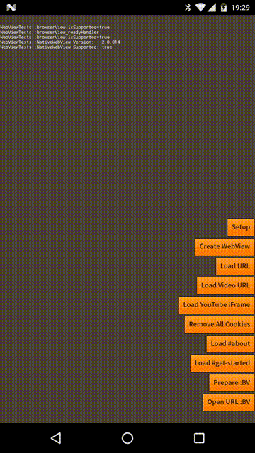
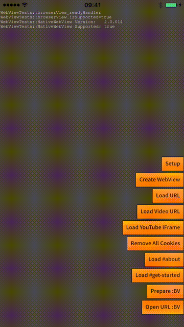

## Browser View

The browser view is the simplest method of displaying a full page website in your application.
This is perfect for displaying external links such as news articles or website information.

The browser view is implemented as:

- **Chrome Custom Tabs** on Android ([docs](https://developer.chrome.com/multidevice/android/customtabs));
- **Safari View Controller** on iOS ([docs](https://developer.apple.com/reference/safariservices/sfsafariviewcontroller))

These views are intended to be used to simply load content external to your application.


The WebView is good solution if you are hosting your own content inside your app. 
If your app directs people to URLs outside your domain, we recommend that you use 
the Browser View for the following reasons:
 
- Simplicity
- Security
- Performance optimisations
- Shared cookie and permissions
- Autocomplete
- Latest browser implementations






## Android Additions

To make sure this functionality works on Android you must add the `androidx.browser.ane` to your application. See the [Add the Extension](add-the-extension) section for information on including this ANE.


## Preparing the Browser View

In order for the browser view to correctly receive events you must call `prepare` before attempting to display any web content. Preparing is a simple process of calling `prepare()` and then waiting for the `BrowserViewEvent.READY` event. 


Example:

```as3
if (NativeWebView.service.browserView.isSupported)
{
	NativeWebView.service.browserView.addEventListener( BrowserViewEvent.READY, browserView_readyHandler );
	NativeWebView.service.browserView.prepare();
}

...

private function browserView_readyHandler( event:BrowserViewEvent ):void
{
	NativeWebView.service.browserView.removeEventListener( BrowserViewEvent.READY, browserView_readyHandler );
	// Browser views are now ready to be used in your application
}
```

>
> This is not 100% required however if you don't do this before opening a url you may 
> find you don't receive any of the `BrowserViewEvent`s. If you don't need those 
> events then you can skip this process.
>


## Open a URL

This is the important part, simply opening a url for display.

```as3
NativeWebView.service.browserView.openWithUrl( "http://airnativeextensions.com" );
```

This call will create and display the browser view and load the specified url.

You can listen to the events dispatched by the view:

```as3
NativeWebView.service.browserView.addEventListener( BrowserViewEvent.CLOSED, browserView_eventHandler );
NativeWebView.service.browserView.addEventListener( BrowserViewEvent.OPENED, browserView_eventHandler );
NativeWebView.service.browserView.addEventListener( BrowserViewEvent.LOADED, browserView_eventHandler );
NativeWebView.service.browserView.addEventListener( BrowserViewEvent.ERROR, browserView_eventHandler );

...

private function browserView_eventHandler( event:BrowserViewEvent ):void
{
	trace( "browserView_eventHandler( " +event.type + " )");
}
```

These events are dispatched when various events occur in the browser view. See the `BrowserViewEvent` 
documentation for details.


## Imports

When using the Browser view you will be interacting with several classes and interfaces. 
The main functionality is defined in the `BrowserView` interface and you will be listening 
for the `BrowserViewEvent` as described.

To use these classes you will need the following import statements:

```as3
import com.distriqt.extension.nativewebview.browser.BrowserView;
import com.distriqt.extension.nativewebview.events.BrowserViewEvent;
```


## Options 

You can specify options when opening a browser view by creating an instance of the `BrowserViewOptions` class and passing that as the second parameter to the `openWithUrl` function:

```as3
var options:BrowserViewOptions = new BrowserViewOptions();

NativeWebView.service.browserView.openWithUrl( "http://airnativeextensions.com", options );
```


### Colours

You can change the background colour of the browser view tool bar by specifying the primary colour:

```as3
options.primaryColour = 0xFF0000;
```

The primary colour is used on iOS 10+ and Android as the background colour of the toolbar.


You can change the text in the toolbar by specifying the secondard colour. This is currently only supported on iOS 10+.

```as3
options.secondaryColour = 0x000000;
```


### Animations

On Android you can select the in and out animations by setting the `animationIn` and `animationOut` properties.

These animations control how the browser view is shown and hidden. For example to slide the browser view in from the bottom and back out to the bottom:

```as3
options.animationIn = BrowserViewOptions.SLIDE_BOTTOM;
options.animationOut = BrowserViewOptions.SLIDE_TOP;
```

The out animation is easier thought of as the direction your application will animate in rather than the view out, so in the above, the browser view would slide in from the bottom and then when closing the application will slide in from the top pushing the browser view out the bottom.


Potential values are:

- `SLIDE_LEFT`
- `SLIDE_RIGHT`
- `SLIDE_BOTTOM`
- `SLIDE_TOP`

The defaults are `SLIDE_LEFT` and `SLIDE_RIGHT` for the `animationIn` and `animationOut` properties respectively, so that the view will slide in from the left and back out towards the left.

>
> Note: The out animation is only used when the user presses the close button. If you programmatically close the view using the `close` function the animation will not be shown.
>

