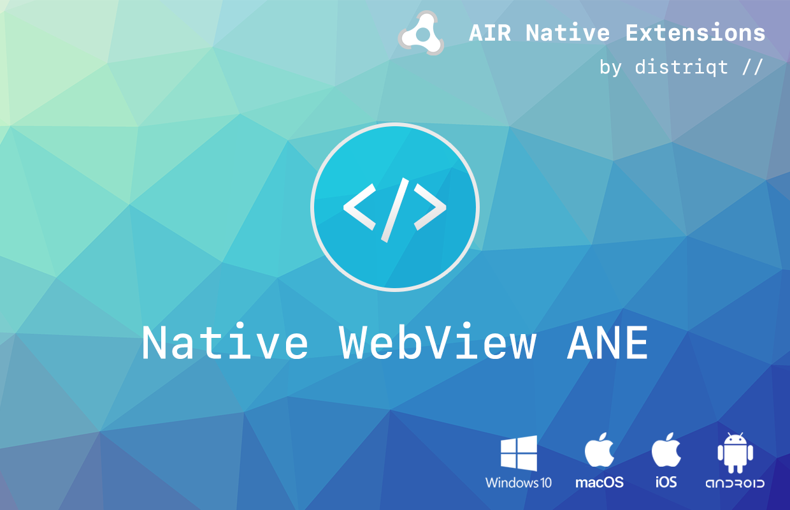
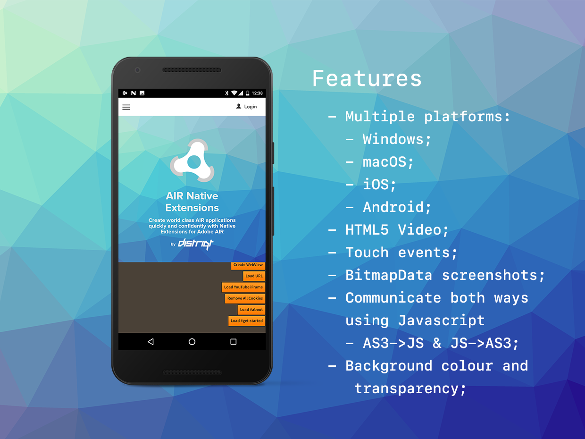

# NativeWebView

The [NativeWebView](https://airnativeextensions.com/extension/com.distriqt.NativeWebView) extension is designed to be a replacement version of the StageWebView, but much more useful.

The simple API allows you to quickly integrate web views in your AIR application. 
Identical code base can be used across all supported platforms allowing you to concentrate on your application and not device specifics.

We provide complete guides to get you up and running with asset selection quickly and easily.

### Features

- Browser View: 
  - Android: Chrome Custom Tabs
  - iOS: Safari View Controller 
- HTML5 Video;
- Touch events;
- Capture BitmapData screenshot;
- Communicate both ways using Javascript AS3->JS & JS->AS3;
- Transparent background;
- Additional page controls: auto play, background colour;
- iOS: Air Printing;

As with all our extensions you get access to a year of support and updates as we are continually improving and updating the extensions for OS updates and feature requests.

## Documentation

The [Wiki](https://github.com/distriqt/ANE-NativeWebView/wiki) forms the best source of detailed documentation for the extension along with the [asdocs](https://docs.airnativeextensions.com/asdocs/nativewebview). 

More information here: 

[com.distriqt.NativeWebView](https://airnativeextensions.com/extension/com.distriqt.NativeWebView)

## License

You can purchase a license for using this extension:

[airnativeextensions.com](https://airnativeextensions.com/)

distriqt retains all copyright.

