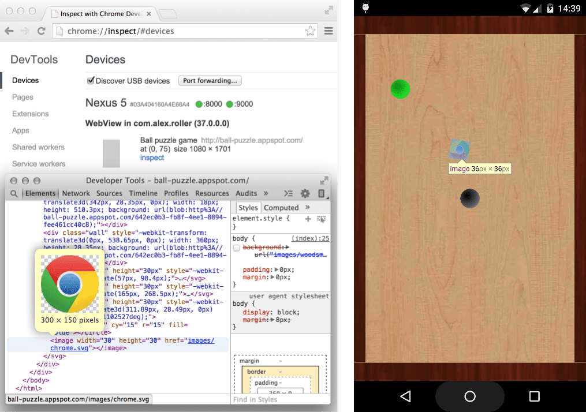

You can remotely debug the content in your webviews using Chrome for Android or Safari for iOS.

## Summary

- Enable WebView debugging
- Access list of debug-enabled WebViews via chrome://inspect
- Debugging WebViews is the same as debugging a web page through remote debugging.


## Configure WebView 

WebView debugging must be enabled from within your application. To enable WebView debugging set the `enableDebugging` flag to `true` in the `WebViewOptions` used to create your webview:

```actionscript
var options:WebViewOptions = new WebViewOptions();
options.enableDebugging = true;

...

var webView:WebView = NativeWebView.service.createWebView( viewPort, options, stage );
```

On Android this setting applies to all of the application's `WebView`s whereas on iOS it applies to the specific instance.


## Inspect the WebView 

### Android 

The chrome://inspect page displays a list of debug-enabled WebViews on your device.

To start debugging, click inspect below the WebView you want to debug. Use DevTools as you would for a remote browser tab.



The gray graphics listed with the WebView represent its size and position relative to the device's screen. If your WebViews have titles set, the titles are listed as well.

### iOS

Firstly open the settings and enable Web Inspector on Safari. 

- **Settings** > **Safari** > **Advanced**
- toggle the Web Inspector option on


Then in Safari on your development machine you will need to enable developer mode: **Safari** > **Settings** > **Show features for web developers**

Under the **Develop** menu find the device you wish to inspect and it should open the code inspection view.


## Troubleshooting

### Android 

Can't see your WebViews on the `chrome://inspect` page?

- Verify that WebView debugging is enabled for your app.
- On your device, open the app with the WebView you want to debug. Then, refresh the `chrome://inspect` page.


