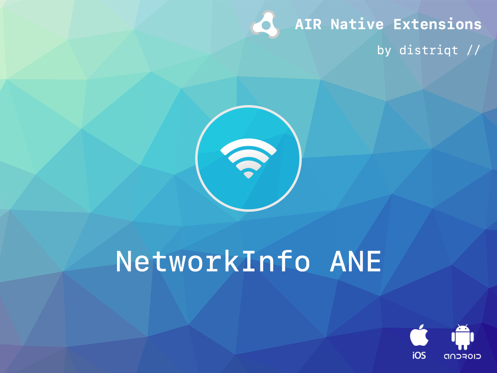
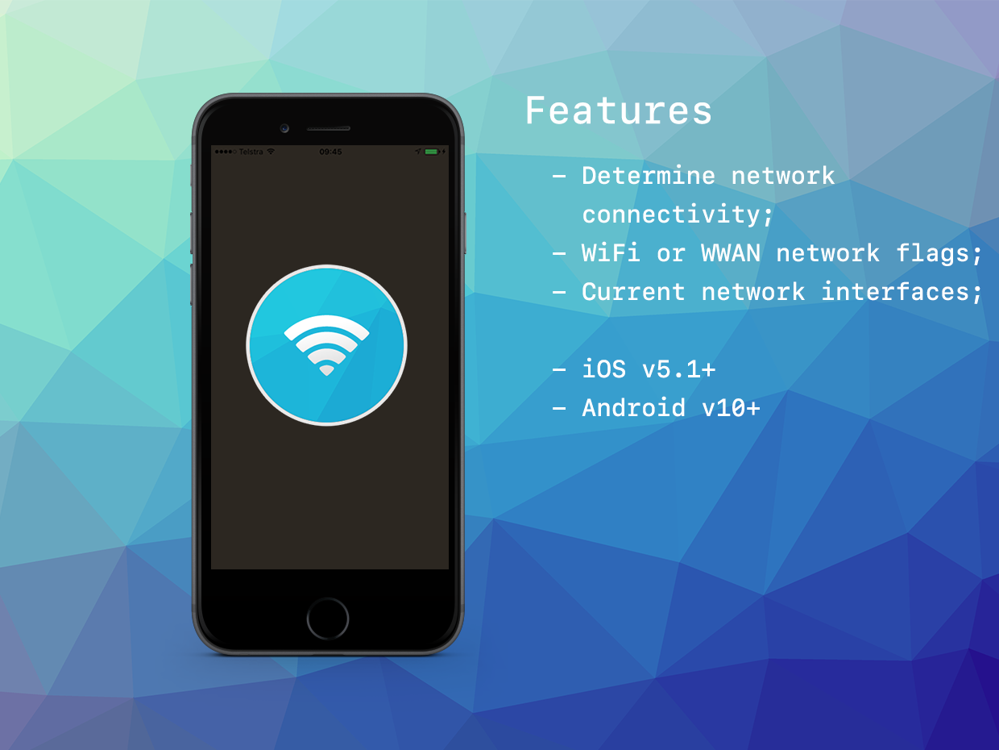

# NetworkInfo

The [NetworkInfo](https://airnativeextensions.com/extension/com.distriqt.NetworkInfo) 
access to information about the device's network interfaces.

The Network Info extension provides access to determine the network type and connected 
interfaces of a device. The default Adobe AIR NetworkInfo class is not fully supported 
on the iOS platform, so this extension provides all functionality developers expect 
from the NetworkInfo utility class.


### Features

- Networks: Determine network connectivity and type (wired, wifi, etc)
- Familiar interface: Uses the same syntax as the AIR NetworkInfo class
- Interfaces: Provides information about the current network interfaces
- Flags to determine if WiFi or WWAN network connection is active
- Single API interface: Works across iOS and Android with the same code
- Sample project code and ASDocs reference


As with all our extensions you get access to a year of support and updates as we are continually improving and updating the extensions for OS updates and feature requests.


## Documentation

The [Wiki](https://github.com/distriqt/ANE-NetworkInfo/wiki) forms the best source of detailed documentation for the extension along with 
the [asdocs](https://docs.airnativeextensions.com/asdocs/networkinfo). 

Quick Example:

```actionscript
```

More information here: 

[com.distriqt.NetworkInfo](https://airnativeextensions.com/extension/com.distriqt.NetworkInfo)


## License

You can purchase a license for using this extension:

[airnativeextensions.com](https://airnativeextensions.com/)

distriqt retains all copyright.



