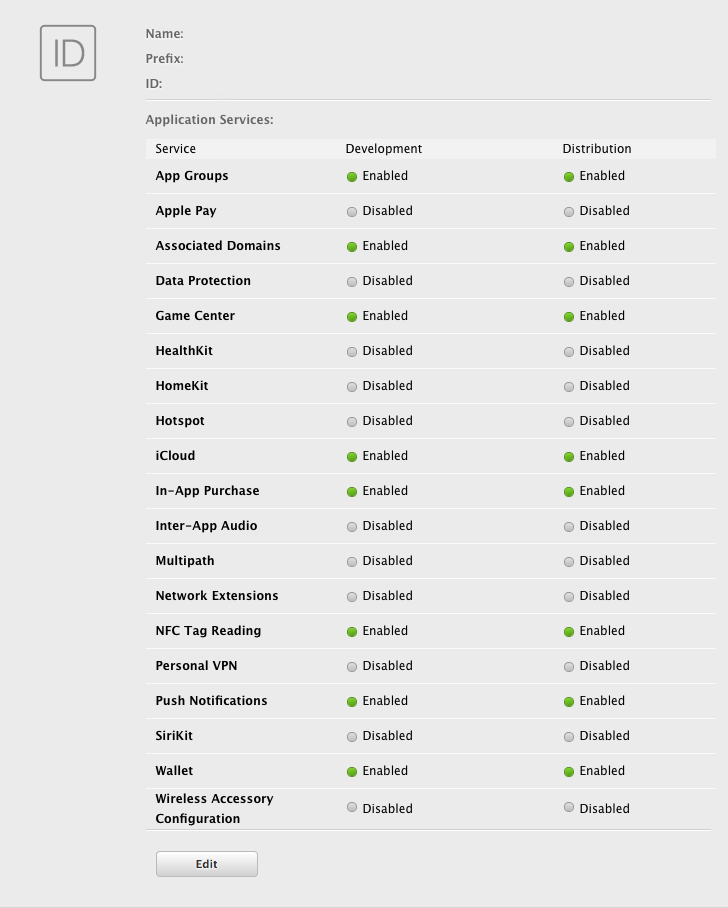
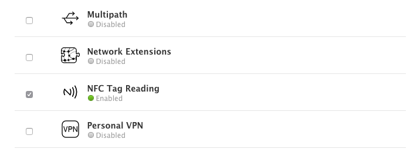

First step is always to add the extension to your development environment. 
To do this use the tutorial located [here](/docs/tutorials/getting-started).


## Dependencies

Many of our extensions use some common libraries, for example, the Android Support libraries.

We have to separate these libraries into separate extensions in order to avoid multiple versions of the libraries being included in your application and causing packaging conflicts. This means that you need to include some additional extensions in your application along with the main extension file.

You will add these extensions as you do with any other extension, and you need to ensure it is packaged with your application.


### Core 

The Core extension is required by this extension. You must include this extension in your application.

The Core extension doesn't provide any functionality in itself but provides support libraries and frameworks used by our extensions.
It also includes some centralised code for some common actions that can cause issues if they are implemented in each individual extension.

You can access this extension here: [https://github.com/distriqt/ANE-Core](https://github.com/distriqt/ANE-Core).


## Extension IDs

The following should be added to your `extensions` node in your application descriptor to identify all the required ANEs in your application:

```xml
<extensions>
    <extensionID>com.distriqt.NFC</extensionID>
    <extensionID>com.distriqt.Core</extensionID>
</extensions>
```


## Android 

### Manifest Additions

At a minimum you must add the NFC permission and include the `NFCActionActivity` activity in your manifest application. 
We also recommend setting the minimum SDK to 19.

You can optionally add the `uses-feature` tag which will make sure your application is only installed on devices that have NFC hardware.


```xml
<manifest android:installLocation="auto" >
	<uses-sdk android:minSdkVersion="19" />

    <uses-permission android:name="android.permission.NFC" />

    <!-- OPTIONAL -->
	<uses-feature android:name="android.hardware.nfc" android:required="true" />
    
    <application>
        <activity android:name="com.distriqt.extension.nfc.activities.NFCActionActivity" android:theme="@android:style/Theme.Translucent.NoTitleBar" />
    </application>
</manifest>
```

If you are planning on getting your application to launch from a tag you will need to add some intent filters to the activity tag. See the documentation on [scanning](scanning) for more information on the format of the intent filters.


## iOS 

Firstly you will need to update your provisioning profile to enable NFC features in your application.

To do this, login to the Apple developer program and navigate to the "Certificates, Identifiers & Profiles" section. Select your application identifier and edit the application services:




You will need to enable "NFC Tag Reading" :




Once enabled, you will need to **regenerate your provisioning profiles** and download them for your AIR application. 


### Info Additions and Entitlements

There are several additions required to enable NFC scanning on iOS. Firstly the usage description tag to the info additions, this is displayed to the user when starting a scan to inform the user why your application is scanning NFC tags in the foreground. 

```xml
<key>NFCReaderUsageDescription</key>
<string>Ready to use NFC</string>
```

You will also need to add the following to the entitlements section to specify the tag formats the application accepts, currently iOS only supports `NDEF`.

```xml
<key>com.apple.developer.nfc.readersession.formats</key>
<array>
    <string>NDEF</string>
</array>
```

If you are using univeral links to background scan on iOS you need to add the domain for each univeral link to the entitlements section:

```xml
<key>com.apple.developer.associated-domains</key>
<array>
    <string>applinks:example.com</string>
</array>
```

>
> Note: iOS requires that you have a universal link setup to launch your application, and that the data in the tag contains this url.
>
> To setup universal links you can follow the Apple documentation [here](https://developer.apple.com/documentation/uikit/inter-process_communication/allowing_apps_and_websites_to_link_to_your_content/enabling_universal_links?language=objc). 
>

#### Example

```xml
<iPhone>
    <InfoAdditions><![CDATA[

        <key>UIDeviceFamily</key>
        <array>
            <string>1</string>
            <string>2</string>
        </array>
        
        <key>NFCReaderUsageDescription</key>
        <string>Ready to use NFC</string>

    ]]></InfoAdditions>
    <requestedDisplayResolution>high</requestedDisplayResolution>
    <Entitlements><![CDATA[

            <key>com.apple.developer.nfc.readersession.formats</key>
            <array>
                <string>NDEF</string>
            </array>

            <key>com.apple.developer.associated-domains</key>
            <array>
                <string>applinks:example.com</string>
            </array>

    ]]></Entitlements>
</iPhone>
```


## Supported

You should always check whether the extension is supported before making calls. 
This allows you to react to whether the functionality is available on the device.

```actionscript
if (NFC.isSupported)
{
	//	Functionality here
}
```


