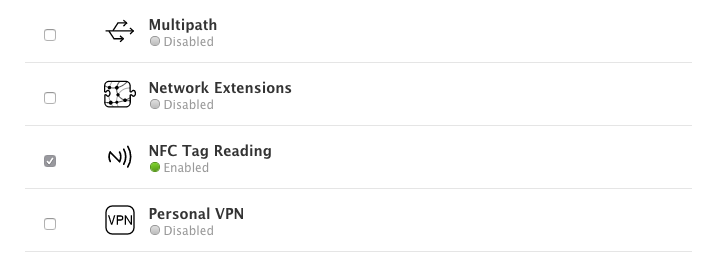

import Tabs from '@theme/Tabs'
import TabItem from '@theme/TabItem'

import InstallAPM from './_includes/add-apm.mdx'
import InstallManual from './_includes/add-manual.mdx'

import AppDescriptorAPM from './_includes/add-apm-appdescriptor.mdx'
import AppDescriptorManual from './_includes/add-manual-appdescriptor.mdx'


The simplest way to install and manage your AIR native extensions and libraries is to use the AIR Package Manager (`apm`). We highly recommend using `apm`, as it will handle downloading all required dependencies and manage your application descriptor (Android manifest additions, iOS info additions etc).

However you can choose to install it manually, as you would have done in the past. 


:::info AIR SDK
This ANE currently requires at least AIR 33+. This is required in order to support versions of Android > 9.0 (API 28). We always recommend using the most recent build with AIR especially for mobile development where the OS changes rapidly.
:::


## Setup 

### iOS 

Firstly you will need to update your provisioning profile to enable NFC features in your application.

To do this, login to the Apple developer program and navigate to the "Certificates, Identifiers & Profiles" section. Select your application identifier and edit the application services:


You will need to enable "NFC Tag Reading" :




Once enabled, you will need to **regenerate your provisioning profiles** and download them for your AIR application. 


## Install

<Tabs
  groupId="packagemanager"
  defaultValue="apm"
  values={[
    {label: 'APM', value: 'apm'},
    {label: 'Manual', value: 'manual'},
  ]}>

  <TabItem value="apm" >
	<InstallAPM/>
  </TabItem>
  <TabItem value="manual" >
	<InstallManual/>
  </TabItem>
  
</Tabs>


## Application Descriptor

<Tabs
  groupId="packagemanager"
  defaultValue="apm"
  values={[
    {label: 'APM', value: 'apm'},
    {label: 'Manual', value: 'manual'},
  ]}>

  <TabItem value="apm" >
	<AppDescriptorAPM/>
  </TabItem>
  <TabItem value="manual" >
	<AppDescriptorManual/>
  </TabItem>
  
</Tabs>


### Universal Links

:::note 
In order to launch your application from an NFC tag on iOS you are required to have a universal link setup to launch your application, and that the data in the tag contains this url.

To setup universal links you can follow the Apple documentation [here](https://developer.apple.com/documentation/xcode/allowing-apps-and-websites-to-link-to-your-content). 
:::

If you are using universal links to background scan on iOS you need to add the domain for each universal link to the entitlements section. 


<Tabs
  groupId="packagemanager"
  defaultValue="apm"
  values={[
    {label: 'APM', value: 'apm'},
    {label: 'Manual', value: 'manual'},
  ]}>

  <TabItem value="apm" >

To add these additions you need to add some additional configuration. Firstly add a custom iOS configuration file by running:

```
apm generate config ios
```

Edit the `config/ios/Entitlements.xml` file that was generated to resemble the following, adding the `com.apple.developer.associated-domains` node:

```xml
<plist version="1.0">
    <dict>

		<key>com.apple.developer.associated-domains</key>
		<array>
			<string>applinks:example.com</string>
		</array>

    </dict>
</plist>
```

Once you have added this configuration run the steps above to update / generate your [application descriptor](#application-descriptor).


  </TabItem>
  <TabItem value="manual" >

To manually add your universal links, add the `com.apple.developer.associated-domains` node to the `Entitlements` section in your application descriptor:

```xml
<key>com.apple.developer.associated-domains</key>
<array>
    <string>applinks:example.com</string>
</array>
```

For example:

```xml
<iPhone>
    <InfoAdditions><![CDATA[

        <key>UIDeviceFamily</key>
        <array>
            <string>1</string>
            <string>2</string>
        </array>
        
        <key>NFCReaderUsageDescription</key>
        <string>Ready to use NFC</string>

    ]]></InfoAdditions>
    <requestedDisplayResolution>high</requestedDisplayResolution>
    <Entitlements><![CDATA[

            <key>com.apple.developer.nfc.readersession.formats</key>
            <array>
                <string>NDEF</string>
            </array>

            <key>com.apple.developer.associated-domains</key>
            <array>
                <string>applinks:example.com</string>
            </array>

    ]]></Entitlements>
</iPhone>
```

  </TabItem>
  
</Tabs>


## Supported

You should always check whether the extension is supported before making calls. 
This allows you to react to whether the functionality is available on the device.

```actionscript
if (NFC.isSupported)
{
	//	Functionality here
}
```


