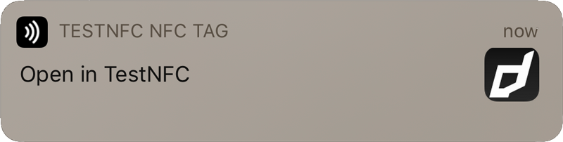
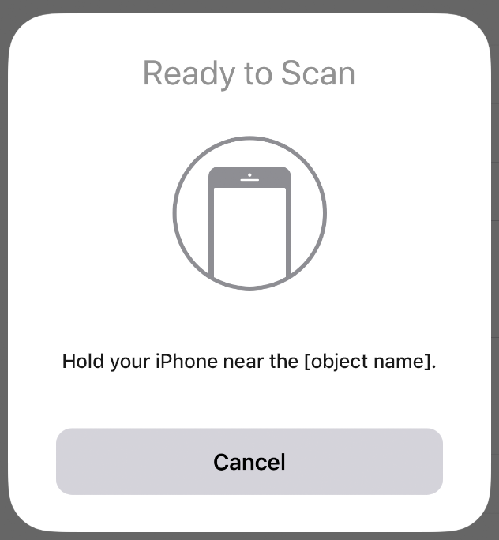

import Tabs from '@theme/Tabs'
import TabItem from '@theme/TabItem'

Dispatch mode relies on the system dispatching data about the tags and responding to these events. Additionally you can use this method to register your application to launch when specific tags are detected by the system.


## Android

### Introduction

Reading NDEF data from an NFC tag is handled with the tag dispatch system, which analyzes discovered NFC tags, appropriately categorizes the data, and starts an application that is interested in the categorized data. An application that wants to handle the scanned NFC tag can declare an intent filter and request to handle the data.

Android-powered devices are usually looking for NFC tags when the screen is unlocked, unless NFC is disabled in the device's Settings menu. When an Android-powered device discovers an NFC tag, the desired behavior is to have the most appropriate activity handle the intent without asking the user what application to use. Because devices scan NFC tags at a very short range, it is likely that making users manually select an activity would force them to move the device away from the tag and break the connection. You should develop your activity to only handle the NFC tags that your activity cares about to prevent the Activity Chooser from appearing.

To help you with this goal, Android provides a special tag dispatch system that analyzes scanned NFC tags, parses them, and tries to locate applications that are interested in the scanned data. It does this by:

- Parsing the NFC tag and figuring out the MIME type or a URI that identifies the data payload in the tag.
- Encapsulating the MIME type or URI and the payload into an intent. These first two steps are described in [How NFC tags are mapped to MIME types and URIs](https://developer.android.com/guide/topics/connectivity/nfc/nfc.html#ndef).
- Starts an activity based on the intent. This is described in [How NFC Tags are Dispatched to Applications](https://developer.android.com/guide/topics/connectivity/nfc/nfc.html#dispatching).


### Application Dispatch

The extension provides an activity that you can use to inform your application about the NFC tag, `NFCActionActivity`. 

In order to get your application to automatically launch and handle NFC tags without having to be running you need to add the `NFCActionActivity` to your applications Android manifest and apply the appropriate filters for your application. There are some examples below.


<Tabs groupId="framework" defaultValue="air" values={[
    {label: 'AIR', value: 'air'},
    {label: 'Unity', value: 'unity'},
  ]}>
<TabItem value="air" >

You should construct your intent filters in your manifest additions in order to correctly start this activity and launch your application when a tag of interest is detected by Android. 

<Tabs
  groupId="packagemanager"
  defaultValue="apm"
  values={[
    {label: 'APM', value: 'apm'},
    {label: 'Manual', value: 'manual'},
  ]}>

<TabItem value="apm" >

To add these additions you need to add some additional configuration. Firstly add a custom Android configuration file by running:

```
apm generate config android
```

Edit the `config/android/AndroidManifest.xml` file that was generated to resemble the following, adding the activity as you require:


```xml
<?xml version="1.0" encoding="utf-8"?>
<manifest xmlns:android="http://schemas.android.com/apk/res/android" xmlns:tools="http://schemas.android.com/tools">

    <application>

		<!-- Add your NFCActionActivity here -->

    </application>

</manifest>
```

Once you have added this configuration run the steps above to update / generate your [application descriptor](add-the-extension.mdx#application-descriptor).


</TabItem>
<TabItem value="manual" >


Remove the `NFCActionActivity` line referenced in the "Add the extension" manifest additions and replace it with your version with intent filters. 


</TabItem>
</Tabs>

</TabItem>
<TabItem value="unity" >

Adding these additions to your manifest can be achieved in several ways.

You can use the `NFCManifest.androidlib` directory in our example to simply merge in the additions to your application. Copy this folder, to your application Assets under `Plugins/Android` and edit the `AndroidManifest.xml` file in the directory to match your requirements. 

Alternatively, if you are using a custom android manifest file then simply add the activity to that file.

</TabItem>
</Tabs>


#### Examples

Some examples of intent filters are below. 


An NDEF record with a url pointing to `https://airnativeextensions.com`:

```xml
<activity android:name="com.distriqt.extension.nfc.activities.NFCActionActivity" android:theme="@android:style/Theme.Translucent.NoTitleBar" android:exported="true" >
    <intent-filter>
        <action android:name="android.nfc.action.NDEF_DISCOVERED"/>
        <category android:name="android.intent.category.DEFAULT"/>
        <data android:scheme="https"
                android:host="airnativeextensions.com"
        />
    </intent-filter>
</application>
```

An NDEF record with a plain text:

```xml
<activity android:name="com.distriqt.extension.nfc.activities.NFCActionActivity" android:theme="@android:style/Theme.Translucent.NoTitleBar" android:exported="true" >
    <intent-filter>
        <action android:name="android.nfc.action.NDEF_DISCOVERED"/>
        <category android:name="android.intent.category.DEFAULT"/>
        <data android:mimeType="text/plain" />
    </intent-filter>
</application>
```

>
> Note: You can add multiple `intent-filter` nodes to the `activity` to register for several different tag types.
>

### Foreground Dispatch

If you don't require your application to be launched from a tag, but instead just need active foreground scanning, (reading tags while your application is active in the foreground) you can use the foreground dispatch method.

This involves calling the `registerForegroundDispatch()` method to register your application for NFC tag detection at runtime.

Similar to the intent filters above, you need to specify the urls or mimetypes that are relevant to your application. This is done through setting the options in an instance of the `ScanOptions` class.

<Tabs groupId="framework" defaultValue="air" values={[
    {label: 'AIR', value: 'air'},
    {label: 'Unity', value: 'unity'},
  ]}>
<TabItem value="air" >

```actionscript 
var options:ScanOptions = new ScanOptions();
options.urls.push( "https://airnativeextensions.com" );  

NFC.service.registerForegroundDispatch( options );
```

</TabItem>
<TabItem value="unity" >

```csharp 
ScanOptions options = new ScanOptions();
options.urls = new string[] { "https://airnativeextensions.com" };

NFC.Instance.RegisterForegroundDispatch(options);
```

</TabItem>
</Tabs>


## iOS

### Introduction

iOS NFC reading is available as an active foreground activity from iOS 11 and as a background / system level activity from iOS 12.


### Background Dispatch 

On iPhones that support background tag reading, the system scans for and reads NFC data without requiring users to scan tags using an app. The system displays a pop-up notification each time it reads a new tag. After the user taps the notification, the system delivers the tag data to the appropriate app. If the iPhone is locked, the system prompts the user to unlock the phone before providing the tag data to the app.

>
> **Note**
> iPhone XS and later support background tag reading.
>

After the device scans an NFC tag while in background tag reading mode, the system inspects the tag’s NDEF message for a URI record by looking for an payload object with the following property values:

- typeNameFormat equal to `NFCTypeNameFormatNFCWellKnown`
- type equal to `“U”`

If the NDEF message contains more than one URI record, the system uses the first one. The URI record must contain either a universal link or a supported URL scheme.

>
> You cannot use a custom URL to launch your application, this only works with a predefined set of url schemes mainly for web urls, email, sms etc.
>

For tags that contain universal links, the system presents a notification and then launches (or brings to the foreground) the app associated with the universal link after the user taps the notification. (This will happen if the application is in the foreground as well, ie. notification will appear and you will receive an event if the user taps the notification)



The system sends the NDEF message to the app and the extension receives it. When you call `checkStartupData()` the `NFCEvent` will be dispatched, following the same process as Android. 
If there are no installed apps associated with the universal link, the system opens the link in Safari.


#### Associated Domains 

In order for this to work you must setup a universal link for your application and included the domain in the `com.apple.developer.associated-domains` entitlements section of your iphone additions.

<Tabs groupId="framework" defaultValue="air" values={[
    {label: 'AIR', value: 'air'},
    {label: 'Unity', value: 'unity'},
  ]}>
<TabItem value="air" >

With AIR this is simply a matter of adding the fields to the entitlements section in your application descriptor, (see [Add the Extension](add-the-extension.mdx#universal-links) for more details).

</TabItem>
<TabItem value="unity" >

With Unity you will need to add your domain to the `NFCConfig.cs` class in the `Assets/distriqt/NFCUnity/NFC/Editor` folder. Set your domains into the `associatedAppDomains` array, for example:

```csharp title="Unity: NFCConfig.cs"
public static string[] associatedAppDomains = new string[] 
{
    // Add your associated App Domains here
    "applinks:example.com"
};
```

These domains will be applied to the entitlements for your application by our post build scripts.

</TabItem>
</Tabs>


### Foreground Dispatch

To initiate reading tags on iOS you call the `registerForegroundDispatch()` method. There are no filtering methods on iOS so any NDEF formatted tags will be detected and events dispatched to your application, and any options provided (as in the Android case) will be ignored.

<Tabs groupId="framework" defaultValue="air" values={[
    {label: 'AIR', value: 'air'},
    {label: 'Unity', value: 'unity'},
  ]}>
<TabItem value="air" >

```actionscript 
NFC.service.registerForegroundDispatch();
```

</TabItem>
<TabItem value="unity" >

```csharp 
NFC.Instance.RegisterForegroundDispatch();
```

</TabItem>
</Tabs>


While scanning on iOS the following dialog will be presented to your user: 




You can customise the message displayed in this dialog by setting the `message` in the options passed to `registerForegroundDispatch()`:

<Tabs groupId="framework" defaultValue="air" values={[
    {label: 'AIR', value: 'air'},
    {label: 'Unity', value: 'unity'},
  ]}>
  <TabItem value="air" >

```actionscript 
var options:ScanOptions = new ScanOptions();
options.message = "Hold your device near the item to learn more about it.";

NFC.service.registerForegroundDispatch( options );
```

  </TabItem>
  <TabItem value="unity" >

```csharp 
ScanOptions options = new ScanOptions();
options.message = "Hold your device near the item to learn more about it.";

NFC.Instance.RegisterForegroundDispatch(options);
```

  </TabItem>
</Tabs>


## Launch Events

If your application is launched from a tag you need to make sure you follow a few steps to ensure you correctly receive the event.

The extension will store the information about the tag until you call `checkStartupData()` which will subsequently trigger the event dispatch.
This allows you to ensure you are ready to handle the event before it gets dispatched.

So on first run of your application, setup your handlers for the events and then call `checkStartupData()`. If the application was launched from a background tag scan then you will immediately receive the appropriate event.

<Tabs groupId="framework" defaultValue="air" values={[
    {label: 'AIR', value: 'air'},
    {label: 'Unity', value: 'unity'},
  ]}>
  <TabItem value="air" >

```actionscript 
NFC.service.addEventListener( NFCEvent.ACTION_NDEF_DISCOVERED, discoveredHandler );

NFC.service.checkStartupData();
```

  </TabItem>
  <TabItem value="unity" >

```csharp 
NFC.Instance.OnNdefDiscovered += Instance_OnNdefDiscovered;

NFC.Instance.CheckStartupData();
```

  </TabItem>
</Tabs>


:::warning
If you do not call `checkStartupData()` then the launch tag event will not be dispatched. However any background or foreground events from then on will work as normal. This solely covers the case where your application was not running at the time the tag was scanned and your application was launched as a result of the scan.
:::

