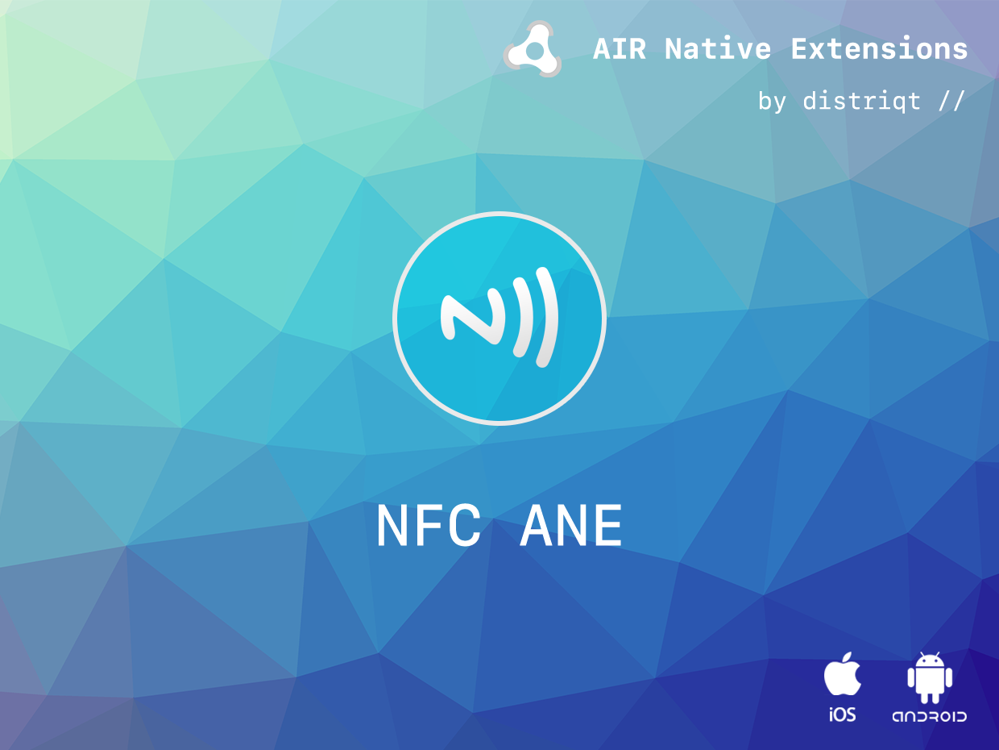
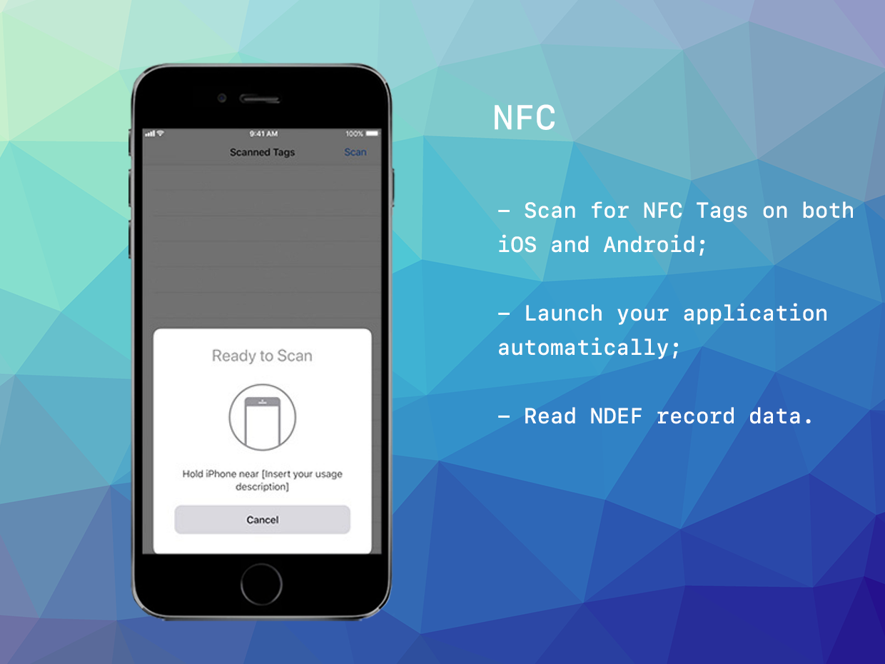

# NFC

The [NFC](https://airnativeextensions.com/extension/com.distriqt.NFC) extension is an AIR Native Extension to use the Near Field Communication (NFC) hardware to scan for NFC Tags and read the record data contained in the tags.

On Android and selected iOS 12+ devices, it can be used to automatically launch your application when a device is in range of a specific formatted tag.  

Additionally it can be used to actively scan for tags in the foreground reading NDEF data when a device is brought close to a tag.

The simple API allows you to quickly integrate NFC scanning in your AIR application in just a few lines of code.


### Features

- Scan for NFC tags on both iOS and Android;
- Launch your application automatically on Android and iOS 12+;
- Read NDEF record data;
- Single API interface - your code works across supported platforms with no modifications;
- Sample project code and ASDocs reference


## Documentation 

The [wiki](https://github.com/distriqt/ANE-NFC/wiki) forms the best source of detailed documentation for the extension along with the [asdocs](https://docs.airnativeextensions.com/asdocs/nfc). 


Quick Example: 

```actionscript
var options:ScanOptions = new ScanOptions();
options.urls.push( "https://airnativeextensions.com" );

NFC.service.addEventListener( NFCEvent.ACTION_NDEF_DISCOVERED, actionDiscoveredHandler );
NFC.service.registerForegroundDispatch( options );

function actionDiscoveredHandler( event:NFCEvent ):void
{
    for each (var message:NdefMessage in event.tag.messages)
    {
        for each (var record:NdefRecord in message.records)
        {
            trace( "\t"+record.toString() + "::"+record.payload.toString() +" url:"+record.url );
        }
    }
}
```

More information here: 

[com.distriqt.NFC](https://airnativeextensions.com/extension/com.distriqt.NFC)


## License

You can purchase a license for using this extension:

[airnativeextensions.com](https://airnativeextensions.com/)

distriqt retains all copyright.





