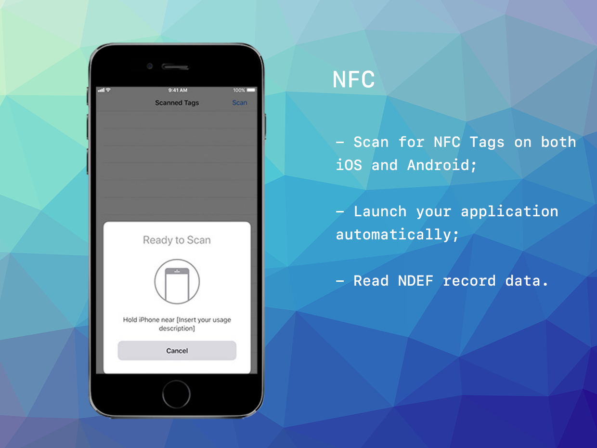

<!--newpage-->


## Contents

- [Overview](#overview)
- [Features](#features)
- [Add the Plugin](#add-the-plugin)
    - [Asset Store](#asset-store)
    - [Manual Installation](#manual-installation)
    - [Import the Plugin](#import-the-plugin)
- [Scanning](#scanning)
    - [Dispatch Mode](#dispatch-mode)
    - [Reader Mode](#reader-mode)
- [Support](#support)


<!--newpage-->


## Overview

The [NFC](https://airnativeextensions.com/extension/com.distriqt.NFC) plugin gives you the ability to use the Near Field Communication (NFC) hardware to scan for NFC Tags and read the record data contained in the tags.

On Android and selected iOS 12+ devices, it can be used to automatically launch your application when a device is in range of a specific formatted tag.  

Additionally it can be used to actively scan for tags in the foreground reading NDEF data when a device is brought close to a tag.

The simple API allows you to quickly integrate NFC scanning in your application in just a few lines of code.


### Features

- Scan for NFC tags on both iOS and Android;
- Launch your application automatically on Android and iOS 12+;
- Read NDEF record data;
- Single API interface - your code works across supported platforms with no modifications;
- Sample project code and ASDocs reference


### Documentation 

The [documentation site](https://docs.airnativeextensions.com/docs/nfc/) forms the best source of detailed documentation for the extension along with the [asdocs](https://docs.airnativeextensions.com/asdocs/nfc). 


Quick Example: 

```csharp 
ScanOptions options = new ScanOptions();
options.urls = new string[] { "https://airnativeextensions.com" };

NFC.Instance.RegisterForegroundDispatch(options);

NFC.Instance.OnNdefDiscovered += Instance_OnNdefDiscovered;

void Instance_OnNdefDiscovered(NFCEvent e)
{
    Debug.Log("Instance_OnNdefDiscovered");
    foreach (NdefMessage message in e.tag.messages)
    {
        foreach (NdefRecord record in message.records)
        {
            Log("  record.payload: " + record.payload);
        }
    }
}
```




<!--newpage-->


## Add the Plugin

First step is always to add the plugin to your development environment. 


### Asset Store

Open the Asset Store in your browser and add the Share plugin to your assets.

Open the Package Manager (Window > Package Manager) in the Unity Editor and select the "My Assets" section. Select the Share plugin, and click Import in the bottom right.


### Manual Installation

In unity you import the package by selecting `Assets / Import Package / Custom Package ...` and then browsing to the unity plugin package file: `com.distriqt.NFC.unitypackage`.


You can manually download the extension from our repository:

- https://github.com/distriqt/ANE-NFC


### Import the Plugin


This will present the import dialog and display all the files for the plugin, make sure all the files are selected.

The plugin will be added to your project and you can now use the plugins functionality in your application.


### Proguard 

If you are using a custom proguard configuration you may need to add the following line to ensure the interface class for the plugin is accessible to unity at runtime.

```
-keep class com.distriqt.extension.nfc.NFCUnityPlugin {*;}
```


<!--newpage-->


## Checking for Support

You can use the `isSupported` flag to determine if this extension is supported on the current platform and device.

This allows you to react to whether the functionality is available on the device and provide an alternative solution if not.


```csharp
if (NFC.isSupported)
{
	// Functionality here
}
```


<!--newpage-->


## Scanning


### Tags

NFC tags come in a wide array of technologies and can also have data written to them in many different ways. Android and iOS has the most support for the NDEF standard, which is defined by the [NFC Forum](https://nfc-forum.org/home).

NDEF data is encapsulated inside a message (`NdefMessage`) that contains one or more records (`NdefRecord`). Each NDEF record must be well-formed according to the specification of the type of record that you want to create.


### Events

Your application will get notified about NFC tag detection events via the `NFCEvent`. This is independent of the mode. The most relevant event is the `NFCEvent.ACTION_NDEF_DISCOVERED` which is dispatched whenever an applicable NDEF NFC tag is detected.

The `NFCEvent` will contain a `Tag` object in the `tag` variable. This contains all the information available about the detected tag, including `NdefMessage`s and `NdefRecord`s contained in the tag. 


```csharp 
NFC.Instance.OnNdefDiscovered += Instance_OnNdefDiscovered;

void Instance_OnNdefDiscovered(NFCEvent e)
{
    Debug.Log("Instance_OnNdefDiscovered");
    foreach (NdefMessage message in e.tag.messages)
    {
        foreach (NdefRecord record in message.records)
        {
            Log("  record.payload: " + record.payload);
        }
    }
}
```

<!--newpage-->

### Modes

There are two modes of scanning for tags, which we reference as:

- ["dispatch mode"](#dispatch-mode), where you are listening for system dispatched events;
- ["reader mode"](#reader-mode), where you are actively reading tags; 

Both are very similar, and will communicate via the same events as above. The main differences being that:

1. reader mode active reads tags and can read a tag multiple times if required, however;
2. reader mode mode interferes with other NFC functionality disabling any peer-to-peer (Android Beam) and card-emulation modes of the NFC adapter on this device;
3. reader mode is only available while your application is active, i.e **only dispatch mode supports background scanning** and launching your application from a tag.

As a general rule, you should use dispatch mode, unless you really need to read a tag multiple times. 

There is also no reason that you can't combine the two, using dispatch mode to register your application for launches from tags and using reader mode to actively scan while your application is in use.


<!--newpage-->

## Dispatch Mode


Dispatch mode relies on the system dispatching data about the tags and responding to these events. Additionally you can use this method to register your application to launch when specific tags are detected by the system.


## Android

### Introduction

Reading NDEF data from an NFC tag is handled with the tag dispatch system, which analyzes discovered NFC tags, appropriately categorizes the data, and starts an application that is interested in the categorized data. An application that wants to handle the scanned NFC tag can declare an intent filter and request to handle the data.

Android-powered devices are usually looking for NFC tags when the screen is unlocked, unless NFC is disabled in the device's Settings menu. When an Android-powered device discovers an NFC tag, the desired behavior is to have the most appropriate activity handle the intent without asking the user what application to use. Because devices scan NFC tags at a very short range, it is likely that making users manually select an activity would force them to move the device away from the tag and break the connection. You should develop your activity to only handle the NFC tags that your activity cares about to prevent the Activity Chooser from appearing.

To help you with this goal, Android provides a special tag dispatch system that analyzes scanned NFC tags, parses them, and tries to locate applications that are interested in the scanned data. It does this by:

- Parsing the NFC tag and figuring out the MIME type or a URI that identifies the data payload in the tag.
- Encapsulating the MIME type or URI and the payload into an intent. These first two steps are described in [How NFC tags are mapped to MIME types and URIs](https://developer.android.com/guide/topics/connectivity/nfc/nfc.html#ndef).
- Starts an activity based on the intent. This is described in [How NFC Tags are Dispatched to Applications](https://developer.android.com/guide/topics/connectivity/nfc/nfc.html#dispatching).


### Application Dispatch

The extension provides an activity that you can use to inform your application about the NFC tag. You should still construct your intent filters in your manifest additions in order to correctly start this activity and launch your application when a tag of interest is detected by Android.

In order to get your application to automatically launch and handle NFC tags without having to be running you need to add the `NFCActionActivity` to your applications Android manifest additions and apply the appropriate filters for your application.

Adding these additions to your manifest can be achieved in several ways.

You can use the `NFCManifest.androidlib` directory in our example to simply merge in the additions to your application. Copy this folder, to your application Assets under `Plugins/Android` and edit the `AndroidManifest.xml` file in the directory to match your requirements. 

Alternatively, if you are using a custom android manifest file then simply add the activity to that file.


Some examples of intent filters are below. 


An NDEF record with a url pointing to `https://airnativeextensions.com`:

```xml
<activity android:name="com.distriqt.extension.nfc.activities.NFCActionActivity" android:theme="@android:style/Theme.Translucent.NoTitleBar" >
    <intent-filter>
        <action android:name="android.nfc.action.NDEF_DISCOVERED"/>
        <category android:name="android.intent.category.DEFAULT"/>
        <data android:scheme="https"
                android:host="airnativeextensions.com"
        />
    </intent-filter>
</application>
```

An NDEF record with a plain text:

```xml
<activity android:name="com.distriqt.extension.nfc.activities.NFCActionActivity" android:theme="@android:style/Theme.Translucent.NoTitleBar" >
    <intent-filter>
        <action android:name="android.nfc.action.NDEF_DISCOVERED"/>
        <category android:name="android.intent.category.DEFAULT"/>
        <data android:mimeType="text/plain" />
    </intent-filter>
</application>
```

>
> Note: You can add multiple `intent-filter` nodes to the `activity` to register for several different tag types.
>

### Foreground Dispatch

If you don't require your application to be launched from a tag, but instead just need active foreground scanning, (reading tags while your application is active in the foreground) you can use the foreground dispatch method.

This involves calling the `RegisterForegroundDispatch()` method to register your application for NFC tag detection at runtime.

Similar to the intent filters above, you need to specify the urls or mimetypes that are relevant to your application. This is done through setting the options in an instance of the `ScanOptions` class.

```csharp 
ScanOptions options = new ScanOptions();
options.urls = new string[] { "https://airnativeextensions.com" };

NFC.Instance.RegisterForegroundDispatch(options);
```


## iOS

### Introduction

iOS NFC reading is available as an active foreground activity from iOS 11 and as a background / system level activity from iOS 12.


### Background Dispatch 

On iPhones that support background tag reading, the system scans for and reads NFC data without requiring users to scan tags using an app. The system displays a pop-up notification each time it reads a new tag. After the user taps the notification, the system delivers the tag data to the appropriate app. If the iPhone is locked, the system prompts the user to unlock the phone before providing the tag data to the app.

>
> **Note**
> iPhone XS and later support background tag reading.
>

After the device scans an NFC tag while in background tag reading mode, the system inspects the tag’s NDEF message for a URI record by looking for an payload object with the following property values:

- typeNameFormat equal to `NFCTypeNameFormatNFCWellKnown`
- type equal to `“U”`

If the NDEF message contains more than one URI record, the system uses the first one. The URI record must contain either a universal link or a supported URL scheme.

>
> You cannot use a custom URL to launch your application, this only works with a predefined set of url schemes mainly for web urls, email, sms etc.
>

For tags that contain universal links, the system presents a notification and then launches (or brings to the foreground) the app associated with the universal link after the user taps the notification. (This will happen if the application is in the foreground as well, ie. notification will appear and you will receive an event if the user taps the notification)


The system sends the NDEF message to the app and the extension receives it. When you call `checkStartupData()` the `NFCEvent` will be dispatched, following the same process as Android. 
If there are no installed apps associated with the universal link, the system opens the link in Safari.


#### Associated Domains 

In order for this to work you must setup a universal link for your application and included the domain in the `com.apple.developer.associated-domains` entitlements section of your iphone additions.

With Unity you will need to add your domain to the `NFCConfig.cs` class in the `Assets/distriqt/NFCUnity/NFC/Editor` folder. Set your domains into the `associatedAppDomains` array, for example:

```csharp 
public static string[] associatedAppDomains = new string[] 
{
    // Add your associated App Domains here
    "applinks:example.com"
};
```

These domains will be applied to the entitlements for your application by our post build scripts.


### Foreground Dispatch

To initiate reading tags on iOS you call the `RegisterForegroundDispatch()` method. There are no filtering methods on iOS so any NDEF formatted tags will be detected and events dispatched to your application, and any options provided (as in the Android case) will be ignored.

```csharp 
NFC.Instance.RegisterForegroundDispatch();
```


While scanning on iOS the following dialog will be presented to your user: 


You can customise the message displayed in this dialog by setting the `message` in the options passed to `RegisterForegroundDispatch()`:

```csharp 
ScanOptions options = new ScanOptions();
options.message = "Hold your device near the item to learn more about it.";

NFC.Instance.RegisterForegroundDispatch(options);
```


<!--newpage-->

## Launch Events

If your application is launched from a tag you need to make sure you follow a few steps to ensure you correctly receive the event.

The extension will store the information about the tag until you call `CheckStartupData()` which will subsequently trigger the event dispatch.
This allows you to ensure you are ready to handle the event before it gets dispatched.

So on first run of your application, setup your handlers for the events and then call `CheckStartupData()`. If the application was launched from a background tag scan then you will immediately receive the appropriate event.


```csharp 
NFC.Instance.OnNdefDiscovered += Instance_OnNdefDiscovered;

NFC.Instance.CheckStartupData();
```


>
> If you do not call `CheckStartupData()` then the launch tag event will not be dispatched. However any background or foreground events from then on will work as normal. This solely covers the case where your application was not running at the time the tag was scanned and your application was launched as a result of the scan.
>


<!--newpage-->

## Reader Mode

Reader mode can be used to active scan for tags and read them multiple times. This is useful in the cases where the data changes on the tag so you may need to re-read it at a later point. 

:::info
It is important to note that using reader mode may interfere with the other NFC operations of the device, disabling any peer-to-peer (Android Beam) and card-emulation modes of the NFC adapter on this device.
:::


### Start scanning

To initiate reader mode call `EnableReaderMode()`:


```csharp 
NFC.Instance.EnableReaderMode();
```


While active any detected tags will dispatch a `OnNdefDiscovered` event:

```csharp 
NFC.Instance.OnNdefDiscovered += Instance_OnNdefDiscovered;

void Instance_OnNdefDiscovered(NFCEvent e)
{
    // ndef tag detected
}
```


### Stop scanning

You should make sure to disable reader mode once you have completed scanning by calling `DisableReaderMode()`:

```csharp 
NFC.Instance.DisableReaderMode();
```


### Restart scanning

If you have scanned a tag and wish to re-read it, you will need to call `Restart()` to invalidate any scanned tags and rescan them:

```csharp 
NFC.Instance.Restart();
```

If a tag scanned previously is still within range then another `OnNdefDiscovered` event will be dispatched with the latest payload data.


<!--newpage-->


## Support

If you need further support integrating or using this extension please feel free to contact us.

- Email: unityplugins@distriqt.com

We have been supporting developers for over 10 years and always happy to help.


<br/>
<br/>
<br/>
<br/>


- [https://distriqt.com](https://distriqt.com)
- [Asset Store](https://assetstore.unity.com/publishers/46451)
- [more native extensions](http://universalextensions.com)
