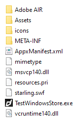

There are several additional things to consider on Windows:

- [Appx Packaging](/docs/tutorials/windows-appx-packaging)
- Additional Dll [Dependencies](#dependencies)
- [AppxManifest additions](#appxmanifest)


## Dependencies

### .Net Framework

This extension requires v4.6 or higher of the .Net framework. This should come preinstalled on any Windows 10 or higher machine so if you are targetting those you should not have to do anything. If however you are targetting older versions of Windows you must ensure .Net v4.6 or higher is installed either manually or as part of an installer.
 

### C++ Redistributable

The native code has a dependency on the Visual C++ 2017 Redistributable package. This package contains code that is required to run code developed using C++ in Visual Studio and is very common amongst Windows applications.

There are two ways to ensure this is available to your application:

- Create an installer that includes the redistributable installer;
- Package the required DLL files from the redistributable with your application;

The first is the suggested method. Installing the redistributable via an installer allows it to be put into the windows update process, allowing bug fixes and security updates to be handled automatically.

The second method is only advised if you need a complete standalone application, where you don't (or cannot) use an installation process. This requires you to package DLLs from the redistributable with your application. 


### Creating an Installer

There are many methods to create application installers and many tutorials available. We suggest you find a method suitable to your environment and application and utilise the tutorials online. 

Some methods include:

- [Inno Setup](http://www.jrsoftware.org/isinfo.php)
- [Wix](http://wixtoolset.org/)
    - [WixEdit](http://wixedit.sourceforge.net)


Tutorials:

- [Generating a Windows installer](http://www.adobe.com/devnet/air/articles/customize-setup-for-AIR-app-with-captive-runtime.html)


You need to include the x86 c++ 2017 redistributable in the installer, there are many examples and documentation online to achieve this.


### Packaging DLLs

Packaging the DLLs into your application involves copying the DLLs specified below into your application root and including in your application package.

The best option is to install Visual Studio 2017 and locate the `Program Files[ (x86)]\Microsoft Visual Studio\2017\edition\VC\Redist\MSVC\lib-version` folder, eg: `C:\Program Files (x86)\Microsoft Visual Studio\2017\Community\VC\Redist\MSVC\14.16.27012\x86\Microsoft.VC141.CRT`

Alternatively, download and install the x86 redistributable from the [Microsoft website](https://support.microsoft.com/en-us/help/2977003/the-latest-supported-visual-c-downloads). This should install the DLLs into `C:\Windows\System32` folder. 


Open the folder and copy the following DLLs to your application:

- `msvcp140.dll`
- `vcruntime140.dll`

If you are having issues locating these files, feel free to contact us for help.




> 
> You should ensure you are allowed to package these files as per the Microsoft Software License terms but generally these are safe to redistribute subject to the license terms. More information here: [Redistributing Visual C++ Files](https://docs.microsoft.com/en-us/cpp/windows/redistributing-visual-cpp-files)
>
> You should get legal advice if you are unsure. 
>


## AppxManifest

The windows notifications UWP support requires a couple of additions to your AppxManifest in order to receive notification events when the user interacts with the notification.

You will need to use the "Sign Separately" method to package your `appx` as described [here](/docs/tutorials/windows-appx-packaging-method1). 

>
> **If you don't make these changes then your application will not receive all the notification events.**
>

During the "Update Content" step you will need to edit the `AppxManifest.xml` file contained in the pacakged files directory and add the following:

- Declaration for `xmlns:com`
- Declaration for `xmlns:desktop`
- In the `IgnorableNamespaces` attribute, `com` and `desktop`
- `com:Extension` for the COM activator
- `desktop:Extension` for `windows.toastNotificationActivation` to declare your toast activator


```xml
<Package
  ...
  xmlns:com="http://schemas.microsoft.com/appx/manifest/com/windows10"
  xmlns:desktop="http://schemas.microsoft.com/appx/manifest/desktop/windows10"
  IgnorableNamespaces="... com desktop">
  ...
  <Applications>
    <Application>
      ...
      <Extensions>

        <!--Register COM CLSID LocalServer32 registry key-->
        <com:Extension Category="windows.comServer">
          <com:ComServer>
            <com:ExeServer Executable="YOURAPPLICATION.exe" Arguments="-ToastActivated" DisplayName="Toast activator">
              <com:Class Id="4db090a5-b5c9-4cbf-97a6-dd6a431f8749" DisplayName="Toast activator"/>
            </com:ExeServer>
          </com:ComServer>
        </com:Extension>

        <!--Specify which CLSID to activate when toast clicked-->
        <desktop:Extension Category="windows.toastNotificationActivation">
          <desktop:ToastNotificationActivation ToastActivatorCLSID="4db090a5-b5c9-4cbf-97a6-dd6a431f8749" /> 
        </desktop:Extension>

      </Extensions>
    </Application>
  </Applications>
 </Package>
```


You also need to replace `YOURAPPLICATION` with the name of the `Executable` attribute in the `Application` node.

For example, this is the entire `AppxManifest.xml` for the distriqt test application:


```xml
<?xml version="1.0" encoding="utf-8"?>
<Package
  xmlns="http://schemas.microsoft.com/appx/manifest/foundation/windows10" 
  xmlns:uap="http://schemas.microsoft.com/appx/manifest/uap/windows10" 
  xmlns:uap2="http://schemas.microsoft.com/appx/manifest/uap/windows10/2" 
  xmlns:uap3="http://schemas.microsoft.com/appx/manifest/uap/windows10/3" 
  xmlns:uap4="http://schemas.microsoft.com/appx/manifest/uap/windows10/4" 
  xmlns:rescap="http://schemas.microsoft.com/appx/manifest/foundation/windows10/restrictedcapabilities" 
  xmlns:rescap3="http://schemas.microsoft.com/appx/manifest/foundation/windows10/restrictedcapabilities/3" 
  xmlns:desktop="http://schemas.microsoft.com/appx/manifest/desktop/windows10" 
  xmlns:desktop2="http://schemas.microsoft.com/appx/manifest/desktop/windows10/2" 
  xmlns:desktop3="http://schemas.microsoft.com/appx/manifest/desktop/windows10/3" 
  xmlns:com="http://schemas.microsoft.com/appx/manifest/com/windows10" 
  xmlns:wincap3="http://schemas.microsoft.com/appx/manifest/foundation/windows10/windowscapabilities/3" 
  IgnorableNamespaces="uap4 wincap3 rescap3 desktop desktop2 desktop3 com">
  <Identity Name="distriqt.airnativeextensions" ProcessorArchitecture="x86" Publisher="CN=38CAD93E-B1A7-480F-B65D-3545798BA205" Version="1.0.0.0" />
  <Properties>
    <DisplayName>distriqt.airnativeextensions</DisplayName>
    <PublisherDisplayName>distriqt</PublisherDisplayName>
    <Logo>Assets\StoreLogo.png</Logo>
  </Properties>
  <Resources>
    <Resource Language="en-us" />
    <Resource uap:Scale="100" />
    <Resource uap:Scale="125" />
    <Resource uap:Scale="150" />
    <Resource uap:Scale="200" />
    <Resource uap:Scale="400" />
  </Resources>
  <Dependencies>
    <TargetDeviceFamily Name="Windows.Desktop" MinVersion="10.0.14393.0" MaxVersionTested="10.0.16299.15" />
  </Dependencies>
  <Capabilities>
    <rescap:Capability Name="runFullTrust" />
    <Capability Name="internetClient" />
  </Capabilities>
  <Applications>
    <Application Id="distriqt.airnativeextensions" Executable="testnotifications.exe" EntryPoint="Windows.FullTrustApplication">
      <uap:VisualElements DisplayName="distriqt.airnativeextensions" Description="distriqt.airnativeextensions" BackgroundColor="transparent" Square150x150Logo="Assets\Square150x150Logo.png" Square44x44Logo="Assets\Square44x44Logo.png">
        <uap:DefaultTile Wide310x150Logo="Assets\Wide310x150Logo.png" Square310x310Logo="Assets\Square310x310Logo.png" Square71x71Logo="Assets\Square71x71Logo.png">
          <uap:ShowNameOnTiles>
            <uap:ShowOn Tile="square150x150Logo" />
            <uap:ShowOn Tile="wide310x150Logo" />
            <uap:ShowOn Tile="square310x310Logo" />
          </uap:ShowNameOnTiles>
        </uap:DefaultTile>
      </uap:VisualElements>

      <Extensions>
        <!--Register COM CLSID LocalServer32 registry key-->
        <com:Extension Category="windows.comServer">
          <com:ComServer>
            <com:ExeServer Executable="testnotifications.exe" Arguments="-ToastActivated" DisplayName="Toast activator">
              <com:Class Id="aa28441a-fba8-45dc-887e-149495769502" DisplayName="Toast activator"/>
            </com:ExeServer>
          </com:ComServer>
        </com:Extension>

        <!--Specify which CLSID to activate when toast clicked-->
        <desktop:Extension Category="windows.toastNotificationActivation">
          <desktop:ToastNotificationActivation ToastActivatorCLSID="aa28441a-fba8-45dc-887e-149495769502" /> 
        </desktop:Extension>
        
      </Extensions>
    </Application>
  </Applications>
</Package>
```


