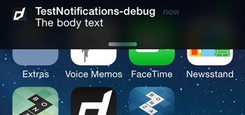

This extension allows access to native local notifications, as opposed to push notifications. 
These notifications are displayed locally in the notification area of the device, generally 
the pull down area at the top of the device.

Displaying a notification is best achieved by using a `NotificationBuilder` to create an instance 
of a `Notification` and then pass that to the `notify` function.


```actionscript
Notifications.service.notify(
	new NotificationBuilder()
		.setAlert( "A simple alert" )
		.setTitle( "A simple notification" )
		.setBody( "The body of the notification" )
		.build()
);
```


## Identifier

You can set an `id` on a notification and use this in certain circumstances to update or cancel
a particular notification.

```actionscript
var id:int = 1;

Notifications.service.notify(
	new NotificationBuilder()
		.setId( id )
		.setAlert( "A simple alert" )
		.setTitle( "A simple notification" )
		.setBody( "The body of the notification" )
		.build()
);
```

:::note
On Android, if a notification with the same `id` has already been posted by your application 
and has not yet been canceled, it will be replaced by the updated information. 
 
On iOS < 10, a new notification will always be displayed. On iOS 10 the old notification will be 
replaced with the new notification.
:::


## Alert, Title, Body, What goes where?

There are 3 textural fields that you set on a notification and you are required to at least set 
an alert or title and a body. This is to make sure you satisfy the minimum requirements on all 
platforms.

The `alert` is used in places where a small text field will the displayed, such as in the notification
bar (ticker text) on older Android versions. 
If you do not supply a value for `alert` then the value for `title` will be assigned.


The `title` is a heading label used on the display of the notification, generally it is at the top 
of the notification and displayed in a single line of bold text. 
If you do not supply a value for `title` then the value for `alert` will be assigned.


The `body` is the main part of the notification. It is your main notification message. At a minimum 
this text will be displayed. On older versions of iOS this will be the only field displayed.


The following examples are all constructed with the same code, a simple notification with all 
text fields and the icon:

```actionscript
Notifications.service.notify(
	new NotificationBuilder()
		.setAlert( "The alert text" )
		.setTitle( "The title text" )
		.setBody( "The body text" )
		.setIcon( "ic_stat_distriqt" )
		.build()
);
```


| OS        | Position 							| Example                            |
| --------- | --------------------------------- | ---------------------------------- |
| Android 4 | Notification Center 				|  |
| Android 4 | Ticker Text 						|  |
| Android 7 | Lock screen 						|  |
| Android 7 | Notification Center 				|  |
| Android 7 | Ticker (no text shown just icon) 	|  |
| iOS 7 | Notification Center 					|  |
| iOS 7 | Top overlay 							|  |
| iOS 9 | Notification Center 					|  |
| iOS 9 | Top overlay  							|  |
| iOS 10 | Full view 							|  |
| iOS 10 | Notification Center 					|  |
| iOS 10 | Top overlay 							|  |


## Payload

You should set a payload on your notification that will get returned in any of the notification events. 
This will help you identify the notification and correctly handle the notification. The payload can be
any string, but we suggest using a JSON encoded object as shown in the example below.

```actionscript
var id:int = 1;
var payload:Object = { id: id, type: "payload" }; // An example payload

Notifications.service.notify(
	new NotificationBuilder()
		.setId( id )
		.setAlert( "A simple alert" )
		.setTitle( "A simple notification" )
		.setBody( "The body of the notification" )
		.setPayload( JSON.stringify(payload) )
		.build()
);
```

The payload is return in the notification events, more on this in the [Receiving Notifications](receiving-notifications.md) section.


