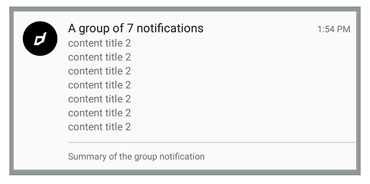

# Notifications

The [Notifications](https://airnativeextensions.com/extension/com.distriqt.Notifications) extension enables the use of Local Notifications 
on your device giving you the ability to easily engage your users on their device without having to setup remote notification servers.

The simple API will have you up and running with notifications in just a few lines of code. Identical code base can be used 
across all platforms without any platfrom specific code, allowing you to develop once and deploy everywhere!

A complete getting started guide will help you through the integration. Also we have detailed AS docs available, and a complete example application.

Getting started with local notifications is quick and easy!

---

This extension allows you to create useful notifications for your users increasing user engagement and bringing them back to your application.

You can give users the ability to quickly interact with your application through actions, allowing them to do common tasks quickly.

As with all our extensions you get access to a year of support and updates as we are continually improving and updating the extensions for OS updates and feature requests.

### Features

- Custom icons;
- Stacking (group) notifications;

- Expanded view notifications: image, text and inbox;

- Actions;

This Wiki forms the best source of detailed documentation for the extension along with the [asdocs](https://docs.airnativeextensions.com/asdocs/notifications). 

