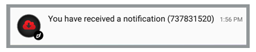

Notification icons refer to the image displayed in the notification center alongside the title, message and any other content associated with the notification.

At a minimum all notifications consist of an icon and body text. 

## iOS 

On iOS the icon is always your application icon. You do not need to do anything additional, just ensure your application has all the required application icon sizes.

## Android

On Android the icon is provided through Android resources and you cannot use your AIR application icon (except on much older versions of Android). This icon must be white and transparent to fit with the Android design guidelines, and will be used in various positions within the Android UI.

By default our extension will use a "bell" icon if you don't provide an icon resources yourself. In some circumstances you may see a white square. This is the Android attempt at using your application icon as the notification icon and is converting your icon based on whether a pixel is transparent or white.

To add your own icon you will need to create your custom resources and then package them into an ANE in your AIR application. To generate these resources goto the Android Asset Studio [Notification Icon Generator](https://romannurik.github.io/AndroidAssetStudio/icons-notification.html#source.space.trim=1&source.space.pad=0&name=ic_stat_distriqt_default) and upload your source image. 

**Take note of the name of the icon.** You will be using this name to reference this icon in notifications. Create as many different icons as you will require. These icons can be used for notification actions as well as for the main notification icon. You can use different icons for different notifications if you wish.

*Notification Bar with custom resource*

*Custom resource icon in simple notification*

To add your custom resources see the AIR SDK documentation on [packaging custom resources](https://airsdk.dev/docs/tutorials/platform/android/custom-resources). 

Alternatively you can create your own custom resources ANE by using the opensource script we have created:

- [Custom Resources](https://github.com/distriqt/ANE-CustomResources)

If you have troubles running this script simply send us your resources and we will create the extension for you, although we do recommend using the more modern AIR SDK `resdir` approach.

### Special Resources

We suggest you supply a default icon resource named `ic_stat_distriqt_default`. This icon will be used in situations where you don't supply an icon name for a notification. This will ensure all your notifications are correctly displayed.

If you don't supply a default icon, then you must ensure all your notifications have an icon property or you will get the default "bell" icon.

### Order of Display

Our extension uses the following order of preference when displaying an icon. If any aren't available or the version of Android doesn't match then the next in the list is attempted.

- custom icon property 
- default icon (`ic_stat_distriqt_default`)
- bell icon on newer Android versions (Lollipop or newer)
- application icon on older Android versions

### Large Icons 

If you wish to use colour or a more detailed image for your notification you can use the "large icon" to display any image in place of the notification icon in the notification center. Your notification icon will still be displayed in the bar and overlayed on top of the large icon. 

For example, in the image below we have used a red cloud in a circle as the large icon and you will see the distriqt logo as our notification icon.

This icon is **not** a resource but an image either:
- packaged with your application and referenced relative to the application root, eg `assets/icons/notification.png`;
- a native path to a file `/path/to/file/notification.png`;
- a url to a publicly accessible image (no authentication etc). 

We don't suggest using a url unless absolutely neccessary, as a user may not get the correct notification if the image fails to download correctly or the device is offline for any reason. 

