## Icons

At a minimum all notifications consist of an icon, a title, and a body text. On iOS and Windows the icon is your application icon. 
On Android the icon must be customised by adding some resources to your application through a custom ANE. 


- Read more here: [Icons](notification-icons)


### Large Icon

In addition you can specify a "large icon". This will be used in places where the system can display a larger icon, mainly in the pull down notification center.

| Android | Windows |
| --- | --- |
| 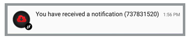 | 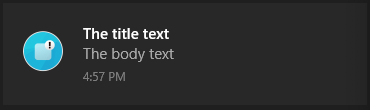 |
| Here the small d (distriqt logo) is the icon (resource), the red cloud in the black circle is the large icon | Windows the large icon completely replaces the application icon |

Large icons can be an asset you package with your application or an image on a public url. It is **not** a resource on Android. We don't suggest using a url unless absolutely neccessary, as a user may not get notifications if the image fails to download correctly or the device is offline for any reason. It can also delay the notification while the image is downloaded.

```actionscript
Notifications.service.notify(
	new NotificationBuilder()
		.setId(id)
		.setIcon( "ic_stat_distriqt" )
		.setAlert( "Notification with group" )
		.setTitle( "Notification with group" )
		.setBody( "The body of the notification" )

		.setLargeIcon( "assets/notifications/icons/largeIcon.png" )

		.build()
);
```

#### Support:
- Android 
- Windows


## Actions

iOS, Android and Windows notifications support "actions". Actions are optional buttons that allow users to handle the most common tasks for a particular notification from within the notification area.


| Android | iOS | Windows |
| --- | --- | --- |
|  | 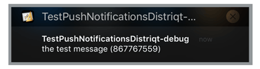 | 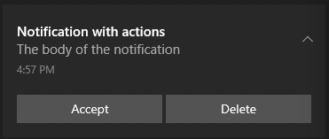 |


Good candidates for actions on notifications are actions that:

- Are essential, frequent, and typical for the content type you're displaying
- Allow the user to accomplish tasks quickly

Avoid actions that are:

- Ambiguous
- The same as the default action of the notification (such as "Read" or "Open")

To add actions to your notification, add a `Category` to your `Service` when you call setup and then pass the name of that category to the notification. 

For example, in the images above we have two actions, "Accept" and "Delete". Firstly we create a category on our service, here we are creating the "INVITE_CATEGORY" and adding the two actions to the category:

```actionscript
var service:Service = new Service();
	service.enableNotificationsWhenActive = true;
	service.categories.push( 
		new CategoryBuilder()
			.setIdentifier( "INVITE_CATEGORY" )
			.addAction( 
				new ActionBuilder()
					.setTitle( "Accept" )
					.setIdentifier( "ACCEPT_IDENTIFIER" )
					.setIcon( "ic_stat_distriqt_default" )
					.build()
			)
			.addAction( 
				new ActionBuilder()
					.setTitle( "Delete" )
					.setDestructive( true )
					.setIdentifier( "DELETE_IDENTIFIER" )
					.setIcon( "ic_stat_distriqt_default" )
					.build()
			)
			.build()
	);
```

Then when we create a notification we specify the "INVITE_CATEGORY" as below:

```actionscript
Notifications.service.notify(
	new NotificationBuilder()
		.setId(id)
		.setAlert( "Notification with actions" )
		.setTitle( "Notification with actions" )
		.setBody( "The body of the notification" )
		.setCategory( "INVITE_CATEGORY" )
		.build()
);
```


#### Support: 
- Android v5.0 + 
- iOS
- Windows 10


## Expanded Layouts

Android notifications can have two states, an expanded layout and a contracted state. The expanded layout 
provides the user with more context, and—in some cases—may allow the user to read a message in its entirety. 
The user can pinch-zoom or perform a single-finger glide to toggle between compact and expanded layouts.

iOS 10 has also introduced some expanded layout types. This is currently limited to the image layout.

The expanded layouts are governed by the `NotificationStyle` set on the notification. There are three expanded 
layout templates (text, inbox and image) as shown in the following images.

### Text expanded layout

| Android | Windows |
| --- | --- |
| 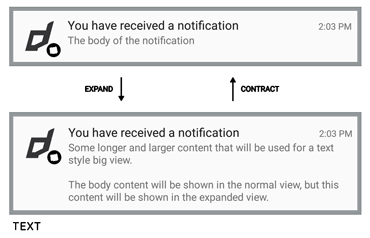 | |


```actionscript
Notifications.service.notify(
	new NotificationBuilder()
		.setId(id)
		.setAlert( "Notification with expanded text" )
		.setTitle( "Notification with expanded text" )
		.setBody( "The body of the notification" )
		.setStyle( 
			new NotificationStyleBuilder()
				.setType( NotificationStyle.TYPE_TEXT )
				.setText( "Some longer and larger content that will be used for a text style big view.\n\nThe body content will be shown in the normal view, but this content will be shown in the expanded view. " )
				.build()
		)
	.build()
);
```

#### Support: 
- Android v5.0 + 
- Windows 10


### Inbox expanded layout

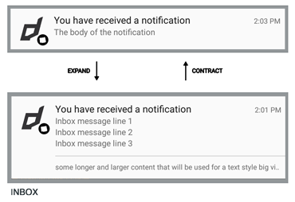


```actionscript
Notifications.service.notify(
	new NotificationBuilder()
		.setId(id)
		.setAlert( "Notification with expanded text" )
		.setTitle( "Notification with expanded text" )
		.setBody( "The body of the notification" )
		.setStyle( 
			new NotificationStyleBuilder()
				.setType( NotificationStyle.TYPE_INBOX )
				.setText( "Summary text" )
				.addLine( "Inbox message line 1" )
				.addLine( "Inbox message line 2" )
				.build()
		)
	.build()
);
```

#### Support: 
- Android v5.0 + 


### Image expanded layout

| Android | iOS | Windows |
| --- | --- | --- |
| 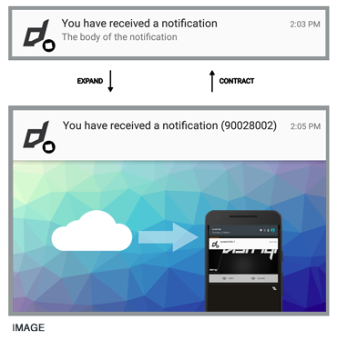 | 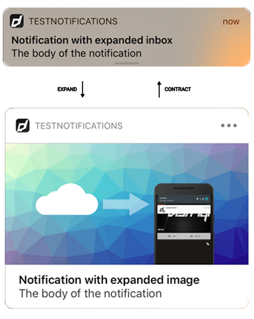 | 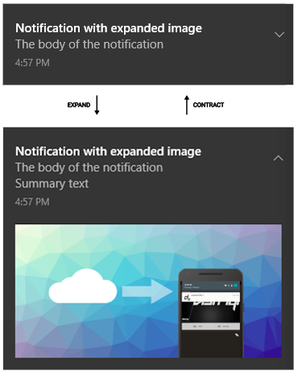 |


```actionscript
Notifications.service.notify(
	new NotificationBuilder()
		.setId(id)
		.setAlert( "Notification with expanded text" )
		.setTitle( "Notification with expanded text" )
		.setBody( "The body of the notification" )
		.setStyle( 
			new NotificationStyleBuilder()
				.setType( NotificationStyle.TYPE_IMAGE )
				.setText( "Summary text" )
				.setImage( "assets/notifications/bigImage3.png" )
				.build()
		)
	.build()
);
```

#### Support: 
- Android v5.0 + 
- iOS v10 +
- Windows 10


## Grouped Notifications

If a notification of a certain type is already pending when your app tries to send a new notification 
of the same type, the notifications will be combined into a single summary notification for the app.

This extension will automatically handle grouping notifications when you provide particular information 
in the notification builder. You can have many notification types and group them together separately.
Each notification is listed as a line in the group showing a summary of the notifications contained in the group.

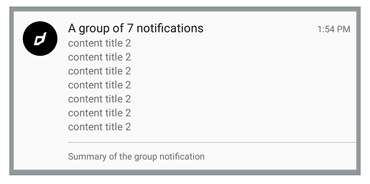

You can have many groups of notifications, the important linking feature is the `groupKey` set by 
calling the `setGroupKey` on your notification builder. The group notification also has a title,
a summary text and different icon from the single notification.

```actionscript
Notifications.service.notify(
	new NotificationBuilder()
		.setId(id)
		.setIcon( "ic_stat_distriqt_default" )
		.setAlert( "Notification with actions" )
		.setTitle( "Notification with actions" )
		.setBody( "The body of the notification" )
		.setGroupKey( "someGroup" )
		.setGroupIcon( "ic_stat_distriqt_default" )
		.setGroupTitle( "Group notification title" )
		.setGroupSummary( "Group notification summary" )
		.build()
);
```

When you call the above, the first notification will be displayed as normal, however the second 
will trigger the grouping of the notifications into a stack as shown in the image above. 

The notifications are grouped by the `groupKey` and the summary notification will use the 
`groupTitle` as the main title and show a line for each notification. The `groupSummary` text 
will be shown at the bottom of the notification and you can also specify a different icon to 
use for the summary notification.

The group title and summary can have the number of notifications displayed inserted into them
by using a `%d` in your string, eg to match the title shown above:

```actionscript
		.setGroupTitle( "A group of %d notifications" )
```

#### Support: 
- Android v5.0 + 
- iOS v10 +


### iOS 10

iOS 10 introduced some ability to group notifications. This is handled automatically by the 
operating system grouping them by a "thread identifier" which we will set to the group key
provided in your notification.


## Background Image

You can add a background or hero image to your notification by calling `setBackgroundImage()` and specifying an image path or url.

| Android | Windows |
| --- | --- |
|  | 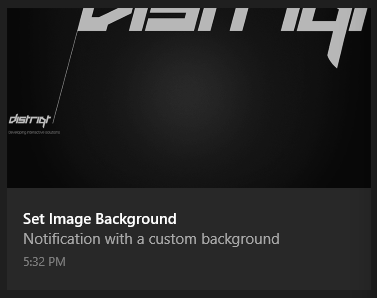 |


On Android in order to cover all notification sizes this image should be sized `2600x256` (91.4:9) and this will be aligned top left. 

On Windows the image is used as the "hero" image for the notification. This hero image was new in the Windows Anniversary Update. The image dimensions are `364x180` pixels at 100% scaling.

To specify the image to use for the background of the image pass the path or url to the `setBackgroundImage` method of your `NotificationBuilder`:

```actionscript
Notifications.service.notify(
	new NotificationBuilder()
		.setId(id)
		.setIcon( "ic_stat_distriqt_default" )
		.setAlert( "Notification with actions" )
		.setTitle( "Notification with actions" )
		.setBody( "The body of the notification" )
	
		.setBackgroundImage( "assets/notifications/background.png" )

		.build()
);
```

The parameter for the `setBackgroundImage` method should be a path to the packaged image asset relative to your application root or a URL to a public image. URL's are discouraged due to the network access and download required.

>
> Note: On Android setting the background image of a notification will remove the notification icon and large icon. If you need to display these you should add them to your image.
>

#### Text Colour

On Android, you can control the text colour of the title and body text by using the `setBackgroundImageTextColour` function. This allows you to match the colour of the text to your image:

```actionscript
		.setBackgroundImage( "assets/notifications/background.png" )
		.setBackgroundImageTextColour( "#FF0000" )
```

Colour supported formats are:
- "#RRGGBB"
- "#AARRGGBB"

The following names are also accepted: red, blue, green, black, white, gray, cyan, magenta, yellow, lightgray, darkgray, grey, lightgrey, darkgrey, aqua, fuchsia, lime, maroon, navy, olive, purple, silver, and teal.

#### Support: 
- Android v5.0+
- Windows Anniversary Update 


