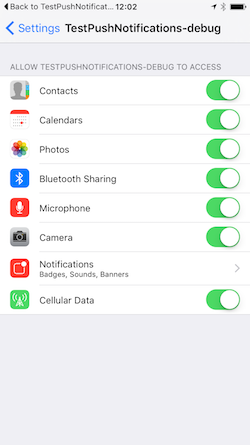

After setting up your service you should check whether the device has given your application authorisation to register and display notifications. 
You can check the value of `hasAuthorisation()` which will return `true` if the device is authorised and `false` otherwise. 
However the better method is to use the `authorisationStatus()` to determine the status, this will allow you to determine if your application has authorisation, has been denied or is not yet determined (i.e. the user has not yet been asked to grant authorisation).

On iOS you will only be able to display the authorisation request dialog once!  Hence it is very important that you inform your users why they should grant authorisation before requesting authorisation. 

To request authorisation you call `requestAuthorisation()`. This function will trigger the native dialog asking the user for authorisation.

```actionscript
Notifications.service.addEventListener( AuthorisationEvent.CHANGED, authorisationChangedHandler );

switch (Notifications.service.authorisationStatus())
{
	case AuthorisationStatus.AUTHORISED:
		// This device has been authorised.
		// You can register this device and expect:
		//	- registration success/failed event, and; 
		// 	- notifications to be displayed
		Notifications.service.register();
		break;
		
	case AuthorisationStatus.SHOULD_EXPLAIN:
	case AuthorisationStatus.NOT_DETERMINED:
		// You are yet to ask for authorisation or need to further explain
		// At this point you should consider your strategy to get your user to authorise
		// notifications by explaining what the application will provide
		Notifications.service.requestAuthorisation();
		break;
		
	case AuthorisationStatus.DENIED:
		// The user has disabled notifications
		// Advise your user of the lack of notifications as you see fit

		// For example: You can redirect to the settings page on iOS
		if (Notifications.service.canOpenDeviceSettings)
		{
			Notifications.service.openDeviceSettings();
		}
		break;
}

function authorisationChangedHandler( event:AuthorisationEvent ):void
{
	// Check the authorisation state again (as above)
}
```

You should respect the `SHOULD_EXPLAIN` status by displaying additional information 
to your user about why you require this functionality.


### Device settings

You can redirect the user to the device settings in order to get them to change the permission to access notifications.

This can only be performed on some platforms and you should firstly check if it is supported before calling.

```actionscript
if (Notifications.service.canOpenDeviceSettings)
{
	Notifications.service.openDeviceSettings();
}
```



