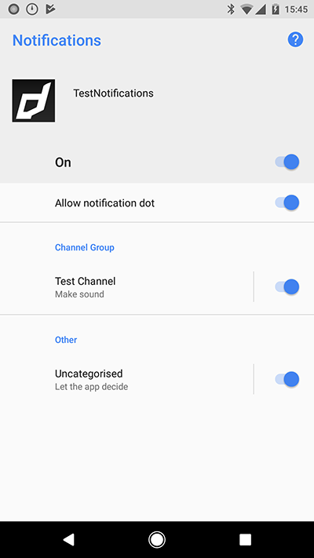

When you are setting up your Service there are a few additional options you can set to use some of the 
advanced features of the services.


### Categories and Actions

The main feature you will probably want to configure here are your notification categories and actions. 
These represent the quick actions that a user can take on a notification.

A notification can be given a category. The system will then apply that category to the notification. 
A category contains a series of actions which will be displayed when the notification is interacted with. 
Each category and action must be given a unique identifier so you can process them accordingly in your code. 
Additionally each action must be given a title.


```actionscript
var service:Service = new Service();

service.categories.push( 
	new CategoryBuilder()
		.setIdentifier( "INVITE_CATEGORY" )
		.addAction( 
			new ActionBuilder()
				.setTitle( "Accept" )
				.setIdentifier( "ACCEPT_IDENTIFIER" )
				.setIcon( "ic_stat_distriqt_default" )
				.build()
		)
		.addAction( 
			new ActionBuilder()
				.setTitle( "Delete" )
				.setDestructive( true )
				.setIdentifier( "DELETE_IDENTIFIER" )
				.build()
		)
		.build()
);

Notifications.service.setup( service );
```

:::note
`setDestructive()` is only supported on some platforms. 
:::

### Actions

On Android you have two additional options that you can use to control in more detail
the operation when the user interacts with an action.

If you wish to launch your application when an action is clicked you can use 
`setWillLaunchApplication` and set it to `true`.

```actionscript
...
			new ActionBuilder()
				.setTitle( "Accept" )
				.setIdentifier( "ACCEPT_IDENTIFIER" )
				.setWillLaunchApplication( true )
				.build()
...
```

When a user clicks this action, it will launch your application and bring it to the foreground.


If you wish for your notification to be cancelled (i.e. removed from the notification center)
you can use `setShouldCancelOnAction` and pass `true`.


```actionscript
...
			new ActionBuilder()
				.setTitle( "Accept" )
				.setIdentifier( "ACCEPT_IDENTIFIER" )
				.setShouldCancelOnAction( true )
				.build()
...
```

When a user clicks this action, the notification will be cancelled and removed from the notification area.


### Notifications When Active

On Android and on iOS v10+ you can enable notifications while your application is active. 
This will show a notification to the user, even if they are currently using the application.

The default is `false`, i.e. not show a notification and your application would only receive
the notification event.

```actionscript
service.enableNotificationsWhenActive = true;
```


### Channels


New to Android `8.0` (API level 26) is the concept of a notification channel. 

:::info
Notification channels provide a unified system to help users manage notifications. When you target Android 8.0 (API level 26), you must implement one or more notification channels to display notifications to your users. If you don't target Android 8.0 (API level 26) but your app is used on devices running Android 8.0 (API level 26), your app behaves the same as it would on devices running Android 7.1 (API level 25) or lower.
:::

:::note
The user interface refers to notification channels as notification categories.
:::

You can create an instance of a `Channel` for each distinct type of notification you need to send. You can also create notification channels to reflect choices made by users of your app. For example, you may set up separate notification channels for each conversation group created by a user in a messaging app.

Users can manage most of the settings associated with notifications using a consistent system UI. All notifications posted to the same notification channel have the same behaviour. When a user modifies the behaviour for any of the following characteristics, it applies to the notification channel:

- Importance
- Sound
- Lights
- Vibration
- Show on lockscreen
- Override do not disturb



Users can visit Settings, or long-press a notification to change these behaviors, or even block a notification channel at any time. You can't programmatically modify the behaviour of a notification channel after it's created and submitted to the notification manager; the user is in charge of those settings after creation. You can however rename a notification channel or update its description after creation.


#### Creating Channels

To create channels you add them to your `Service` definition. A `Service.channels` is an array of `Channel` objects that you should create when passing your service to the `setup` function.

You should use the `ChannelBuilder` to create a `Channel` object.

```actionscript
var service:Service = new Service();

// Setup other service related properties

service.channels.push(
    new ChannelBuilder()
        .setId( "example_channel" )
        .setName( "Example Channel" )
        .build()
);
```

:::caution
You must add at least one channel.
:::


