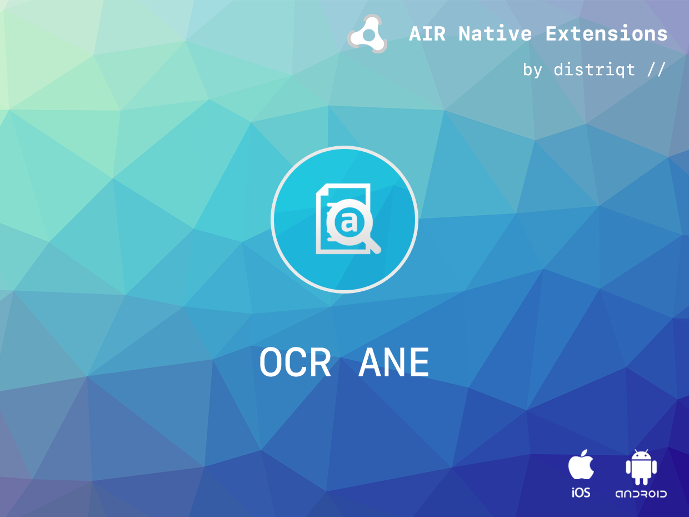
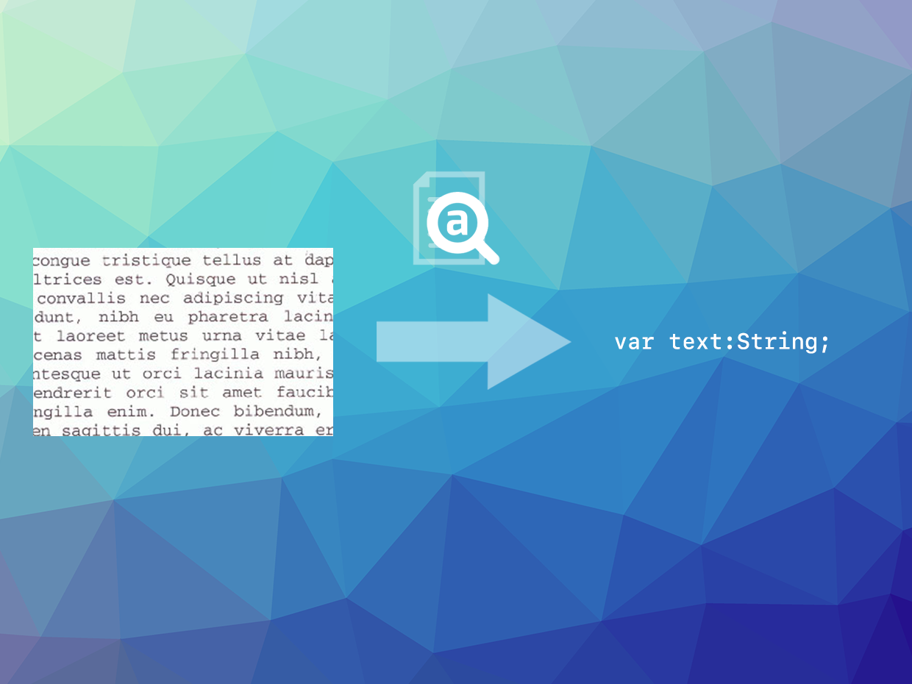

# OCR

The [OCR](https://airnativeextensions.com/extension/com.distriqt.OCR) extension gives you the ability to perform optical character recognition (https://en.wikipedia.org/wiki/Optical_character_recognition) on an image.

It is built upon the powerful [Tesseract Open Source OCR Engine](https://github.com/tesseract-ocr/tesseract). 

The simple API allows you to quickly scan an image for textural content, using the powerful Tesseract framework, in just a few lines of code. 


### Features:

- OCR using the Tesseract framework;
- Recognise text from image BitmapData;
- Set languages;
- Set whitelist characters;
- Single API interface - your code works across supported platforms with no modifications;
- Sample project code and ASDocs reference;


## Documentation

The [wiki](https://github.com/distriqt/ANE-OCR/wiki) forms the best source of detailed documentation for the extension along with the [asdocs](http://docs.airnativeextensions.com/ocr/docs). 

Quick Example: 

```actionscript
OCR.service.recognise( image );
```

More information here: 

https://airnativeextensions.com/extension/com.distriqt.OCR


## License

You can purchase a license for using this extension:

https://airnativeextensions.com

distriqt retains all copyright.


