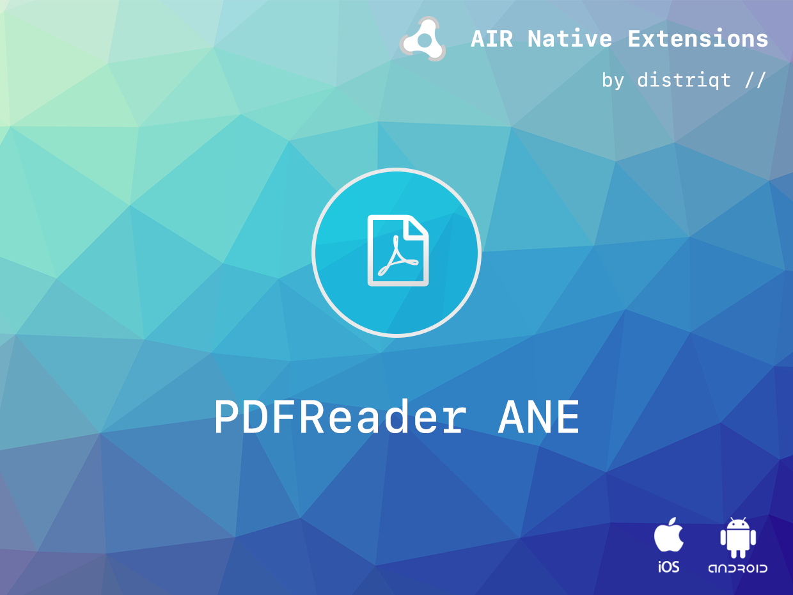

# PDFReader

The [PDFReader](https://airnativeextensions.com/extension/com.distriqt.PDFReader) extension 
gives you the ability to display PDF files internally to your application. This allows you 
to easy display user manuals, terms and conditions, privacy policies and other such documents 
easily in your application without having show the file in another application and potentially 
losing your user.

The simple API allows you to quickly integrate PDF views in your AIR application. 
Identical code base can be used across supported platforms allowing you to concentrate on 
your application and not device specifics.

We provide complete guides to get you up and running with asset selection quickly and easily.

### Features

- Show a PDF View in your application;
- Control the position and size of the view;
- Automatically download PDFs from a server and display locally;
- Intercept links on iOS
- User can email PDF
- Sample project code and ASDocs reference

As with all our extensions you get access to a year of support and updates as we are continually 
improving and updating the extensions for OS updates and feature requests.


## Documentation

The [wiki](https://github.com/distriqt/ANE-Location/wiki) forms the best source of detailed documentation for the extension along with the [asdocs](https://docs.airnativeextensions.com/asdocs/pdfreader). 


Quick Example:

```actionscript
PDFReader.service.showPDF( File.applicationDirectory.nativePath + File.separator + "TestDocument.pdf" );
```

More information here: 

[com.distriqt.PDFReader](https://airnativeextensions.com/extension/com.distriqt.PDFReader)


## License

You can purchase a license for using this extension:

[airnativeextensions.com](https://airnativeextensions.com/)

distriqt retains all copyright.


