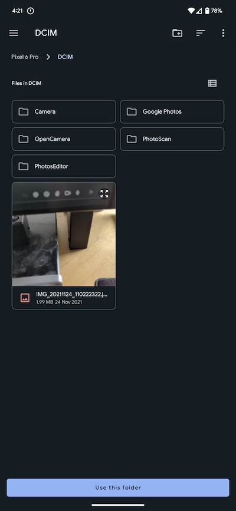

Android has placed additional permissions on files outside of your application sandbox and now requires you to request user access to these directories (eg the camera storage on the sdcard: `/sdcard/DCIM` ). 

To gain access to these folders call the `openDirectory()` method with the required path:


```actionscript
var f:File = new File( "/sdcard/DCIM" );
Permissions.instance.openDirectory( f.nativePath );
```

This process uses the `ACTION_OPEN_DOCUMENT_TREE` intent to allow the user to pick a directory subtree. Once complete your application will be able to fully manage documents within the returned directory. There are some [exceptions](https://developer.android.com/training/data-storage/shared/documents-files#document-tree-access-restrictions) starting in Android 11 (API 30) 

This will display a "browse" dialog for the user to select a directory and grant your application access to this location:




Once complete this will dispatch a `PermissionsEvent.OPEN_DIRECTORY` event with the selected path. 

```as3
Permissions.instance.addEventListener( 
    PermissionsEvent.OPEN_DOCUMENT, 
    function ( event:PermissionsEvent ):void
    {
        trace( event.path );
    } 
);
```

:::note Path
Please note the path will likely be an Android content uri and not a file path, for example:

```
content://com.android.externalstorage.documents/tree/primary%3ADCIM
```
:::


