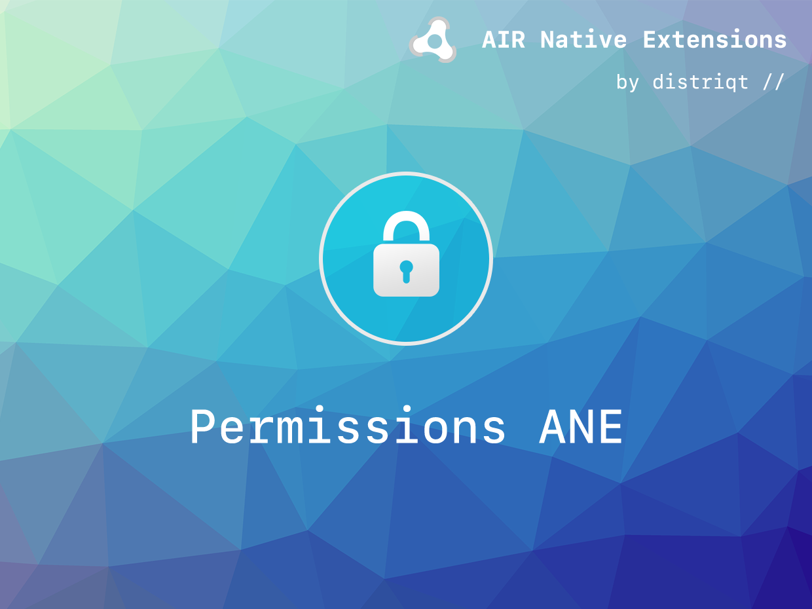

# Permissions

The [Permissions](https://airnativeextensions.com/extension/com.distriqt.Permissions) extension
gives you access to the Android device permissions being able to query and request user
permission to access 'dangerous' permissions.

The simple API allows you to quickly integrate permissions in your AIR application.
Identical code base can be used across all platforms allowing you to concentrate on
your application and not device specifics.

We provide complete guides to get you up and running with asset selection quickly and easily.

### Features

- Check the current authorisation status;
- Request access to required permissions;
- Single API interface - your code works across supported platforms with no modifications;
- Sample project code and ASDocs reference

As with all our extensions you get access to a year of support and updates as we are continually
improving and updating the extensions for OS updates and feature requests.
