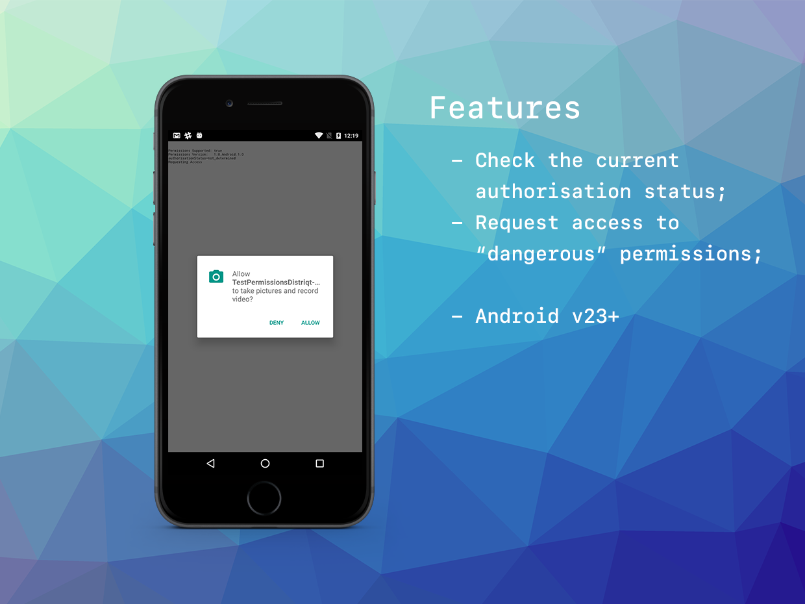

# Permissions

The [Permissions](https://airnativeextensions.com/extension/com.distriqt.Permissions) extension 
gives you access to the Android device permissions being able to query and request user 
permission to access 'dangerous' permissions.

The simple API allows you to quickly integrate permissions in your AIR application. 
Identical code base can be used across all platforms allowing you to concentrate on 
your application and not device specifics.

We provide complete guides to get you up and running with asset selection quickly and easily.


### Features

- Check the current authorisation status;
- Request access to required permissions;
- Single API interface - your code works across supported platforms with no modifications;
- Sample project code and ASDocs reference


As with all our extensions you get access to a year of support and updates as we are continually 
improving and updating the extensions for OS updates and feature requests.


## Documentation

The [wiki](https://github.com/distriqt/ANE-Permissions/wiki) forms the best source of detailed documentation for the extension along with the [asdocs](https://docs.airnativeextensions.com/asdocs/permissions). 


Quick Example:

```actionscript
if (Permissions.isSupported)
{
	Permissions.service.setPermissions( [ "android.permission.CAMERA" ] );
	
	Permissions.service.addEventListener( AuthorisationEvent.CHANGED, authorisationChangedHandler );

	var status:String = Permissions.service.authorisationStatus();
	trace( "authorisationStatus="+status );
	switch (status)
	{
		case AuthorisationStatus.NOT_DETERMINED:
		case AuthorisationStatus.SHOULD_EXPLAIN:
			trace( "Requesting Access" );
			Permissions.service.requestAccess();
			return;
			
		case AuthorisationStatus.DENIED:
		case AuthorisationStatus.UNKNOWN:
		case AuthorisationStatus.RESTRICTED:
			trace( "Access Denied" );
			return;
			
		case AuthorisationStatus.AUTHORISED:
			trace( "Authorised" );
			break;						
	}
}

...

private function authorisationChangedHandler( event:AuthorisationEvent ):void
{
	trace( "authorisation changed: " + event.status );
}
```

More information here: 

[com.distriqt.Permissions](https://airnativeextensions.com/extension/com.distriqt.Permissions)


## License

You can purchase a license for using this extension:

[airnativeextensions.com](https://airnativeextensions.com/)

distriqt retains all copyright.


