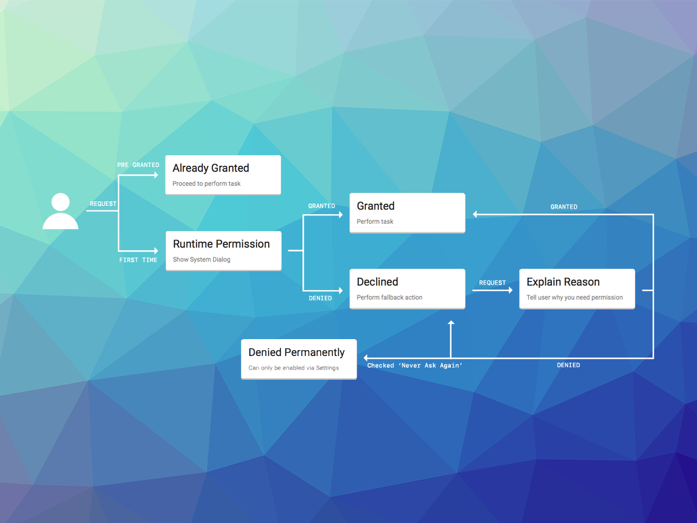

When you are going to be accessing a 'dangerous' permission you must check that 
your application has been allowed access.



On Android these permissions are listed through the manifest additions. On older 
versions of Android these permissions are accepted when the user installs the 
application. More modern versions (Marshmallow 6 [API v23]+) require that you request 
the permissions similar to iOS. You will still need to list them in your manifest 
and then follow the same code below.


## Multiple Permissions

You can use the extension to handle multiple permissions by passing an array of permissions to the extension and then using the following functionality to check for authorisation status of all the permissions combined.


### Set Permissions

You must inform the extension which permissions you wish to request.
This is done by passing an array of `String`s each being the permission required.

For example to set the camera permission:

```actionscript
Permissions.service.setPermissions( 
    [ 
        "android.permission.CAMERA" 
    ] 
);
```

### Check Authorisation

You can check the current authorisation status by calling the `authorisationStatus()` method:

```actionscript
switch (Permissions.service.authorisationStatus())
{
	case AuthorisationStatus.AUTHORISED:
		// This device has been authorised.
		break;
		
	case AuthorisationStatus.NOT_DETERMINED:
	case AuthorisationStatus.SHOULD_EXPLAIN:
		// You are yet to ask for authorisation or need to further explain
		// At this point you should consider your strategy to get your 
		// user to authorise by explaining your need for the permissions
		break;
		
	case AuthorisationStatus.DENIED:
	case AuthorisationStatus.UNKNOWN:
	case AuthorisationStatus.RESTRICTED:
		// The user has disabled the permissions
		// Advise your user of the lack of permissions as you see fit
		break;
}
```

You should respect the `SHOULD_EXPLAIN` status by displaying additional information 
to your user about why you require this functionality.


### Request Authorisation

To request authorisation call the `requestAuthorisation()` function. You can either wait for the event or supply a callback function to get details on when the request authorisation process completes.


#### Event

You will receive an `AuthorisationEvent.CHANGED` event after the process completes which contains the updated `status`: 

```actionscript
Permissions.service.addEventListener( AuthorisationEvent.CHANGED, authorisationChangedHandler );
Permissions.service.requestAuthorisation();
```

You will then receive a change event if the user accepted your permission request:

```actionscript
function authorisationChangedHandler( event:AuthorisationEvent ):void
{
	// Check the authorisation state again (as above)
}
```

#### Callback

You can supply a function to the `requestAuthorisation()` method that will be called when the process completes. This method should have the following signature `function( status:String ):void`. The `status` parameter is the updated authorisation status.

```actionscript
Permissions.instance.requestAuthorisation(
		function ( status:String ):void
		{
			trace( "requestAuthorisation(): status=" + status );
			// Check the authorisation state again (as above)
		} );
```


### Example

```actionscript
function checkAndRequestAuthorisation():void 
{
	switch (Permissions.service.authorisationStatus())
	{
		case AuthorisationStatus.AUTHORISED:
			// This device has been authorised.
			break;
			
		case AuthorisationStatus.NOT_DETERMINED:
			// You are yet to ask for authorisation 
			Permissions.service.addEventListener( AuthorisationEvent.CHANGED, authorisationChangedHandler );
			Permissions.service.requestAuthorisation();
			break;

		case AuthorisationStatus.SHOULD_EXPLAIN:
			// At this point you should consider your strategy to get your 
			// user to authorise by explaining your need for the permissions
			
			// You can attempt a request again or show a dialog as to the requirement for the permission

			break;

		case AuthorisationStatus.DENIED:
		case AuthorisationStatus.UNKNOWN:
		case AuthorisationStatus.RESTRICTED:
			// The user has disabled the permissions
			// Advise your user of the lack of permissions as you see fit
			break;
	}
}

function authorisationChangedHandler( event:AuthorisationEvent ):void
{
	// Check the authorisation state again (as above)
	checkAndRequestAuthorisation();
}
```


## Individual Permissions 

Instead of using multiple permissions together it is often more important to request permissions individually and when appropriate functionality is being used in your application (eg requesting camera permission when the user requests to take a photo).


### Check Authorisation

You can check the authorisation status for a specific permission by using the `authorisationStatusForPermission()` method:

```actionscript
var status:String = Permissions.instance.authorisationStatusForPermission( "android.permission.CAMERA" );
```

`status` can be one of the values defined in the `AuthorisationStatus` class:

```actionscript
switch (status)
{
	case AuthorisationStatus.AUTHORISED:
		// This device has been authorised.
		break;
		
	case AuthorisationStatus.NOT_DETERMINED:
	case AuthorisationStatus.SHOULD_EXPLAIN:
		// You are yet to ask for authorisation or need to further explain
		// At this point you should consider your strategy to get your 
		// user to authorise by explaining your need for the permission
		break;
		
	case AuthorisationStatus.DENIED:
	case AuthorisationStatus.UNKNOWN:
	case AuthorisationStatus.RESTRICTED:
		// The user has disabled the permission
		// Advise your user of the lack of permission as you see fit
		break;
}
```


### Request Authorisation


To request authorisation for an individual permission you can use the `requestAuthorisationForPermission()` method passing the permission of interest.


```actionscript
Permissions.instance.requestAuthorisationForPermission( "android.permission.CAMERA" );
```

Similar to the `requestAuthorisation()` method this method can either be handled with an event result or via a callback function.


#### Event

You will receive an `AuthorisationEvent.CHANGED` (or `AuthorisationEvent.PERMISSION_CHANGED`) event after the process completes which contains the updated `status`: 

```actionscript
Permissions.service.addEventListener( AuthorisationEvent.CHANGED, authorisationChangedHandler );
Permissions.service.requestAuthorisationForPermission( "android.permission.CAMERA" );
```

You will then receive a change event if the user accepted your permission request:

```actionscript
function authorisationChangedHandler( event:AuthorisationEvent ):void
{
	// Check the authorisation state again (as above)
}
```

#### Callback

You can supply a function to the `requestAuthorisation()` method that will be called when the process completes. This method should have the following signature `function( status:String ):void`. The `status` parameter is the updated authorisation status.

```actionscript
Permissions.instance.requestAuthorisationForPermission(
		"android.permission.CAMERA",
		function ( status:String ):void
		{
			trace( "requestAuthorisationForPermission(): status=" + status );
			// Check the authorisation state again (as above)
		} );
```


## Events 

There are two main events of interest dispatched by this extension.

- `AuthorisationEvent.CHANGED`: Dispatched when the authorisation status has changed. This is independent of any particular permission and just indicates something has changed. 
- `AuthorisationEvent.PERMISSION_CHANGED`: Dispatched when the authorisation status of a specific permission changes. The event contains the permission and the new status. If you are using the "multiple permissions" approach you may receive multiple of these events after a request authorisation process has completed.


