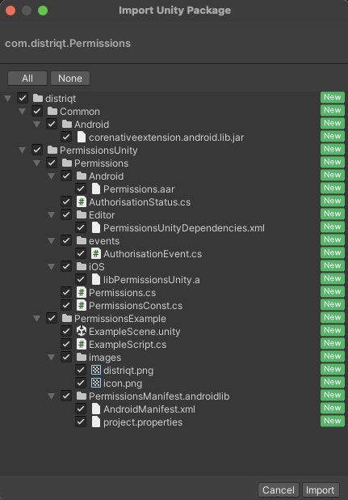

<!--newpage-->

## Contents

- [Overview](#overview)
- [Features](#features)
- [Add the Plugin](#add-the-plugin)
    - [Asset Store](#asset-store)
    - [Manual Installation](#manual-installation)
    - [Import the Plugin](#import-the-plugin)
	- [iOS Setup](#ios-setup)
- [Usage](#usage)
    - [Checking for Support](#checking-for-support)   
	- [Set Permissions](#set-permissions)
	- [Requesting Access](#requesting-access)
- [Support](#support)


<!--newpage-->

## Overview

The Permissions extension gives you access to the Android device permissions being able to query and request user permission to access 'dangerous' permissions.

The simple API allows you to quickly integrate permissions in your AIR application. Identical code base can be used across all platforms allowing you to concentrate on your application and not device specifics.

We provide complete guides to get you up and running with permissions quickly and easily.


Please note you can access the most recent documentation for this plugin here: https://docs.airnativeextensions.com/docs/permissions/

<!--newpage-->

## Features

Save key/value pairs to App Cloud Defaults on: 

- Check the current authorisation status;
- Request access to required permissions;
- Single API interface - your code works across supported platforms with no modifications;
- Sample project code and reference

As with all our extensions you get access to a year of support and updates as we are continually improving and updating the extensions for OS updates and feature requests.


## Add the Plugin

First step is always to add the plugin to your development environment. 


### Asset Store

Open the Asset Store in your browser and add the Permissions plugin to your assets.

Open the Package Manager (Window > Package Manager) in the Unity Editor and select the "My Assets" section. Select the Permissions plugin, and click Import in the bottom right.


### Manual Installation

In unity you import the package by selecting `Assets / Import Package / Custom Package ...` and then browsing to the unity plugin package file: `com.distriqt.Permissions.unitypackage`.


You can manually download the extension from our repository:

- https://github.com/distriqt/ANE-Permissions


### Import the Plugin

This will present the import dialog and display all the files for the plugin, make sure all the files are selected.

The plugin will be added to your project and you can now use the plugins functionality in your application.




### Android

#### Proguard

If you are using a custom proguard configuration you may need to add the following line to ensure the interface class for the plugin is accessible to unity at runtime.

```
-keep class com.distriqt.extension.permissions.PermissionsUnityPlugin {*;}
```


<!--newpage-->


## Usage


### Checking for Support

You can use the `isSupported` flag to determine if this extension is supported on the current platform and device.

This allows you to react to whether the functionality is available on the device and provide an alternative solution if not.


```csharp
if (AppGroupDefaults.isSupported)
{
	// Functionality here
}
```

<!--newpage-->


## Set Permissions

There are several methods to add entries to the android manifest in Unity. 
If you already have a preferred approach, you can simply add the permissions you require to your manifest, eg:

```xml
<uses-permission android:name="android.permission.CAMERA" />
```

The approach we prefer is to create a folder in your `Assets` folder something like `Project.androidlib`, (you can create this in a subfolder like `Plugins/Android` to keep things organised).

Create a file in this directory called `project.properties` and add the following contents:

```
android.library=true
```

Then create an `AndroidManifests.xml` file and add the additions you need:

```xml
<?xml version="1.0" encoding="utf-8"?>
<manifest 
    xmlns:android="http://schemas.android.com/apk/res/android" 
    package="project.packagename.resources">

	<uses-permission android:name="android.permission.CAMERA" />

</manifest>
```

Unity will merge the contents of this file into your applications manifest during a build.


<!--newpage-->


## Requesting Access


### Check Authorisation Status

You can check the authorisation status for a specific permission by using the `authorisationStatusForPermission()` method:


```csharp 
string status = Permissions.Instance.AuthorisationStatusForPermission(
    "android.permission.CAMERA"
);
```


`status` can be one of the values defined in the `AuthorisationStatus` class:

- `AuthorisationStatus.AUTHORISED`: This device has been authorised.
- `AuthorisationStatus.NOT_DETERMINED`: You are yet to ask for authorisation.
- `AuthorisationStatus.SHOULD_EXPLAIN`: You need to further explain.
- `AuthorisationStatus.DENIED`: The user has disabled the permission.
- `AuthorisationStatus.UNKNOWN`: The permission is in an unknown state, normally indicating an error has occurred.
- `AuthorisationStatus.RESTRICTED`: The user has restricted the permission to certain assets.
		


### Request Authorisation


To request authorisation for an individual permission you can use the `RequestAuthorisationForPermission()` method passing the permission of interest.


```csharp 
Permissions.Instance.RequestAuthorisationForPermission( 
    "android.permission.CAMERA" 
    );
```


This method can either be handled with an event result or via a callback function.


#### Event

You will receive an `OnAuthorisationChanged` event after the process completes which contains the updated `status`: 

```csharp 
Permissions.Instance.OnAuthorisationChanged += Permissions_OnAuthorisationChanged;

Permissions.service.RequestAuthorisationForPermission( 
    "android.permission.CAMERA" 
    );
```

You will then receive a change event if the user accepted your permission request:

```csharp
private void Permissions_OnAuthorisationChanged(AuthorisationEvent e)
{
	// Check the authorisation state again (as above)
}
```


#### Callback

You can supply a function to the `RequestAuthorisationForPermission()` method that will be called when the process completes.
This method should have the following signature `( string status )`. The `status` parameter is the updated authorisation status.

```csharp 
Permissions.Instance.RequestAuthorisationForPermission(
	"android.permission.CAMERA",
	(string status) =>
	{
		Log("request auth status = " + status);
		// Check the authorisation state again (as above)
	}
);
```


<!--newpage-->


## Support

If you need further support integrating or using this extension please feel free to contact us.

- Email: unityplugins@distriqt.com

We have been supporting developers for over 10 years and always happy to help.


<br/>
<br/>
<br/>
<br/>


- [https://distriqt.com](https://distriqt.com)
- [more native extensions](https://airnativeextensions.com)
