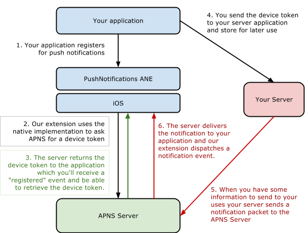
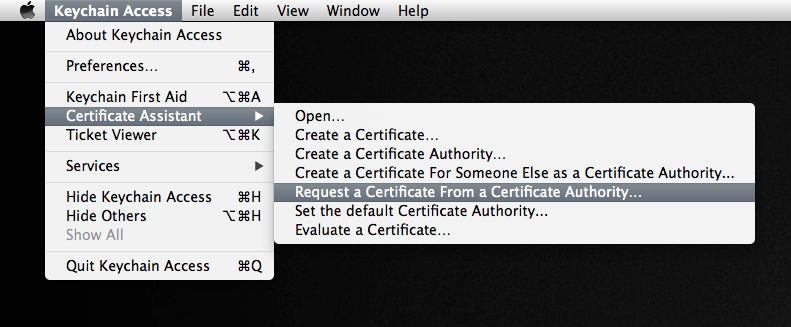
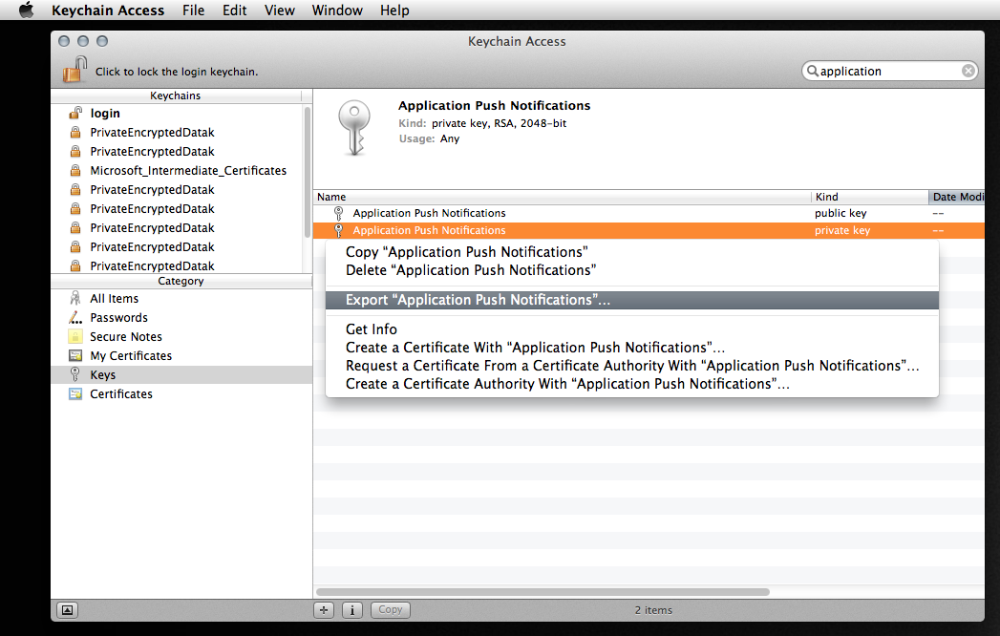
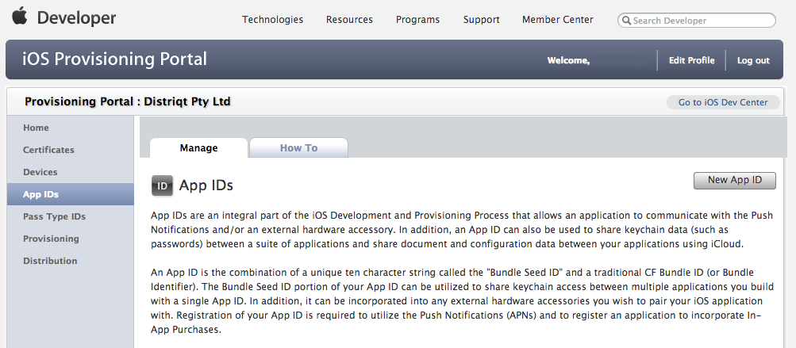
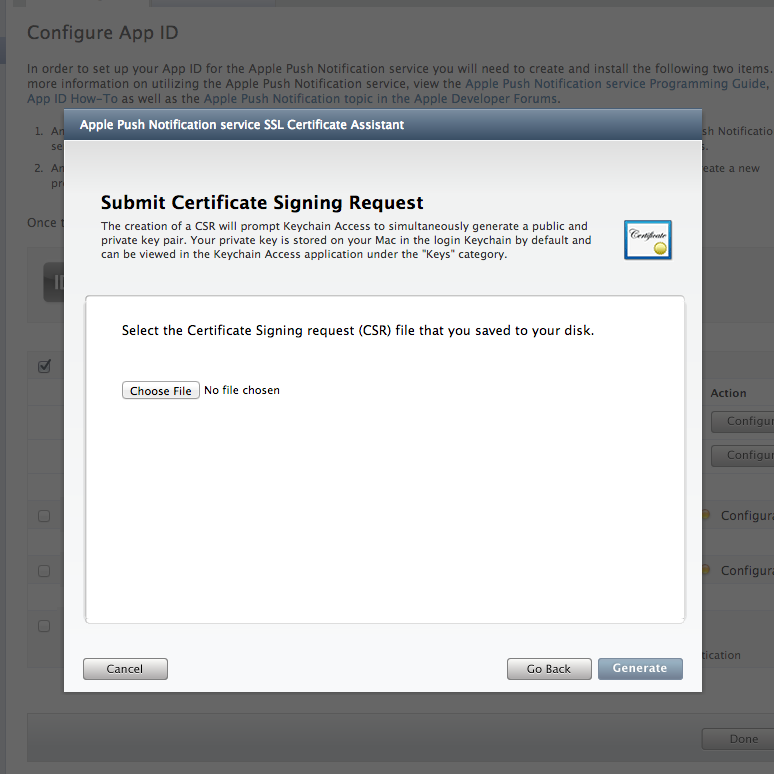
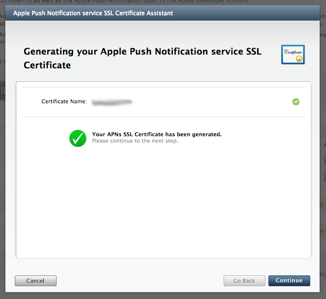
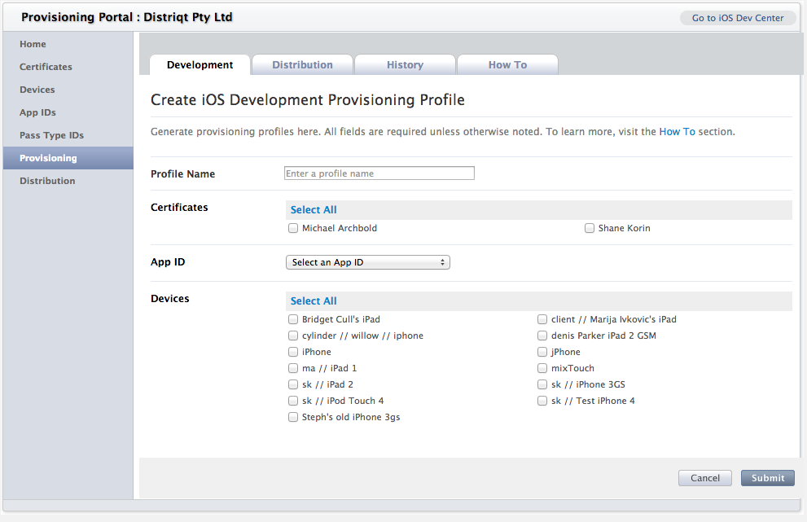
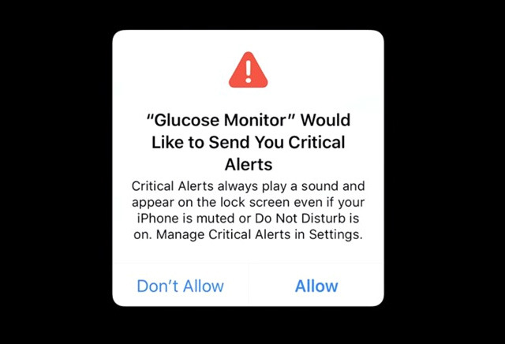

## Required ANEs

APNS is supported by all of the ANEs in the repository. It is integrated into the iOS SDK so requires no additional SDKs or frameworks so we have included it in every ANE.  

Make sure you have added the common ANEs from the [Add the Extension](add-the-extension) section. This includes the Core and Android Support ANEs. There are no additional ANEs required to use APNS.


# Setup 

Apple Push Notification Service (APNS) is the push notification system for use on 
iOS with iPhones, iPads and other such iOS devices.

The system is quite complex and has a lot of different components as you can see 
in the diagram below.



When the device finally receives the notification, the notification will be displayed 
to the user (depending on the options specified in the notification, more about these 
later). The user can then respond to the notification as they see fit, dismissing it 
or opening your application.


Your server will be required to implement a solution to gather device tokens and to 
send the notification to the APNS server with the required devices specified. This 
solution will not be part of this tutorial but we will show you everything up to and 
including sending a test notification.


## Requirements

Before we start, it’s important to check that you have all of the following:

- An iOS device (they do not work in the simulator)
- An iOS Developer program membership
- A server connected to the internet, ideally that can run background processes 
  (for testing this can simply be a local installation of Apache + PHP)
- Access to an OSX machine.

It’s important that you have all of these organised before starting the APNS setup. 
It is potentially possible to do parts of this without an OSX machine but we won’t 
be showing that in this tutorial.


## APNS Data Packet

It’s important to understand that at the very base of the APNS implementation is a 
very simple JSON packet. They are intended to be small, delivering only the simplest 
amount of information and can be no more than 256 bytes.

```
{
	"aps":
	{
		"alert": "A notification message",
		"sound": "default"
	}
}
```

The notification packet can contain a range of information that will determine what 
happens on the phone when the packet is received.

Details on the notification payload are best described in the *“Local and Push Notification Programming Guide”* 
as part of the iOS Developer Library Documentation. 

You can find this [here](https://developer.apple.com/library/content/documentation/NetworkingInternet/Conceptual/RemoteNotificationsPG/CreatingtheNotificationPayload.html).


## Caveats and Characteristics

Firstly and foremost, push notifications are not reliable and the APNS server does 
not guarantee delivery of a notification that your server sends it. The delivery 
time will also vary from a few seconds up to half an hour.

Additionally a device may not be able to receive a notification, for instance it 
may be on a network that blocks the ports used for push notification communication. 
Or it could be as simple as the device is switched off.

Push notifications will become expensive if you don’t prepare for it. You must take 
care that your application when deployed to lots of users doesn’t quickly use your 
notification quotas. Be aware of what notifications are being sent to your 
applications and be prepared to pay if you don’t.

You must take these into consideration when designing your notifications system.

Lastly, you must abide by the Apple App Store Review Guidelines for Push Notifications. 
They are all fairly reasonable but it’s always important to check before you design 
your application requirements.

- [Review Guidelines](https://developer.apple.com/appstore/resources/approval/guidelines.html)


## Certificates

This is the painful part of the APNS setup, gathering all the required provisioning 
profiles and certificates. Get a cup of coffee and take your time through the process 
and you won’t end up pulling your hair out.

There are two different provisioning profiles associated with an application, 
the **development** and the **distribution** (or production) profiles. 
Similarly there are two types of certificates for your application server to use 
to communicate with the APNS server:

- Development - for use when you’re running your application in debug mode and signed with the developer profile. With this certificate you can talk to the APNS sandbox environment to test your application.
- Production - for use when you are distributing your application either as an ad-hoc application or through the AppStore.

If you use the wrong certificate then the push notification will fail and your 
application won’t receive the notification. The process for creating these certificates 
is very similar for both cases so we’ll just concentrate on the development profiles 
and certificates.

### Certificate Signing Request (CSR)

This process is very similar to when you first created your developer account in the 
iOS developer program. These certificates are based off the classic form of 
public-private key cryptography, but don’t worry you don’t need to know anything 
about them to make this work. Just be aware that you will be creating certificates 
and exchanging them between the apple servers and yourself.

Most importantly you will create a certificate that is to be used to communicate from 
your server to the APNS servers. This is different and separate from your developer 
certificates you use to sign your applications. It is however “private” and you should 
not share the certificate with anyone not related to the development of these 
push notifications.

To create these certificates you create a **“Certificate Signing Request” (CSR)** and 
send the CSR to a certificate issuing authority, in this case the APNS section of the 
iOS developer portal. The authority then issues you with a certificate that you can 
use to secure your communications.

On OSX you will create your CSR by using the **Keychain Access** application. 
You will find this in the following location:

`Applications / Utilities / Keychain Access`

Choose the option under the main application menu (as shown in the screenshot below):

`Keychain Access / Certificate Assistant / Request a Certificate From a Certificate Authority...`



You should then be presented with a window asking for some details about the certificate request.

Here you should enter your email address, it’s recommended you use the same email as 
you use to sign up for the developer program but this is not essential, and a common 
name for your certificate. The common name just needs to be something descriptive to 
allow you to easily identify the certificate.

Make sure you’ve checked the Saved to disk option and then click Continue. Save the 
file somewhere convenient, you will need it again soon. We suggest you change the name 
of the file to something like `ApplicationPushNotifications.certSigningRequest`.


 

Next we need to export the private key as a p12 file. To do this return to the Keychain 
Access program and open the keys category. You should be able to see a public and a 
private key with the Common name you used in the previous step. You can also use the 
search in the top left to locate them.

We export this certificate by right clicking on the private key and selecting export.

You will need to enter a passphrase, which will be used to protect your private key. 
You should enter something that is secure but also that you can easily recall. Normal 
rules with passwords apply here!



Now we move on to the provisioning in the iOS portal.


### iOS Provisioning Portal

Now you will need to log into your iOS Provisioning Portal with your iOS developer Apple ID: 

- [https://developer.apple.com/account/ios/profile/profileList.action](https://developer.apple.com/account/ios/profile/profileList.action)

Here we are going to make a new application ID and use the CSR to create an SSL certificate 
for your application server communications.

You can update an existing application ID to include push notifications, as long as you 
follow the steps after creating the application ID to enable push notifications in your 
application and make sure you download the provisioning profile for the application again! 
It will have changed and won’t work if you don’t update your profile.

To make a new application ID, go to the App IDs section on the left and click the New App ID button.



You will then be presented with the “Create App ID” form. Enter your application details, for example:

```
Description:               Distriqt Test Application
Bundle Identifier:         com.distriqt.test
```

Take note of the **Bundle Seed ID (App ID Prefix)** and the **Bundle Identifier (App ID Suffix)**. 
We will need these later.


After you have created the application it will appear in your App ID list, with something like the following beside it. Note that Push Notifications are listed as “Configurable”, both for development and production.


Click Configure. You should then be presented with the Configure App ID page. Look for the section as shown below and click the checkbox to enable the App ID for Apple Push Notification service. This should activate the Configure actions on the right. Click the button beside the Development Push SSL Certificate. (You can come back to this same place to configure the production certificate at a later date).


This will now ask you to upload the CSR file we created earlier. This is the ApplicationPushNotifications.certSigningRequest file not the p12 file. Choose the file and click Generate.



Your certificate should now get generated and after a while you'll get a message saying "Your APNs SSL Certificate has been generated. Please continue to the next step".



You will now get to download the SSL certificate. Click download and save the certificate somewhere safe. It should be called aps_development.cer. We suggest you rename it to something matching the application that it’s associated with.


You should now see the Status for the Development Push SSL Certificate is green and labelled as Enabled.


You should see the expiration date of the certificate listed. It is very important that you note this date and make sure you return and update the certificate before the date is reached. Otherwise you will experience a period where notifications will not work in your application!

Lastly while we’re still in the Provisioning Portal lets create a provisioning profile for the application. Go to the Provisioning section and on the Development tab, click New Profile.



Give the profile a name and select the App ID you’ve just created, along with any devices you wish to test on. Make sure you select your developer certificate from the Certificates section. Click Submit and the profile will be generated.

This is no different from any other provisioning profile, all we are doing is making sure we retrieve the profile after the application has been setup for push notifications.

You may need to refresh the page if the profile still is in the Pending state.

Click the Download action and save the provisioning profile file along with all your other development files. You won’t need to use this file on your application server, you simply have to use this to develop your application.


### Using the Certificate

You should have 3 files saved somewhere at this point (ignoring the mobile provisioning file):

- the Certificate Signing Request (CSR)
- the private key - exported as a `p12` file
- the SSL certificate downloaded from the iOS provisioning portal (`aps_development.cer`)

These files are very important in the communication between your application server 
and the APNS servers. It’s suggested you keep them in a safe place. You can throw 
the CSR away if you wish but we’ve always kept them. If you need to renew the 
certificates at a later date you can use the same CSR and skip a few of the 
earlier steps.

What we need to do now is convert the certificate and private key into a format that 
we can use easily.

Our test notification example for APNS uses PHP so we will convert them into a 
single file in the PEM format. We will use this PEM file later when we are sending 
test notifications but here we will show you how to create it.

We will be using the OpenSSL tools for this. Place the `p12` and `cer` files into a 
directory and open a Terminal window in that directory. We are going to create `pem` 
files from each of the `p12` and `cer` files and then combine them into a single file.

Convert the `cer` file to `pem`:

```
openssl x509 -in aps_developer_identity.cer -inform der -out YOUR_CERTIFICATE.pem
```

Convert the `p12` file into a `pem` file. 

It will ask you for the password to the private key. This is the password you used 
when you exported the key from your Keychain. It should then ask you for a new 
“PEM pass phrase”, this is a separate password to the PEM file you are creating so 
again use something secure. You must enter a passphrase. If you don’t your private 
key may not get included correctly in the final PEM.

```
openssl pkcs12 -nocerts -out YOUR_PRIVATE_KEY.pem -in YOUR_PRIVATE_KEY.p12
```

Finally, combine the two files:

```
cat YOUR_CERTIFICATE.pem YOUR_PRIVATE_KEY.pem > ck.pem
```

This `ck.pem` file is what we will use in the php script later so keep this file handy.

You can test the connection to the APNS sandbox (sandbox as we created the development 
certificate through this process) at this point if you wish with the following command:

```
openssl s_client -connect gateway.sandbox.push.apple.com:2195 -cert YOUR_CERTIFICATE.pem -key YOUR_PRIVATE_KEY.pem
```

This should connect to the server and dump out a whole heap of information about 
the process. Eventually after the successful connection you should be able to 
type a few characters and the server should disconnect.


## Info Additions and Entitlements

Push notifications require a few additions to the Info plist and Entitlements section 
of your application to correctly configure your application for push notifications. 

You should add the listing below to application descriptor iPhone node.

You must replace the `BUNDLE_SEED_ID` and `BUNDLE_IDENTIFIER` with the information you
gathered when setting up your application. Also make sure you set the environment 
correctly either using production or development, both are shown in the example 
below with the production version commented out. More on this below.

```xml
<iPhone>
	<InfoAdditions><![CDATA[
		<key>UIPrerenderedIcon</key>
		<true/>
		
		<key>UIDeviceFamily</key>
		<array>
			<string>1</string>
			<string>2</string>
		</array>
	
		
	]]></InfoAdditions>
	<requestedDisplayResolution>high</requestedDisplayResolution>
	<Entitlements><![CDATA[
		
		<!-- DEVELOPMENT -->
		<key>get-task-allow</key>
		<true/>
		<key>aps-environment</key>
		<string>development</string>
		
		<!-- PRODUCTION -->
		<!--
		<key>get-task-allow</key>
		<false/>
		<key>aps-environment</key>
		<string>production</string>
		-->
		
		<key>application-identifier</key>
		<string>BUNDLE_SEED_ID.BUNDLE_IDENTIFIER</string>
		<key>keychain-access-groups</key>
		<array>
			<string>BUNDLE_SEED_ID.*</string>
		</array>
		
	]]></Entitlements>
</iPhone>
```


The first entitlement field is the `aps-environment`. This field indicates whether 
we are using the development or the production environment. It must be either 
`development` or `production` and depends on which configuration you are using. 
If you are running a debug build you should use development. If you are looking 
to publish the application to the AppStore, you should use production.

You should have noted the `BUNDLE_SEED_ID` (or App ID Prefix) and `BUNDLE_IDENTIFIER` 
when you were setting up your application in the iOS developer center. 
The seed id should be a unique ten character string and the identifier should be 
similar to your AIR application id.


### Background notifications

If you are planning to setup your application to receive background notifications 
then you should include the UIBackgroundModes key:

```xml
		<key>UIBackgroundModes</key>
		<array>
			<string>remote-notification</string>
		</array>
```

However it is not required if you do not wish to include it. 

If it is enabled, you will be able to send silent notifications in the background 
to trigger an event when your application is running in the background. 
If you do not include it, then you will only receive the notification events in 
the background when the user clicks a notification.


### Critical Alerts

Critical alerts are important notifications that will ignore Do Not Disturb mode, and ringer settings, so they cannot be muted.

This is an opt-in service and developers must request approval from Apple in order to add this feature to an application. Generally only applications that send notifications related to health, public safety and home security are approved.



If you are approved by Apple then to enable critical alerts you will need to add the following to your `Entitlements` section:

```xml
<key>com.apple.developer.usernotifications.critical-alerts</key>
<true/>
```

Additionally you will need to request authorisation from the user. This is handled as part of the normal authorisation process however you need to inform the extension that you require critical alerts by calling `setShouldRequestCriticalAlerts()` on your `Service` configuration:

```actionscript
var service:Service = new Service() 
	.setShouldRequestCriticalAlerts();

// Other service options


```

