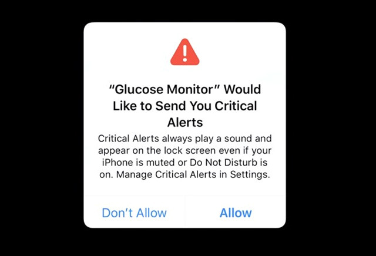

import Tabs from '@theme/Tabs'
import TabItem from '@theme/TabItem'

import InstallAPM from './_includes/add-apm.md'
import InstallManual from './_includes/add-manual.md'

import AppDescriptorAPM from './_includes/add-apm-appdescriptor.md'
import AppDescriptorManual from './_includes/add-manual-appdescriptor.md'

:::info About
Apple Push Notification Service (APNS) is the push notification system for use on iOS with iPhones, iPads and other such iOS devices.
:::

This section describes how to setup your AIR application to use Apple Push Notification Service (APNS) with this extension.

This service is supported by all the variants however we suggest using one of the following variants:

- base variant (i.e. the main extension) 
	- Includes FCM on Android 
- APNS (this is an air package only for `apm`) 
	- iOS only, same as the base variant but includes none of the FCM dependencies for Android 

The other variants can be used but there is additional configuration that is needed.  


## Setup

You should firstly setup the APNS service for your application. Follow the [setup guide](apple-push-notification-service) for instructions.


## Install

The simplest way to install and manage your AIR native extensions and libraries is to use the AIR Package Manager (`apm`). We highly recommend using `apm`, as it will handle downloading all required dependencies and manage your application descriptor (Android manifest additions, iOS info additions etc).

However you can choose to install it manually, as you would have done in the past. 

<Tabs
  groupId="packagemanager"
  defaultValue="apm"
  values={[
    {label: 'APM', value: 'apm'},
    {label: 'Manual', value: 'manual'},
  ]}>

  <TabItem value="apm" >
	<InstallAPM/>
  </TabItem>
  <TabItem value="manual" >
	<InstallManual/>
  </TabItem>
  
</Tabs>


## Application Descriptor

<Tabs
  groupId="packagemanager"
  defaultValue="apm"
  values={[
    {label: 'APM', value: 'apm'},
    {label: 'Manual', value: 'manual'},
  ]}>

  <TabItem value="apm" >
	<AppDescriptorAPM/>
  </TabItem>
  <TabItem value="manual" >
	<AppDescriptorManual/>
  </TabItem>
  
</Tabs>


### Background notifications

> Optional

If you are planning to setup your application to receive background notifications 
then you need to include some additional configuration. 

If it is enabled, you will be able to send silent notifications in the background 
to trigger an event when your application is running in the background. 
If you do not include it, then you will only receive the notification events in 
the background when the user clicks a notification.

However it is not required if you do not wish to include it. 

<Tabs
  groupId="packagemanager"
  defaultValue="apm"
  values={[
    {label: 'APM', value: 'apm'},
    {label: 'Manual', value: 'manual'},
  ]}>

  <TabItem value="apm" >

Firstly add a custom iOS configuration file by running:

```
apm generate config ios
```

Edit the `config/ios/InfoAdditions.xml` file that was generated to resemble the following, adding the `UIBackgroundModes` node:

```xml
<plist version="1.0">
    <dict>

        <key>UIDeviceFamily</key>
        <array>
            <string>1</string>
            <string>2</string>
        </array>

		<key>UIBackgroundModes</key>
		<array>
			<string>remote-notification</string>
		</array>

    </dict>
</plist>
```

You can add any other information you need in your info additions in this file as well, such as `MinimumOSVersion` or your `UILaunchStoryboardName`. 

Once you have added this configuration run the steps above to update / generate your application descriptor.

  </TabItem>
  <TabItem value="manual" >

If you are planning to setup your application to receive background notifications 
then you should include the UIBackgroundModes key:

```xml
<key>UIBackgroundModes</key>
<array>
	<string>remote-notification</string>
</array>
```

  </TabItem>
  
</Tabs>


### Critical Alerts

> Optional 

Critical alerts are important notifications that will ignore Do Not Disturb mode, and ringer settings, so they cannot be muted.

This is an opt-in service and developers must request approval from Apple in order to add this feature to an application. Generally only applications that send notifications related to health, public safety and home security are approved.



If you are approved by Apple then to enable critical alerts you will need to add some additions to your `Entitlements` section.

<Tabs
  groupId="packagemanager"
  defaultValue="apm"
  values={[
    {label: 'APM', value: 'apm'},
    {label: 'Manual', value: 'manual'},
  ]}>

  <TabItem value="apm" >

Firstly add a custom iOS configuration file by running:

```
apm generate config ios
```

Edit the `config/ios/Entitlements.xml` file that was generated to resemble the following:

```xml
<plist version="1.0">
    <dict>

        <key>com.apple.developer.usernotifications.critical-alerts</key>
		<true/>

    </dict>
</plist>
```

You can add any other information you need in your info additions in this file as well, such as `MinimumOSVersion` or your `UILaunchStoryboardName`. 

Once you have added this configuration run the steps above to update / generate your application descriptor.

  </TabItem>
  <TabItem value="manual" >

Add the following to your `Entitlements` section in your application descriptor:

```xml
<key>com.apple.developer.usernotifications.critical-alerts</key>
<true/>
```

  </TabItem>
  
</Tabs>


Additionally you will need to request authorisation from the user. This is handled as part of the normal authorisation process however you need to inform the extension that you require critical alerts by calling `setShouldRequestCriticalAlerts()` on your `Service` configuration:

```actionscript
var service:Service = new Service() 
	.setShouldRequestCriticalAlerts();

// Other service options

```


