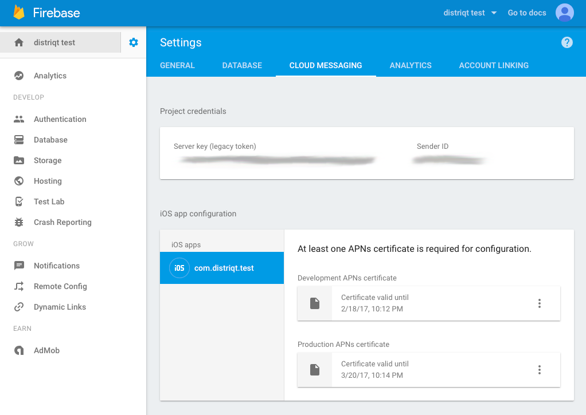

## Required ANEs

To use this service add `com.distriqt.PushNotifications.FCM.ane` variant of the extension to your project in place of  `com.distriqt.PushNotifications.ane`. You should only add one of the variants to your project. If you need to support multiple services please use the All Services variant.

All variants of the Push Notifications extension have the same extension id: `com.distriqt.PushNotifications` so you should add this to your extensions list in your application descriptor:

```xml
<extensions>
	...
	
	<extensionID>com.distriqt.PushNotifications</extensionID>
	
	...
</extensions>
```

Make sure you have added the common ANEs from the [Add the Extension](add-the-extension) section first. This includes the Core and Android Support ANEs.


### Google Play Services

This ANE requires usage of certain aspects of the Google Play Services client library. 
The client library is available as a series of ANEs that you add into your applications packaging options. 
Each separate ANE provides a component from the Play Services client library and are used by different ANEs. 
These client libraries aren't packaged with this ANE as they are used by multiple ANEs and separating them 
will avoid conflicts, allowing you to use multiple ANEs in the one application.

This ANE requires the following Google Play Services:

- [`com.distriqt.playservices.Base`](https://github.com/distriqt/ANE-GooglePlayServices/raw/master/lib/com.distriqt.playservices.Base.ane)

You must include the above native extensions in your application along with this extension, 
and you need to ensure they are packaged with your application.

You can access the Google Play Services client library extensions here: [https://github.com/distriqt/ANE-GooglePlayServices](https://github.com/distriqt/ANE-GooglePlayServices).


### Firebase

To use Firebase Cloud Messaging you must include the core Firebase libraries and configure 
your Firebase application. The core libraries are available in the `com.google.firebase.core` extension alongside the Google Play Services:

- [`com.google.firebase.core`](https://github.com/distriqt/ANE-GooglePlayServices/raw/master/lib/com.google.firebase.core.ane)


See the [Firebase configuration documentation](https://docs.airnativeextensions.com/docs/firebase/setup/configuration-files/) on how to configure your application.


>
> **Note**
>
> If you wish to use Firebase on iOS you must disable the "Hide ANE-Library-Symbols" option in your packaging settings.
>
> We highly discourage usage of this setting as it can increase the size of your application by 
> not correctly identifying code that is shared between extensions. 
>
> Any good ANE should not require this setting. 
>
>


## Extension IDs

The following should be added to your `extensions` node in your application descriptor to identify all the required ANEs in your application:

```xml
<extensions>
	<extensionID>com.distriqt.PushNotifications</extensionID>
	<extensionID>com.distriqt.Core</extensionID>
	<extensionID>com.distriqt.playservices.Base</extensionID>

	<extensionID>com.google.firebase.core</extensionID>
	<extensionID>com.google.android.datatransport</extensionID>
	<extensionID>com.google.dagger</extensionID>
    <extensionID>com.google.protobuflite</extensionID>

	<extensionID>androidx.core</extensionID>
	<extensionID>androidx.browser</extensionID>
	<extensionID>androidx.appcompat</extensionID>
	<extensionID>androidx.cardview</extensionID>
	<extensionID>androidx.constraintlayout</extensionID>
	<extensionID>androidx.vectordrawable</extensionID>
</extensions>
```


# Android 

## Manifest Additions

You must add all the Firebase related manifest additions along with several additions for Cloud Messaging. 

The following shows the complete manifest additions node. You must replace `APPLICATION_PACKAGE` with your 
AIR application's Java package name, something like `air.com.distriqt.test`.
Generally this is your AIR application id prefixed by `air.` unless you have specified no air flair in your build options.


```xml
<manifest android:installLocation="auto">
	
	<uses-permission android:name="android.permission.INTERNET" />
	<uses-permission android:name="android.permission.ACCESS_NETWORK_STATE" />
	<uses-permission android:name="android.permission.WAKE_LOCK" />
	
	<!-- OPTIONAL -->
	<uses-permission android:name="android.permission.VIBRATE"/>
	<uses-permission android:name="android.permission.RECEIVE_BOOT_COMPLETED" />
	
	<uses-permission android:name="com.google.android.finsky.permission.BIND_GET_INSTALL_REFERRER_SERVICE" /> 
	<uses-permission android:name="com.google.android.c2dm.permission.RECEIVE" />
	<permission android:name="APPLICATION_PACKAGE.permission.C2D_MESSAGE" android:protectionLevel="signature" />
	<uses-permission android:name="APPLICATION_PACKAGE.permission.C2D_MESSAGE" />
	
	<application>
		<meta-data android:name="com.google.android.gms.version" android:value="@integer/google_play_services_version" />

		<activity android:name="com.google.android.gms.common.api.GoogleApiActivity" 
			android:theme="@android:style/Theme.Translucent.NoTitleBar" 
			android:exported="false"/>


		<!-- NOTIFICATIONS -->
		<receiver android:name="com.distriqt.extension.pushnotifications.notifications.receivers.NotificationReceiver">
			<intent-filter>
				<action android:name="APPLICATION_PACKAGE.NOTIFICATION_SELECTED" />
				<action android:name="APPLICATION_PACKAGE.NOTIFICATION_DELETED" />
				<action android:name="APPLICATION_PACKAGE.NOTIFICATION_ACTION" />
				<data android:scheme="dtpn" />
			</intent-filter>
			<intent-filter>
				<action android:name="android.intent.action.BOOT_COMPLETED" />
			</intent-filter>
		</receiver>
		<provider
			android:name="com.distriqt.extension.pushnotifications.content.FileProvider"
			android:authorities="APPLICATION_PACKAGE.pushnotificationsfileprovider"
			android:grantUriPermissions="true"
			android:exported="false">
			<meta-data
				android:name="android.support.FILE_PROVIDER_PATHS"
				android:resource="@xml/distriqt_pushnotifications_paths" />
		</provider>


		<!-- FIREBASE CLOUD MESSAGING -->
		<meta-data android:name="com.google.firebase.messaging.default_notification_icon" android:resource="@drawable/ic_stat_distriqt" />
		<meta-data android:name="com.google.firebase.messaging.default_notification_color" android:resource="@color/blue" />
		<meta-data android:name="com.google.firebase.messaging.default_notification_channel_id" android:value="test_sound_res_channel"/>

		<service android:name="com.distriqt.extension.pushnotifications.fcm.FcmMessagingService">
			<intent-filter>
				<action android:name="com.google.firebase.MESSAGING_EVENT"/>
			</intent-filter>
		</service>
		<service
			android:name="com.distriqt.extension.pushnotifications.fcm.FcmInstanceIDService"
			android:exported="true">
			<intent-filter>
				<action android:name="com.google.firebase.INSTANCE_ID_EVENT"/>
			</intent-filter>
		</service>
		<receiver
			android:name="com.google.firebase.iid.FirebaseInstanceIdReceiver"
			android:exported="true"
			android:permission="com.google.android.c2dm.permission.SEND" >
			<intent-filter>
				<action android:name="com.google.android.c2dm.intent.RECEIVE" />
			</intent-filter>
		</receiver>


		<!-- FIREBASE CORE -->
		<receiver
			android:name="com.google.android.gms.measurement.AppMeasurementReceiver"
			android:enabled="true"
			android:exported="false" >
		</receiver>

		<service
			android:name="com.google.android.gms.measurement.AppMeasurementService"
			android:enabled="true"
			android:exported="false" />
		<service
			android:name="com.google.android.gms.measurement.AppMeasurementJobService"
			android:enabled="true"
			android:exported="false"
			android:permission="android.permission.BIND_JOB_SERVICE" />
		<service
			android:name="com.google.firebase.components.ComponentDiscoveryService"
			android:directBootAware="true"
			android:exported="false" >
			<meta-data
				android:name="com.google.firebase.components:com.google.firebase.analytics.connector.internal.AnalyticsConnectorRegistrar"
				android:value="com.google.firebase.components.ComponentRegistrar" />
			<meta-data
				android:name="com.google.firebase.components:com.google.firebase.installations.FirebaseInstallationsRegistrar"
				android:value="com.google.firebase.components.ComponentRegistrar" />

			<!-- Firebase Cloud Messaging -->
			<meta-data
				android:name="com.google.firebase.components:com.google.firebase.iid.Registrar"
				android:value="com.google.firebase.components.ComponentRegistrar" />
			<meta-data
				android:name="com.google.firebase.components:com.google.firebase.messaging.FirebaseMessagingRegistrar"
				android:value="com.google.firebase.components.ComponentRegistrar" />
			<meta-data
				android:name="com.google.firebase.components:com.google.firebase.datatransport.TransportRegistrar"
				android:value="com.google.firebase.components.ComponentRegistrar" />

		</service>

		<provider
			android:name="com.google.firebase.provider.FirebaseInitProvider"
			android:authorities="com.distriqt.extension.firebase.test.firebaseinitprovider"
			android:exported="false"
			android:initOrder="100" />


		<!-- datatransport -->
		<service
			android:name="com.google.android.datatransport.runtime.backends.TransportBackendDiscovery"
			android:exported="false" >
			<meta-data
				android:name="backend:com.google.android.datatransport.cct.CctBackendFactory"
				android:value="cct" />
		</service>
		<service
			android:name="com.google.android.datatransport.runtime.scheduling.jobscheduling.JobInfoSchedulerService"
			android:exported="false"
			android:permission="android.permission.BIND_JOB_SERVICE" >
		</service>
		<receiver
			android:name="com.google.android.datatransport.runtime.scheduling.jobscheduling.AlarmManagerSchedulerBroadcastReceiver"
			android:exported="false" />
		
		
		
	</application>
	
</manifest>
```

#### Component Discovery Service

The `com.google.firebase.components.ComponentDiscoveryService` is particularly important for Firebase configuration.

The meta-data tags that are added to this service specify the components that should be initialised by Firebase and you must ensure that you have added the appropriate tags for the services you are using.

Firebase Messaging depends on Analytics so you must at least include the following tags:


- Analytics:

```xml
<meta-data
	android:name="com.google.firebase.components:com.google.firebase.analytics.connector.internal.AnalyticsConnectorRegistrar"
	android:value="com.google.firebase.components.ComponentRegistrar" />
<meta-data
	android:name="com.google.firebase.components:com.google.firebase.installations.FirebaseInstallationsRegistrar"
	android:value="com.google.firebase.components.ComponentRegistrar" />
```

- Messaging (FCM):

```xml
<meta-data
	android:name="com.google.firebase.components:com.google.firebase.iid.Registrar"
	android:value="com.google.firebase.components.ComponentRegistrar" />
<meta-data
	android:name="com.google.firebase.components:com.google.firebase.messaging.FirebaseMessagingRegistrar"
	android:value="com.google.firebase.components.ComponentRegistrar" />
<meta-data
	android:name="com.google.firebase.components:com.google.firebase.datatransport.TransportRegistrar"
	android:value="com.google.firebase.components.ComponentRegistrar" />
```


### MultiDex Applications 

If you have a large application and are supporting Android 4.x then you will need to ensure you enable your application to correctly support MultiDex to allow the application to be broken up into smaller dex packages.

This is enabled by default with releases of AIR v25+, except in the Android 4.x case where you need to change the manifest additions for the application tag to match the following and use the `MultiDexApplication`.


#### Using AndroidX

This will require the addition of the `androidx.multidex` extension which contains the `androidx.multidex.MultiDexApplication` implementation.

```xml
<manifest android:installLocation="auto">
	<!-- PERMISSIONS -->

	<application android:name="androidx.multidex.MultiDexApplication">

		<!-- ACTIVITIES / RECEIVERS / SERVICES -->

	</application>
</manifest>
```


# iOS 

Firebase on iOS uses APNS certificates and APNS notifications to deliver messages. 
So you'll need to go through the process of setting up your APNS certificates and enabling APNS for your application. 

Once you have setup your APNS certificates you must add them to your Firebase application. 
Navigate to your application and click on settings, then the "Cloud Messaging" tab and upload your certificates.



You can find more information on setting up the certificates in the [Firebase documentation](https://firebase.google.com/docs/cloud-messaging/ios/certs).


## Info Additions and Entitlements

In order for the Firebase system to work well with AIR and other extensions we need
to disable the automatic delegate proxy that Firebase implements on iOS. To do so 
you must add the following to your InfoAdditions:

```xml
<key>FirebaseAppDelegateProxyEnabled</key>
<false/>
```

Example:

```xml
<InfoAdditions><![CDATA[
	
	<key>FirebaseAppDelegateProxyEnabled</key>
	<false/>

]]></InfoAdditions>
<requestedDisplayResolution>high</requestedDisplayResolution>
<Entitlements><![CDATA[
	
	<!-- DEVELOPMENT -->
	<key>get-task-allow</key>
	<true/>
	<key>aps-environment</key>
	<string>development</string>
	
	<!-- PRODUCTION -->
	<!--
	<key>get-task-allow</key>
	<false/>
	<key>aps-environment</key>
	<string>production</string>
	-->
	
	<key>application-identifier</key>
	<string>X5LW23Q6CJ.com.distriqt.test</string>
	<key>keychain-access-groups</key>
	<array>
		<string>X5LW23Q6CJ.*</string>
	</array>
	
]]></Entitlements>
```

>
> Note the difference between a development and production / adhoc entitlements. The `get-task-allow` and `aps-environment` must be set correctly for your build.
>

The first entitlement field is the `aps-environment`. This field indicates whether we are using the `development` or the `production` environment. It must be either development or production and depends on which configuration you are using. If you are running a debug build you should use `development`. If you are looking to publish the application to the AppStore, you should use `production`.

Also note the `get-task-allow` field should be set to `false` or removed for production builds.

