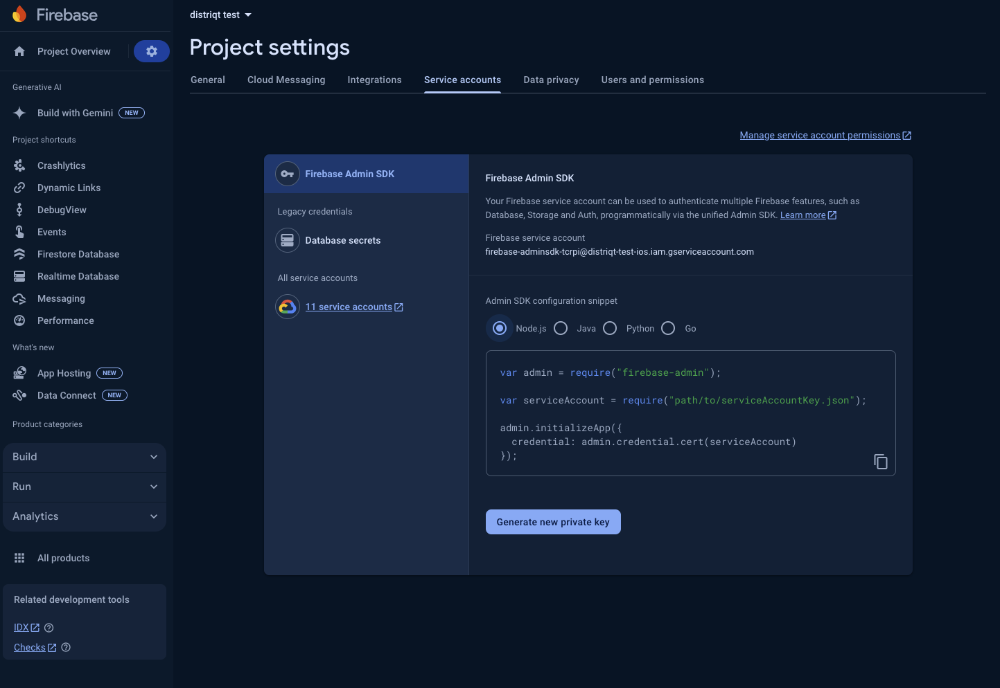

## HTTP v1 API 

:::caution
As with the legacy APIs, HTTP v1 messages must be sent through a trusted environment such as your app server or Cloud Functions for Firebase using the HTTP protocol or the Admin SDK to build message requests. Sending directly from client app logic carries extreme security risk and is not supported.
:::

Here we will create a simple Node.js app to send a message to a registration id. 

Firstly you'll need to get your service account details to authorise requests to Firebase from your server. In the Firebase console under "Project settings" you will find the "Service accounts" section. Download the json file and place it in your project root (we have used the filename `service-account.json` in the following example).




Next install the official node package for firebase:

```
npm install firebase-admin
```

Add the following code (`send.js`) to load your service account and send a push notification to the specified registration token:

```js title="send.js"
const admin = require("firebase-admin");
const serviceAccount = require("./service-account.json");

admin.initializeApp({
  credential: admin.credential.cert(serviceAccount),
});


const registrationToken = "YOUR_DEVICE_ID_TOKEN";

const message = {
  notification: {
    body: "a default notification",
    title: "default title",
  },
  token: registrationToken,
};

// Send a message to the device corresponding to the provided
// registration token.
admin.messaging()
  .send(message)
  .then((response) => {
    // Response is a message ID string.
    console.log("Successfully sent message:", response);
  })
  .catch((error) => {
    console.log("Error sending message:", error);
  });
```

Update the `registrationToken` from the application running on your test device and send the notification by calling:

```
node send.js
```

You should see a success message like:

```
Successfully sent message: projects/distriqt-test-ios/messages/0:1721878990106292%32d7332f32d7332f
``` 

and the notification should appear on your device.


### Migrate from legacy API

If you are looking to migrate from the legacy FCM APIs to HTTP v1, Google have created a guide here: https://firebase.google.com/docs/cloud-messaging/migrate-v1


## FCM legacy APIs for HTTP

:::note
This is now deprecated. See the notes on [migrating the to HTTP v1 API](#migrate-from-legacy-api).
::: 

Sending a message with Firebase is very similar (if not exactly the same) as GCM apart from the endpoint. 


Firebase Cloud Messaging has a server-side APIs that you can call to send messages. 
See https://firebase.google.com/docs/cloud-messaging/server.

Sending a message can be as simple as using curl to call a HTTP end-point. 
See https://firebase.google.com/docs/cloud-messaging/server#implementing-http-connection-server-protocol

```
curl -X POST --header "Authorization: key=<API_ACCESS_KEY>" --Header "Content-Type: application/json" https://fcm.googleapis.com/fcm/send -d "{\"to\":\"<YOUR_DEVICE_ID_TOKEN>\",\"notification\":{\"body\":\"Yellow\"},\"priority":10}"
```


### PHP Example

Simple PHP script demonstrating the same:

```php
$registrationId = "YOUR_DEVICE_ID_TOKEN";
$apiKey = "API_ACCESS_KEY";

$dataPayload = array(
	'notification' => array(
		'icon' => 'ic_utrofi_notification',
		'alert' => "ticker text 2", 
		'title' => "content title 2", 
		'body' => "body copy 2",
		'sound' => 'default'
));

$response = sendNotification( 
	$apiKey, 
	array($registrationId), 
	$dataPayload,
	null
);
echo $response;


////////////////////////////////////////////////////////////////////////////////
//	
//

/**
 * The following function will send a FCM notification using curl.
 * 
 * @param $apiKey				[string] 	The Browser API key string for your GCM account
 * @param $registrationIdsArray [array] 	An array of registration ids to send this notification to
 * @param $messageData			[array]		An named array of data to send as the notification payload
 */
function sendNotification( $apiKey, $registrationIdsArray, $customData, $notification  )
{
    $headers = array("Content-Type:" . "application/json", "Authorization:" . "key=" . $apiKey);
    $data = array(
        'registration_ids' => $registrationIdsArray,
    );
	if ($customData != null) 	$data['data'] = $customData;
	if ($notification != null)	$data['notification'] = $notification;

	$post = json_encode($data);
	
	print( $post );

    $ch = curl_init();

    curl_setopt( $ch, CURLOPT_HTTPHEADER, $headers ); 
    curl_setopt( $ch, CURLOPT_URL, "https://fcm.googleapis.com/fcm/send" );
    curl_setopt( $ch, CURLOPT_SSL_VERIFYHOST, 0 );
    curl_setopt( $ch, CURLOPT_SSL_VERIFYPEER, 0 );
    curl_setopt( $ch, CURLOPT_RETURNTRANSFER, true );
    curl_setopt( $ch, CURLOPT_POSTFIELDS, $post );

    $response = curl_exec($ch);
    curl_close($ch);

    return $response;
}


```
