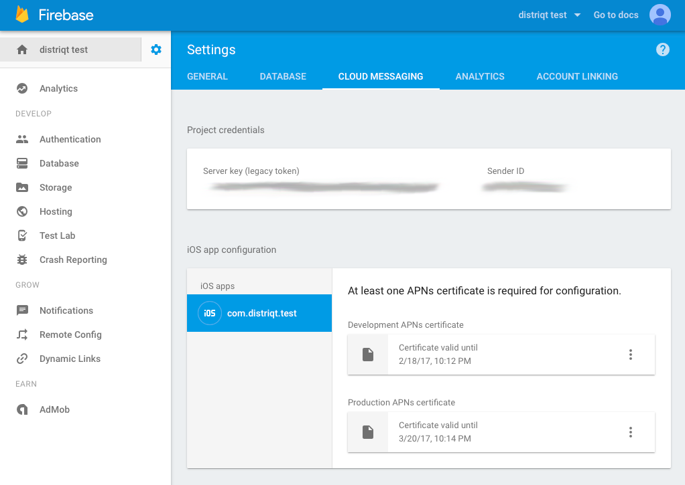

You should firstly setup a Firebase project for your application. See the documentation to [Create a Firebase Project](/docs/firebase/setup/create-a-firebase-project).

Once complete you need to grab the configuration files for your application and add these to your application.

This should include:

- iOS: `GoogleService-Info.plist` 
- Android: `values.xml`

See more on adding these [configuration files here](/docs/firebase/setup/configuration-files)

### iOS 

Firebase on iOS uses APNS certificates and APNS notifications to deliver messages. 
So you'll need to go through the process of setting up your [APNS certificates and enabling APNS](../apple/apple-push-notification-service) for your application. 

Once you have setup your APNS certificates you must add them to your Firebase application. 
Navigate to your application and click on settings, then the "Cloud Messaging" tab and upload your certificates.

You can find more information on setting up the certificates in the [Firebase documentation](https://firebase.google.com/docs/cloud-messaging/ios/certs).

