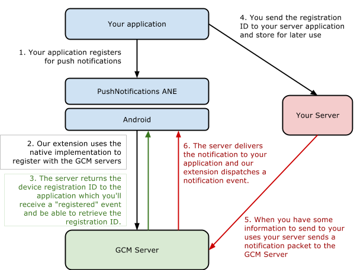
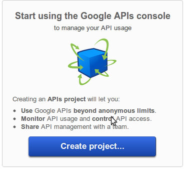
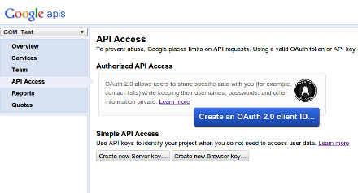
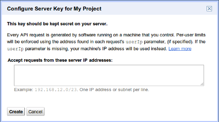
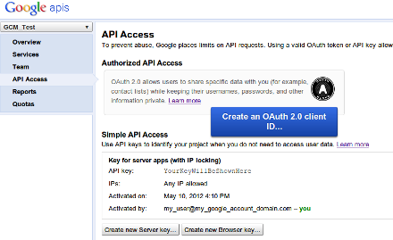

>
> Google is advising you use [Firebase Cloud Messaging](../firebase/firebase-cloud-messaging) in place of GCM and have deprecated the GCM service.
> You should move to the more powerful FCM platform.
>
> We will no longer be maintaining the development of the GCM service.
>

Google Cloud Messaging (GCM) is Android’s push notification system. 
The GCM system is a very simple system to get up and running.

Google Cloud Messaging for Android (GCM) is a free service that helps developers 
send data from servers to their Android applications on Android devices. This 
could be a lightweight message telling the Android application that there is new 
data to be fetched from the server (for instance, a movie uploaded by a friend), 
or it could be a message containing up to 4kb of payload data (so apps like 
instant messaging can consume the message directly). The GCM service handles all 
aspects of queueing of messages and delivery to the target Android application 
running on the target device.



Architecturally it’s very similar to the APNS process, though “device token” 
is called “registration ID” the process is relatively identical. The actual 
implementation is very different though as we will see in the following.


## Required ANEs

### Google Play Services

This ANE requires usage of certain aspects of the Google Play Services client library. 
The client library is available as a series of ANEs that you add into your applications packaging options. 
Each separate ANE provides a component from the Play Services client library and are used by different ANEs. 
These client libraries aren't packaged with this ANE as they are used by multiple ANEs and separating them 
will avoid conflicts, allowing you to use multiple ANEs in the one application.

This ANE requires the following Google Play Services:

- [com.distriqt.playservices.Base.ane](https://github.com/distriqt/ANE-GooglePlayServices/raw/master/lib/com.distriqt.playservices.Base.ane)
- [com.distriqt.playservices.GCM.ane](https://github.com/distriqt/ANE-GooglePlayServices/raw/master/lib/com.distriqt.playservices.GCM.ane)

You must include the above native extensions in your application along with this extension, 
and you need to ensure they are packaged with your application.

You can access the Google Play Services client library extensions here: [https://github.com/distriqt/ANE-GooglePlayServices](https://github.com/distriqt/ANE-GooglePlayServices).


## Extension IDs

The following should be added to your `extensions` node in your application descriptor to identify all the required ANEs in your application:

```xml
<extensions>
	<extensionID>com.distriqt.PushNotifications</extensionID>
	<extensionID>com.distriqt.Core</extensionID>

	<extensionID>com.distriqt.playservices.Base</extensionID>
	<extensionID>com.distriqt.playservices.GCM</extensionID>

	<extensionID>com.google.android.datatransport</extensionID>
	<extensionID>com.google.dagger</extensionID>
	<extensionID>androidx.core</extensionID>
	<extensionID>androidx.browser</extensionID>
</extensions>
```


# Setup


## Caveats and Characteristics

Here are the primary characteristics of Google Cloud Messaging (GCM):

- It allows 3rd-party application servers to send messages to their Android applications.
- An Android application on an Android device doesn't need to be running to receive messages. 
  The system will wake up the Android application via Intent broadcast when the message 
  arrives, as long as the application is set up with the proper broadcast receiver and permissions.
- It does not provide any built-in user interface or other handling for message data. 
  GCM simply passes raw message data received straight to the Android application, which 
  has full control of how to handle it. For example, the application might post a 
  notification, display a custom user interface, or silently sync data.
- It requires devices running Android 2.2 or higher that also have the Google Play Store 
  application installed, or or an emulator running Android 2.2 with Google APIs. However, 
  you are not limited to deploying your Android applications through Google Play Store.
- It uses an existing connection for Google services. For pre-3.0 devices, this 
  requires users to set up their Google account on their mobile devices. A Google 
  account is not a requirement on devices running Android 4.0.4 or higher.

It’s important to note a few things here. Firstly the device needs to have the 
Google Play Store application installed and secondly that there needs to be an 
active Google account on the device (pre Android v4.0.4). You must be aware of 
these limitations when designing and testing your application.


## Set up the GCM Service

You will need to sign up to the Google Cloud Messaging service. This process is 
outlined in the "Getting Started" section on the Android developer site:

- [http://developer.android.com/guide/google/gcm/gs.html](http://developer.android.com/guide/google/gcm/gs.html)

You need to follow these instructions to get your API keys. If you are using our 
native extension in AIR then anything further can be ignored (i.e. anything from 
"Install the Helper Libraries"), though you will need it when developing your 
own native application.

We have summarised the instructions below.

### Creating a Google API Project

To create a Google API project:

- Open the Google APIs Console Page

- If you haven't created an API project yet, this page will prompt you to do so:  
> Note: If you already have existing projects, the first page you see will be the 
> Dashboard page. From there you can create a new project by opening the project 
> drop-down menu (upper left corner) and choosing `Other projects > Create`.

- Click Create project. Your browser URL will change to something like: https://code.google.com/apis/console/#project:4815162342

- Take note of the value after #project: (4815162342 in this example). 
  This is your project number, and it will be used later on as the **GCM sender ID**.


### Enabling the GCM Service

To obtain an API key:

- In the main Google APIs Console page, select API Access. 
  You will see a screen that resembles the following:  

- Click Create new Server key. Either a server key or a browser key should work. 
  The advantage to using a server key is that it allows you to whitelist IP 
  addresses. The following screen appears: 

- Click Create: 

Take note of the API key value (YourKeyWillBeShownHere) in this example, as it will be used later on.

>
> Note: If you need to rotate the key, click Generate new key. A new key will be 
> created while the old one will still be active for up to 24 hours. If you want 
> to get rid of the old key immediately (for example, if you feel it was compromised), 
> click Delete key.
>

You should now have two important pieces of information:

- Your GCM Sender ID
- Your API key

You will need these later so make note of them.

If you are building your own application server you should read the following 
documentation: [https://developers.google.com/cloud-messaging/gcm#server](https://developers.google.com/cloud-messaging/gcm#server)


## Sender ID

You should make note of your Sender ID in the tutorial for usage when setting up your `Service`.


## Manifest Additions

Push notifications require a few additions to the manifest to be able to receive notifications and react accordingly. 

You should add the listing below to your manifest, with the following changes.

There are two important things here. If you are adding this to an existing application, you must make sure you have 
only one application node inside your manifest additions. 
You’ll need to copy the receiver and service from that node and place that inside your current application node.
If you have two application nodes the push notifications may not work.

You should make sure you only have one application node in your manifest additions. 
Combine the sections together if you have more than one.


Secondly you need to replace all the application ID's: `APPLICATION_PACKAGE` with your application package name. 
It is important here that you use the full application ID with the air. prefix (unless you are removing this during your packaging)
as this will be your actual application package name in the Android system.

It will be of the form `air.com.distriqt.test`

>
> If any other of our ANEs require the `FileProvider` only add **one** of the references. 
> The file provider will be shared amongst our extensions.
>

```xml
<manifest android:installLocation="auto">
	<uses-sdk android:minSdkVersion="14" />
	
	<uses-permission android:name="android.permission.INTERNET"/>
	
	<!-- OPTIONAL -->
	<uses-permission android:name="android.permission.VIBRATE"/>
	<uses-permission android:name="android.permission.RECEIVE_BOOT_COMPLETED" />
	
	<!-- GCM PERMISSIONS -->				
	<uses-permission android:name="android.permission.WAKE_LOCK" />
	<uses-permission android:name="com.google.android.c2dm.permission.RECEIVE" />
	
	<!-- Only this application can receive the messages and registration result --> 
	<permission android:name="APPLICATION_PACKAGE.permission.C2D_MESSAGE" android:protectionLevel="signature" />
	<uses-permission android:name="APPLICATION_PACKAGE.permission.C2D_MESSAGE" />
	
	<application>
		<meta-data android:name="com.google.android.gms.version" android:value="@integer/google_play_services_version" />
	
		<receiver
			android:name="com.google.android.gms.gcm.GcmReceiver"
			android:exported="true"
			android:permission="com.google.android.c2dm.permission.SEND" >
			<intent-filter>
				<action android:name="com.google.android.c2dm.intent.RECEIVE" />
				<category android:name="APPLICATION_PACKAGE" />
			</intent-filter>
		</receiver>
		<service
			android:name="com.distriqt.extension.pushnotifications.gcm.GcmListenerService"
			android:exported="false" >
			<intent-filter>
				<action android:name="com.google.android.c2dm.intent.RECEIVE" />
			</intent-filter>
		</service>
		<service
			android:name="com.distriqt.extension.pushnotifications.gcm.InstanceIDListenerService"
			android:exported="false">
			<intent-filter>
				<action android:name="com.google.android.gms.iid.InstanceID" />
			</intent-filter>
		</service>
		<service android:name="com.distriqt.extension.pushnotifications.gcm.RegistrationIntentService" android:exported="false" />

		<activity android:name="com.distriqt.extension.pushnotifications.PushNotificationsActivity">
			<intent-filter>
				<action android:name="APPLICATION_PACKAGE.NOTIFICATION_DEFAULT" />
				<category android:name="android.intent.category.DEFAULT" />
			</intent-filter>
		</activity>				
		

		
		<!-- NOTIFICATIONS -->
		<receiver android:name="com.distriqt.extension.pushnotifications.notifications.receivers.NotificationReceiver">
			<intent-filter>
				<action android:name="APPLICATION_PACKAGE.NOTIFICATION_SELECTED" />
				<action android:name="APPLICATION_PACKAGE.NOTIFICATION_DELETED" />
				<action android:name="APPLICATION_PACKAGE.NOTIFICATION_ACTION" />
				<data android:scheme="dtpn" />
			</intent-filter>
			<intent-filter>
				<action android:name="android.intent.action.BOOT_COMPLETED" />
			</intent-filter>
		</receiver>
		<provider
			android:name="com.distriqt.extension.pushnotifications.content.FileProvider"
			android:authorities="APPLICATION_PACKAGE.pushnotificationsfileprovider"
			android:grantUriPermissions="true"
			android:exported="false">
			<meta-data 
				android:name="android.support.FILE_PROVIDER_PATHS" 
				android:resource="@xml/distriqt_pushnotifications_paths" />
		</provider>


		
	</application>
		
</manifest>
```


### MultiDex Applications 

If you have a large application and are supporting Android 4.x then you will need to ensure you enable your application to correctly support MultiDex to allow the application to be broken up into smaller dex packages.

This is enabled by default with releases of AIR v25+, except in the Android 4.x case where you need to change the manifest additions for the application tag to match the following and use the `MultiDexApplication`.


#### Using AndroidX

This will require the addition of the `androidx.multidex` extension which contains the `androidx.multidex.MultiDexApplication` implementation.

```xml
<manifest android:installLocation="auto">
	<!-- PERMISSIONS -->

	<application android:name="androidx.multidex.MultiDexApplication">

		<!-- ACTIVITIES / RECEIVERS / SERVICES -->

	</application>
</manifest>
```


