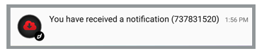

Notification icons refer to the image displayed in the notification center alongside the title, message and any other content associated with the notification.

At a minimum all notifications consist of an icon and body text. 


## iOS 

On iOS the icon is always your application icon. You do not need to do anything additional, just ensure your application has all the required application icon sizes.


## Android

On Android the icon is provided through Android resources and you cannot use your AIR application icon (except on much older versions of Android). This icon must be white and transparent to fit with the Android design guidelines, and will be used in various positions within the Android UI.


By default our extension will use a "bell" icon if you don't provide an icon resources yourself. In some circumstances you may see a white square. This is the Android attempt at using your application icon as the notification icon and is converting your icon based on whether a pixel is transparent or white.


To add your own icon you will need to create your custom resources and then package them into an ANE in your AIR application. To generate these resources goto the Android Asset Studio [Notification Icon Generator](https://romannurik.github.io/AndroidAssetStudio/icons-notification.html#source.space.trim=1&source.space.pad=0&name=ic_stat_distriqt_default) and upload your source image. 

**Take note of the name of the icon.** You will be using this name to reference this icon in notifications. Create as many different icons as you will require. These icons can be used for notification actions as well as for the main notification icon. You can use different icons for different notifications if you wish.


*Notification Bar with custom resource*


*Custom resource icon in simple notification*


To create your own custom resources ANE have a look at the opensource script we have created:

- [Custom Resources](https://github.com/distriqt/ANE-CustomResources)

If you have troubles running this script simply send us your resources and we will create the extension for you.


### Special Resources

We suggest you supply a default icon resource named `ic_stat_distriqt_default`. This icon will be used in situations where you don't supply an icon name for a notification. This will ensure all your notifications are correctly displayed. 

> 
> **Note**: With the OneSignal service it does not use our notification system and hence will not utilise the `ic_stat_distriqt_default` default icon resource. Instead you should supply a default icon resource named `ic_stat_onesignal_default`. This icon will be used in the same situations as the `ic_stat_distriqt_default` for the OneSignal service.
> 

If you don't supply a default icon, then you must ensure all your notifications have an icon property or you will get the default "bell" icon.


### Order of Display

Our extension uses the following order of preference when displaying an icon. If any aren't available or the version of Android doesn't match then the next in the list is attempted.

- custom icon resource (property in payload) 
- default icon resource
  - OneSignal: `ic_stat_onesignal_default`
  - All other services: `ic_stat_distriqt_default`
- bell icon on newer Android versions (Lollipop or newer)
- application icon on older Android versions


### Large Icons 

If you wish to use colour or a more detailed image for your notification you can use the "large icon" to display any image in place of the notification icon in the notification center. Your notification icon will still be displayed in the bar and overlayed on top of the large icon. 

For example, in the image below we have used a red cloud in a circle as the large icon and you will see the distriqt logo as our notification icon.



This icon is **not** a resource but an image either packaged with your application or downloaded from a url. We don't suggest using a url unless absolutely neccessary, as a user may not get notifications if the image fails to download correctly or the device is offline for any reason. It can also delay the notification while the image is downloaded.


### Firebase Notes

With Firebase Cloud Messaging you may use the console to send messages as opposed to the API. The notifications created from these messages aren't displayed using our notification creation logic but internal to Firebase. 

In order for you to specify the icon correctly in these situations you need to add the following to your manifest inside your `application` tag.

```xml
<meta-data android:name="com.google.firebase.messaging.default_notification_icon" android:resource="@drawable/ic_stat_distriqt_default" />
<meta-data android:name="com.google.firebase.messaging.default_notification_color" android:resource="@color/black" />
<meta-data android:name="com.google.firebase.messaging.default_notification_channel_id" android:value="default_channel_id" />
```

This will direct Firebase to use the same default icon as other notifications, however you can change the resource in the `default_notification_icon` to any that you require.

>
> Note: If you receive a missing resource error when packaging, make sure you have correctly specified the name of your resource for the `default_notification_icon`.
>

Some other values for the notification colour include (with their coresponding ARGB hex codes):

- `@color/white`: #FFFFFFFF
- `@color/black`: #FF000000
- `@color/blue`: #FF33B5E5
- `@color/purple`: #FFAA66CC
- `@color/green`: #FF99CC00
- `@color/orange`: #FFFFBB33
- `@color/red`: #FFFF4444
- `@color/darkblue`: #FF0099CC
- `@color/darkpurple`: #FF9933CC
- `@color/darkgreen`: #FF669900
- `@color/darkorange`: #FFFF8800
- `@color/darkred`: #FFCC0000

You can also add a colour to a resource and add it as part of your custom resources. Contact us if you need help with this.


#### OneSignal Notes

With OneSignal it is important that you provide a resource named `ic_stat_onesignal_default` as a default icon for your notifications. 

You can read more on OneSignal Android Notification Icons here: https://documentation.onesignal.com/docs/customize-notification-icons 
