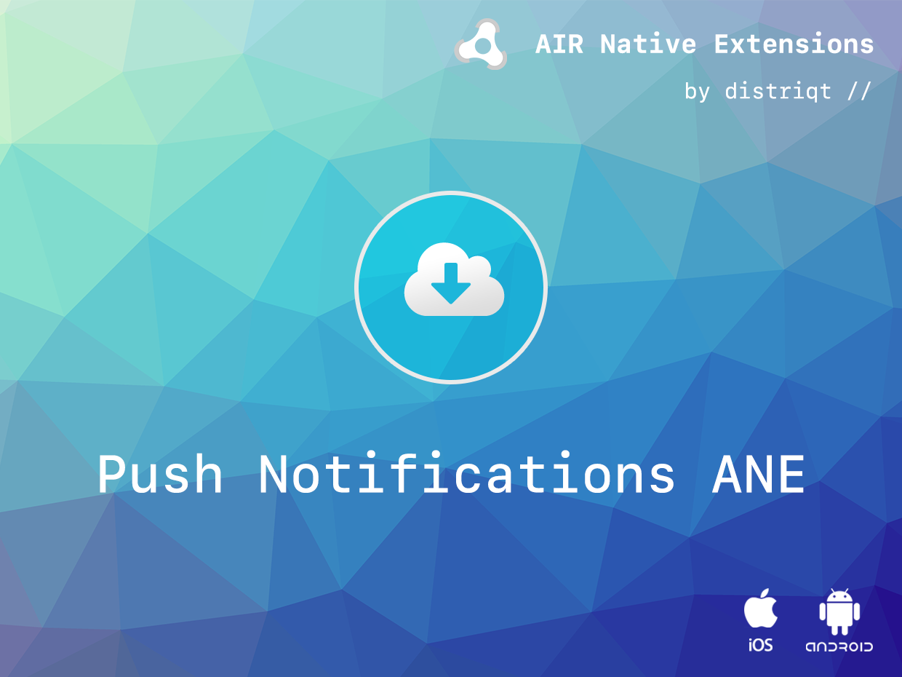
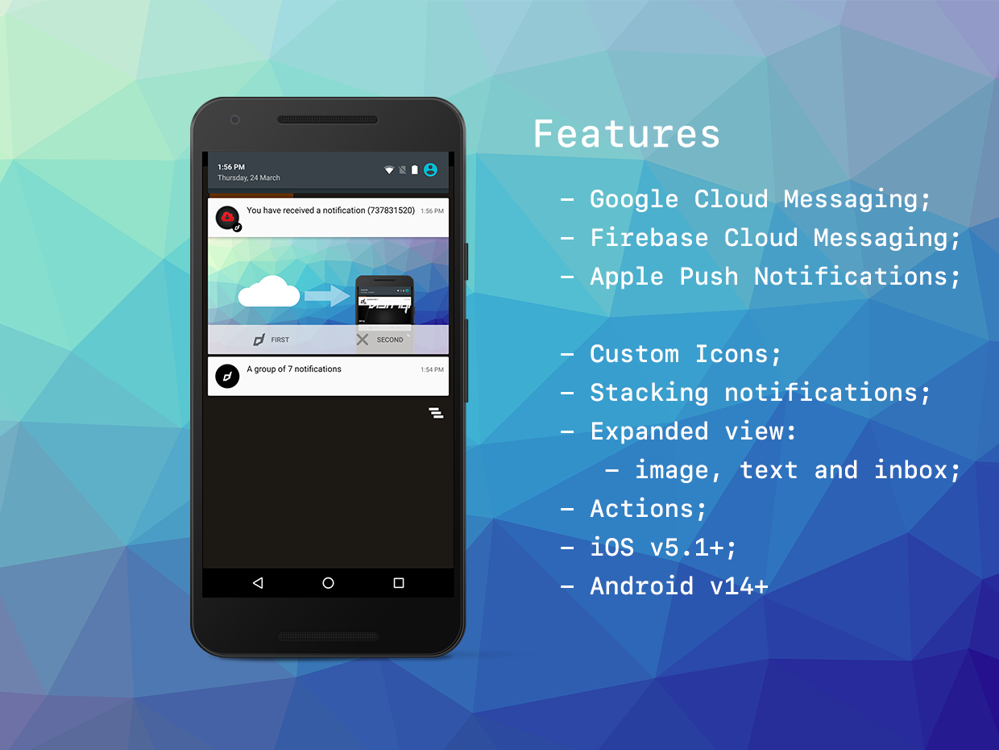

# Push Notifications

The [Push Notifications](https://airnativeextensions.com/extension/com.distriqt.PushNotifications) extension allows you to  receive and process push notifications using push notification services. 

The simple API will have you up and running with push notifications in just a few lines of code. 
Identical code base can be used across all platforms without any platform specific code, allowing you to develop once and deploy everywhere!

Advanced users have in depth access to permissions, payloads, and even silent notifications. 
You can control how to process the data and how to display the notification including many customisations allowing you to create useful push notifications for your users increasing user engagement and bringing them back to your application.

You can use silent notifications to send information about updates to your application without user interaction, allowing you to update content in the background without affecting your user experience.

You can give users the ability to quickly interact with your application through actions, 
allowing them to do common tasks quickly.

Our extension is completely customisable in notification fields allowing you to change the data fields 
that get processed into a notification on Android, allowing deep integration with other messaging platforms, such as OneSignal.

The simple extension API will have you quickly up and running with remote notifications.

As with all our extensions you get access to a year of support and updates as we are continually 
improving and updating the extensions for OS updates and feature requests.

### Features

- Apple Push Notification Service support for iOS devices;
- Google Cloud Messaging service support for Android devices;
- Firebase Cloud Messaging service support for iOS and Android devices;
- Azure Notification Hub service on Android and iOS;
- OneSignal Messaging service on Android and iOS;
- Windows Notification Service (WNS) on Windows 10;
- Register for and receive notifications from remote services with only a few lines of code;
- Receive notifications on application start if the user started from a notification;
- Single simple API interface - your code works across supported platforms with no modifications;
- Sample project code and ASDocs reference

### Supported services

- Apple Push Notification Service (APNS)
- Firebase Cloud Messaging (FCM)
- Google Cloud Messaging (GCM)
- OneSignal
- Windows Notification Service (WNS)
- Azure Notification Hubs

This Wiki forms the best source of detailed documentation for the extension along with 
the [asdocs](https://docs.airnativeextensions.com/asdocs/pushnotifications). 

