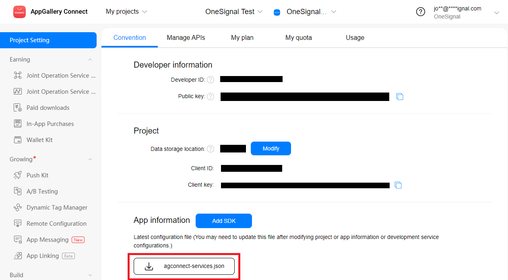

import Tabs from "@theme/Tabs";
import TabItem from "@theme/TabItem";

If you wish to use Amazon device messaging in OneSignal you will need to do some additional changes to your installation.

We will assume you have already setup your OneSignal account and have your App ID. If not see the [setup](onesignal.md) section.

## Amazon API Key File

Download the `agconnect-services.json` file:

- From the AppGallery Connect Project List select your app.

- Ensure you have added your certificate SHA fingerprint to your app configuration.

- Click on the "agconnect-services.json" button to download this file.



- Place this file at the root of your application and ensure it is packaged.

## Update Manifest

In order to support Amazon we need to add a few things to the manifest additions in your app descriptor.

<Tabs
  groupId="packagemanager"
  defaultValue="apm"
  values={[
    {label: 'APM', value: 'apm'},
    {label: 'Manual', value: 'manual'},
  ]}>

  <TabItem value="apm" >

Using `apm` you can generate a custom configuration which can be merged into your app descriptor by `apm`. Firstly create a configuration for android:

```
apm generate config android
```

Then edit the file created at `config/android/AndroidManifest.xml`.

Firstly add the amazon namespace at the top of the file:

```xml
<?xml version="1.0" encoding="utf-8"?>
<manifest xmlns:android="http://schemas.android.com/apk/res/android"
    xmlns:amazon="http://schemas.amazon.com/apk/res/android"
>
```

Then add the following permissions, services and receivers, so your file should resemble:

```xml
<?xml version="1.0" encoding="utf-8"?>
<manifest xmlns:android="http://schemas.android.com/apk/res/android"
    xmlns:amazon="http://schemas.amazon.com/apk/res/android"
>
    <uses-sdk android:minSdkVersion="19" android:targetSdkVersion="33"/>

    <uses-permission android:name="com.amazon.device.messaging.permission.RECEIVE" />
    <permission android:name="${applicationId}.permission.RECEIVE_ADM_MESSAGE" android:protectionLevel="signature" />
    <uses-permission android:name="${applicationId}.permission.RECEIVE_ADM_MESSAGE" />

    <application>

        <amazon:enable-feature android:name="com.amazon.device.messaging" android:required="false"/>
        <service android:name="com.onesignal.notifications.services.ADMMessageHandler" android:exported="false" />
        <service android:name="com.onesignal.notifications.services.ADMMessageHandlerJob"
                android:permission="android.permission.BIND_JOB_SERVICE"
                android:exported="false" />
        <receiver android:name="com.onesignal.notifications.receivers.ADMMessageReceiver"
                android:permission="com.amazon.device.messaging.permission.SEND"
                android:exported="true" >
            <intent-filter>
                <action android:name="com.amazon.device.messaging.intent.REGISTRATION" />
                <action android:name="com.amazon.device.messaging.intent.RECEIVE" />
                <category android:name="${applicationId}" />
            </intent-filter>
        </receiver>

    </application>

</manifest>
```

:::info
Do not change the `${applicationId}` references as these will be automatically handled by the merge process.
:::


Then regenerate your application descriptor.

```
apm generate app-descriptor
```

  </TabItem>
  <TabItem value="manual" >

To manually do this you will need to manually add the following to your manifest additions in your application descriptor.

Firstly add the amazon namespace at the top of the file:

```xml
<manifestAdditions><![CDATA[
			<manifest xmlns:amazon="http://schemas.amazon.com/apk/res/android">

      ...

      ]]>
</manifestAdditions>
```

You should add the listing below to your manifest, ensure you merge the `application` node with any existing node in your manifest.
The following listing should be added along with the listing used when originally installing OneSignal.

:::caution
Ensure you replace:
-  `APPLICATION_PACKAGE` with your AIR application's Java package name, something like `air.com.distriqt.test`. Generally this is your AIR application id prefixed by `air.` unless you have specified no air flair in your build options.
:::


```xml
<uses-permission android:name="com.amazon.device.messaging.permission.RECEIVE" />
<permission android:name="APPLICATION_PACKAGE.permission.RECEIVE_ADM_MESSAGE" android:protectionLevel="signature" />
<uses-permission android:name="APPLICATION_PACKAGE.permission.RECEIVE_ADM_MESSAGE" />

<application>
  <amazon:enable-feature android:name="com.amazon.device.messaging"
                         android:required="false"/>
  <service android:name="com.onesignal.ADMMessageHandler"
           android:exported="false" />
  <service android:name="com.onesignal.ADMMessageHandlerJob"
           android:permission="android.permission.BIND_JOB_SERVICE"
           android:exported="false" />
  <receiver android:name="com.onesignal.ADMMessageHandler$Receiver"
            android:permission="com.amazon.device.messaging.permission.SEND" >
    <intent-filter>
      <action android:name="com.amazon.device.messaging.intent.REGISTRATION" />
      <action android:name="com.amazon.device.messaging.intent.RECEIVE" />
      <category android:name="APPLICATION_PACKAGE" />
    </intent-filter>
  </receiver>
</application>
```


  </TabItem>
  
</Tabs>

