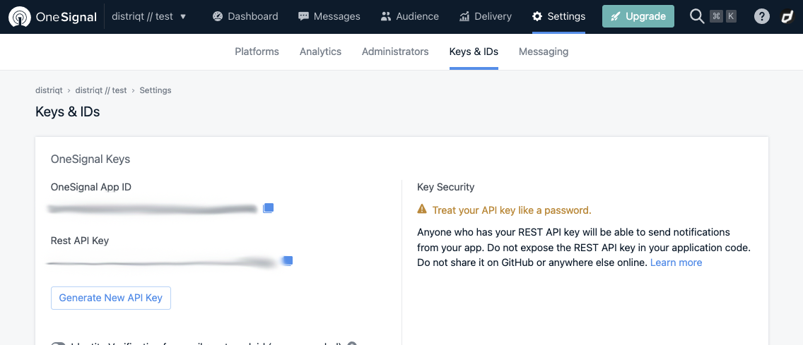

OneSignal provides a simple interface to push notifications, letting content creators focus on quality user engagement instead of complex implementation.

OneSignal's documentation is fairly comprehensive and will guide you through the majority of the setup, so we are just going to highlight the key points here.

## Create an Account

The first step is to create an account with OneSignal. 

You can sign up here: 
- [Sign Up](https://app.onesignal.com/signup)

Once you have created an account, log in to the app:
- [Login](https://app.onesignal.com/login)

## Create an App 

The process is fairly straight forward to add a new app to your account. Follow the guide and create your app. You will initially just add one platform and you can add others later.

- Click the "New App/Website" button;
- Enter the name of your application and select one of the platforms (iOS/Android etc);
- Follow the documentation to configure your application;

Once complete you will need to take note of your *OneSignal App ID*. This is available in your app dashboard, under *Settings / Keys & IDs*. 

> Your OneSignal App ID or just App ID, is the main identifier we use to differentiate your app from all other OneSignal apps. You will use this in all your SDK initialization codes and API calls. The App ID should not be treated as private.

More information on the OneSignal App ID is available in [Keys & IDs](https://documentation.onesignal.com/docs/accounts-and-keys#section-app-id).

