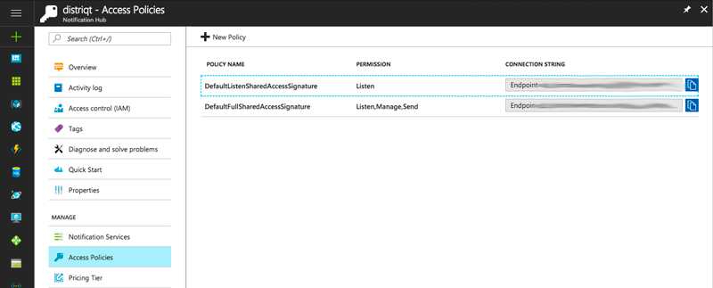

The following shows how to configure the `Service` for usage with your Azure Notification Hub.


```actionscript
var service:Service;
if (PushNotifications.service.isServiceSupported( Service.AZURE ))
{
	service = new Service( Service.AZURE );
	service.serviceId  = AZURE_HUB_NAME;
	service.serviceKey = AZURE_HUB_LISTENACCESS;
}

PushNotifications.service.setup( service );
```


The `serviceId` will be the name of your notification hub, eg `distriqt`.

The `serviceKey` will be the connection string value for the `DefaultListenSharedAccessSignature` 
policy defined in the **Access Policies** section of your hub.




