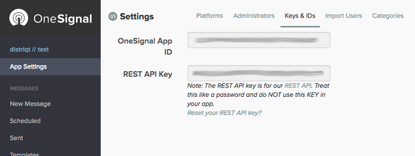

OneSignal does most of the initialisation of your application from the server so you should
just need to add your app id to the service and call `setup`.

The following shows how to configure the `Service` for usage with your One Signal app.


```actionscript
var service:Service = new Service( Service.ONESIGNAL, Config.oneSignalAppId );
service.enableNotificationsWhenActive = true;
	
PushNotifications.service.setup( service );
```

The `serviceId` will be your OneSignal App ID which you can retrieve from your App Settings under **Keys & IDs**.





## Android notification sounds

As of Android O notification sounds now need to be specified on a Channel.
So in order to play a custom sound on a notification you need to setup a channel. 

>
> Note you must have added the FileProvider correctly to your manifest additions for sounds to playback correctly.
>


OneSignal will do this automatically through the dashboard however it requires resources for the notification sounds. The easier method is to setup the channels in your application and then just use the existing notification channel id when sending notifications.


```actionscript
var service:Service = new Service( Service.ONESIGNAL, Config.oneSignalAppId )
	.setNotificationsWhenActive( true )
;
						
service.channels.push(
	new ChannelBuilder()
		.setId( "sound_channel" )
		.setName( "Sound Channel" )
		.setSound( "assets/notifications/sounds/notification.mp3" )
		.setImportance( Channel.IMPORTANCE_HIGH )
		.build()
);
						
PushNotifications.service.setup( service );
```


Then when sending your notification set the channel id to the id defined in your channel (`sound_channel` in the above example):

- Using REST set the "existing_android_channel_id"
- Using the dashboard set the Category to "(Created In App)" and set the Local Channel Id to your channel id.


