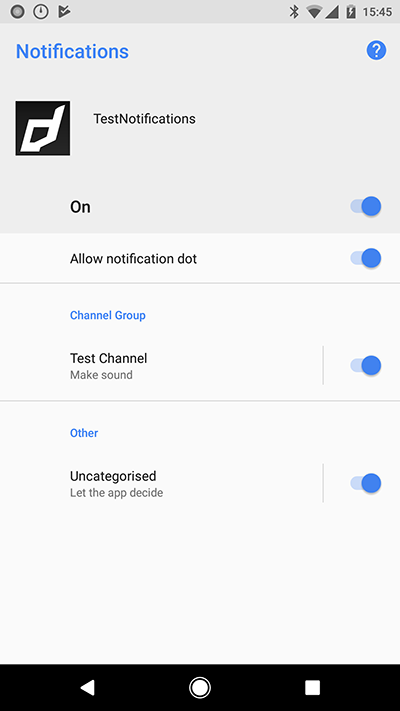

## Core Initialisation

It is important that before attempting to use any of this extensions functionality that your initialise the Core extension by calling at some point early in your application, generally at the same time as the initialisation of this extension. If you are using other extensions that also require the Core extension, you only need to initialise it once, before initialising the other extensions.

```actionscript
Core.init();
```

The Core extension doesn't provide any functionality in itself but provides support libraries and frameworks used by our extensions. This initialisation ensures that the functionality to support application level communication is enabled eg from launch notifications and events.


## Service

When you are setting up your `Service` there are a few additional options you can set to use some of the advanced features of the services.


### Service Type

The most important option is the service type you plan to use in your application.

You must set this early by creating an instance of the `Service` class and passing it
to the `setup` function. It cannot be changed.

The available services are listed in the `Service` class, include:

- `APNS` : Apple's Push Notification Service 
  - iOS only
- `FCM` : Firebase Cloud Messaging 
  - Android and iOS
- `GCM` : Google Cloud Messaging 
  - **No longer supported**  
- `ONESIGNAL` : One Signal
  - Android and iOS 
  - (Windows manually through WNS)
- `WNS` : Windows Notification Service
  - Windows
- `AZURE` : Microsoft Notification Hubs
  - Android and iOS
- `DEFAULT` : The service type will depend on the platform
  - iOS: `APNS`
  - Android: `GCM`


```actionscript
var service:Service = new Service( Service.DEFAULT );

// Call setup to configure
PushNotifications.service.setup( service );
```

If you wish to use APNS on iOS and FCM on Android you can use something like the following:

```actionscript
var service:Service;
if (PushNotifications.service.implementation == "iOS")
{
	service = new Service( Service.APNS );
}
else 
{
	service = new Service( Service.FCM );
}
PushNotifications.service.setup( service );
```


### Checking Service Support

You can check whether the current application/device supports a particular service by using the `isServiceSupported` function.

```actionscript 
if (PushNotifications.service.isServiceSupported( Service.FCM ))
{
	// FCM is supported on the current device
}
```

The return value of this function will be different not only between devices and platforms but also between the variants of the extension. For example, the Azure variant will return false for support for FCM, whereas the FCM variant will return true.

You can use this to prioritise services as your application requires.

For example: 

```actionscript
if (PushNotifications.isSupported)
{
	var service:Service;
	if (PushNotifications.service.isServiceSupported( Service.FCM ))
	{
		service = new Service( Service.FCM );
	}
	else if (PushNotifications.service.isServiceSupported( Service.APNS ))
	{
		service = new Service( Service.APNS );
	}
	else 
	{
		// Handle the case where no service supported. 
		// Eg: turn off notifications in this application
	}
}
```


### Service ID

Some services require an identifier to be included as part of the configuration.

This is only required for some services such as GCM and Azure. 

For example, with GCM you should set your GCM sender id here:

```actionscript
service.serviceId = GCM_SENDER_ID;
```

This can be left as the default on other platforms and will be ignored.


### Service Key

In addition to the `serviceId` some services require an auth key or connection string
which should be specified here.

```actionscript
service.serviceKey = "";
```

This can be left as the default on most platforms and will be ignored.


### Categories and Actions

The main feature you will probably want to configure here are your notification categories and actions. 
These represent the quick actions that a user can take on a notification.

In the notification payload a notification can be given a category. 
The system will then apply that category to the notification. 
A category contains a series of actions which will be displayed when the notification is interacted with.
Each category and action must be given a unique identifier so you can process them accordingly in your code. 
Additionally each action must be given a title.


```actionscript
var service:Service = new Service( Service.DEFAULT, Config.gcmSenderId );
service.enableNotificationsWhenActive = true;

service.categories.push( 
	new CategoryBuilder()
		.setIdentifier( "INVITE_CATEGORY" )
		.addAction( 
			new ActionBuilder()
				.setTitle( "Accept" )
				.setIdentifier( "ACCEPT_IDENTIFIER" )
				.build()
		)
		.addAction( 
			new ActionBuilder()
				.setTitle( "Delete" )
				.setDestructive( true )
				.setIdentifier( "DELETE_IDENTIFIER" )
				.build()
		)
		.build()
);

PushNotifications.service.setup( service );
```


### Notifications When Active

On Android, Windows and on iOS v10+ you can enable notifications while your application is active. 
This will show a notification to the user, even if they are currently using the application.

The default is `false`, i.e. not show a notification and your application would only receive
the notification event.

```actionscript
service.setNotificationsWhenActive( true );
```

### Sandbox Mode

Lastly in order to correctly test some of the services you should specify whether you
are using the sandbox (testing) mode. This is not required by all platforms however some,
including Firebase on iOS require this setting to be able to correctly test your application.

Set `sandboxMode` to `true` for development environments and the default `false` for production.

```actionscript
service.sandboxMode = true;
```


### Channels

New to Android `8.0` (API level 26) is the concept of a notification channel. 

>
> Notification channels provide a unified system to help users manage notifications. When you target Android 8.0 (API level 26), you must implement one or more notification channels to display notifications to your users. If you don't target Android 8.0 (API level 26) but your app is used on devices running Android 8.0 (API level 26), your app behaves the same as it would on devices running Android 7.1 (API level 25) or lower.
>


> Note: The user interface refers to notification channels as notification categories.

You can create an instance of a `Channel` for each distinct type of notification you need to send. You can also create notification channels to reflect choices made by users of your app. For example, you may set up separate notification channels for each conversation group created by a user in a messaging app.

Users can manage most of the settings associated with notifications using a consistent system UI. All notifications posted to the same notification channel have the same behavior. When a user modifies the behavior for any of the following characteristics, it applies to the notification channel:

- Importance
- Sound
- Lights
- Vibration
- Show on lockscreen
- Override do not disturb



Users can visit Settings, or long-press a notification to change these behaviors, or even block a notification channel at any time. You can't programmatically modify the behavior of a notification channel after it's created and submitted to the notification manager; the user is in charge of those settings after creation. You can however rename a notification channel or update its description after creation.


#### Creating Channels

To create channels you add them to your `Service` definition. A `Service.channels` is an array of `Channel` objects that you should create when passing your service to the `setup` function.

You should use the `ChannelBuilder` to create a `Channel` object.

```actionscript
var service:Service = new Service();

// Setup other service related properties

service.channels.push(
    new ChannelBuilder()
        .setId( "test_channel" )
        .setName( "Test Channel" )
        .build()
);
```

**You must add at least one channel.**


#### Channel Sounds

Notification sounds on Android O (API v26) and higher now must be set on the Channel. Individual notification sounds will be ignored. 

To set a sound on a channel, use the `setSound( path )` function and pass the local path to an mp3 file.

eg:

```actionscript
new ChannelBuilder()
	.setId( "test_channel" )
	.setName( "Test Channel" )
	.setSound( "assets/notifications/sounds/notification.mp3" )
	.build()
```

This path should be relative to your application root.

This path can also be a resource name if you are packaging raw mp3 resources with your application in a custom resources extension.


### Example

The following example sets up the `DEFAULT` service with a category containing two actions.

```actionscript
var service:Service = new Service( Service.DEFAULT, Config.gcmSenderId );
service.sandboxMode = false;
service.enableNotificationsWhenActive = true;

service.categories.push( 
	new CategoryBuilder()
		.setIdentifier( "INVITE_CATEGORY" )
		.addAction( 
			new ActionBuilder()
				.setTitle( "Accept" )
				.setIdentifier( "ACCEPT_IDENTIFIER" )
				.build()
		)
		.addAction( 
			new ActionBuilder()
				.setTitle( "Delete" )
				.setDestructive( true )
				.setIdentifier( "DELETE_IDENTIFIER" )
				.build()
		)
		.build()
);

service.channels.push(
    new ChannelBuilder()
        .setId( "test_channel" )
        .setName( "Test Channel" )
        .build()
);

PushNotifications.service.setup( service );
```

