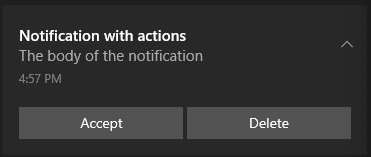

>
> The Windows Push Notification Services (WNS) enable third-party developers to send toast, tile, badge, and raw updates from their own cloud service. This provides a mechanism to deliver new updates to your users in a power-efficient and dependable way.
>
> 
>

WNS is supported by all of the ANEs in the repository. It is the core notification service on Windows UWP and requires minimal additional libraries so we have included it in every ANE.  

Make sure you have added the common ANEs from the [Add the Extension](../add-the-extension) section particularly the Core ANE and been through the specific requirements for [Windows](add-the-extension).


- [AppxManifest additions](#appxmanifest)


## Credentials

Before you can send notifications using WNS, your app must be registered with the Store Dashboard. This will provide you with credentials for your app that your cloud service will use in authenticating with WNS. These credentials consist of a Package Security Identifier (SID) and a secret key. 

To perform this registration, sign in to [Partner Center](https://partner.microsoft.com/en-us/dashboard/home). After you create your app, you can retrieve the credentials bygoing to the WNS/MPNS page and clicking on the **Live Services site** link.


The live services page will contain the credentials you need. In particular, you'll need to note:

- **Application Secret**, or "client secret";
- **Package SID**, "or client id".


These credentials are used when sending notifications and not needed in your application. Your application needs no specific identifiers, however it must be created with the same `Identity` as the application in the store, ie you will see the **Application Identity** tag in the image above matches the `AppxManifest` below.


**Each app has its own set of credentials for its cloud service. These credentials cannot be used to send notifications to any other app.**


See the [WNS message section](windows-wns-message) for an example usage.


## AppxManifest

The windows notifications UWP support requires a couple of additions to your AppxManifest in order to receive notification events when the user interacts with the notification.

You will need to use the "Sign Separately" method to package your `appx` as described [here](/docs/tutorials/windows-appx-packaging-method1). 

>
> **If you don't make these changes then your application will not receive all the notification events.**
>

During the "Update Content" step you will need to edit the `AppxManifest.xml` file contained in the pacakged files directory and add the following:

- Declaration for `xmlns:com`
- Declaration for `xmlns:desktop`
- In the `IgnorableNamespaces` attribute, `com` and `desktop`
- `com:Extension` for the COM activator
- `desktop:Extension` for `windows.toastNotificationActivation` to declare your toast activator


```xml
<Package
  ...
  xmlns:com="http://schemas.microsoft.com/appx/manifest/com/windows10"
  xmlns:desktop="http://schemas.microsoft.com/appx/manifest/desktop/windows10"
  IgnorableNamespaces="... com desktop">
  ...
  <Applications>
    <Application>
      ...
      <Extensions>

        <!--Register COM CLSID LocalServer32 registry key-->
        <com:Extension Category="windows.comServer">
          <com:ComServer>
            <com:ExeServer Executable="YOURAPPLICATION.exe" Arguments="-ToastActivated" DisplayName="Toast activator">
              <com:Class Id="4db090a5-b5c9-4cbf-97a6-dd6a431f8749" DisplayName="Toast activator"/>
            </com:ExeServer>
          </com:ComServer>
        </com:Extension>

        <!--Specify which CLSID to activate when toast clicked-->
        <desktop:Extension Category="windows.toastNotificationActivation">
          <desktop:ToastNotificationActivation ToastActivatorCLSID="4db090a5-b5c9-4cbf-97a6-dd6a431f8749" /> 
        </desktop:Extension>

      </Extensions>
    </Application>
  </Applications>
 </Package>
```


You also need to replace `YOURAPPLICATION` with the name of the `Executable` attribute in the `Application` node.

For example, this is the entire `AppxManifest.xml` for the distriqt test application:


```xml
<?xml version="1.0" encoding="utf-8"?>
<Package
  xmlns="http://schemas.microsoft.com/appx/manifest/foundation/windows10" 
  xmlns:uap="http://schemas.microsoft.com/appx/manifest/uap/windows10" 
  xmlns:uap2="http://schemas.microsoft.com/appx/manifest/uap/windows10/2" 
  xmlns:uap3="http://schemas.microsoft.com/appx/manifest/uap/windows10/3" 
  xmlns:uap4="http://schemas.microsoft.com/appx/manifest/uap/windows10/4" 
  xmlns:rescap="http://schemas.microsoft.com/appx/manifest/foundation/windows10/restrictedcapabilities" 
  xmlns:rescap3="http://schemas.microsoft.com/appx/manifest/foundation/windows10/restrictedcapabilities/3" 
  xmlns:desktop="http://schemas.microsoft.com/appx/manifest/desktop/windows10" 
  xmlns:desktop2="http://schemas.microsoft.com/appx/manifest/desktop/windows10/2" 
  xmlns:desktop3="http://schemas.microsoft.com/appx/manifest/desktop/windows10/3" 
  xmlns:com="http://schemas.microsoft.com/appx/manifest/com/windows10" 
  xmlns:wincap3="http://schemas.microsoft.com/appx/manifest/foundation/windows10/windowscapabilities/3" 
  IgnorableNamespaces="uap4 wincap3 rescap3 desktop desktop2 desktop3 com">
  <Identity Name="distriqt.airnativeextensions" ProcessorArchitecture="x86" Publisher="CN=38CAD93E-B1A7-480F-B65D-3545798BA205" Version="1.0.0.0" />
  <Properties>
    <DisplayName>distriqt.airnativeextensions</DisplayName>
    <PublisherDisplayName>distriqt</PublisherDisplayName>
    <Logo>Assets\StoreLogo.png</Logo>
  </Properties>
  <Resources>
    <Resource Language="en-us" />
    <Resource uap:Scale="100" />
    <Resource uap:Scale="125" />
    <Resource uap:Scale="150" />
    <Resource uap:Scale="200" />
    <Resource uap:Scale="400" />
  </Resources>
  <Dependencies>
    <TargetDeviceFamily Name="Windows.Desktop" MinVersion="10.0.14393.0" MaxVersionTested="10.0.16299.15" />
  </Dependencies>
  <Capabilities>
    <rescap:Capability Name="runFullTrust" />
    <Capability Name="internetClient" />
  </Capabilities>
  <Applications>
    <Application Id="distriqt.airnativeextensions" Executable="testnotifications.exe" EntryPoint="Windows.FullTrustApplication">
      <uap:VisualElements DisplayName="distriqt.airnativeextensions" Description="distriqt.airnativeextensions" BackgroundColor="transparent" Square150x150Logo="Assets\Square150x150Logo.png" Square44x44Logo="Assets\Square44x44Logo.png">
        <uap:DefaultTile Wide310x150Logo="Assets\Wide310x150Logo.png" Square310x310Logo="Assets\Square310x310Logo.png" Square71x71Logo="Assets\Square71x71Logo.png">
          <uap:ShowNameOnTiles>
            <uap:ShowOn Tile="square150x150Logo" />
            <uap:ShowOn Tile="wide310x150Logo" />
            <uap:ShowOn Tile="square310x310Logo" />
          </uap:ShowNameOnTiles>
        </uap:DefaultTile>
      </uap:VisualElements>

      <Extensions>
        <!--Register COM CLSID LocalServer32 registry key-->
        <com:Extension Category="windows.comServer">
          <com:ComServer>
            <com:ExeServer Executable="testnotifications.exe" Arguments="-ToastActivated" DisplayName="Toast activator">
              <com:Class Id="aa28441a-fba8-45dc-887e-149495769502" DisplayName="Toast activator"/>
            </com:ExeServer>
          </com:ComServer>
        </com:Extension>

        <!--Specify which CLSID to activate when toast clicked-->
        <desktop:Extension Category="windows.toastNotificationActivation">
          <desktop:ToastNotificationActivation ToastActivatorCLSID="aa28441a-fba8-45dc-887e-149495769502" /> 
        </desktop:Extension>
        
      </Extensions>
    </Application>
  </Applications>
</Package>
```


## Terminology

WNS refers to a "notification channel" that is created for you to send notifications to. This channel is the value that is returned as the "device token" from this extension. 


## Supported Features 

WNS supports actions, selection and notification events. 

Actions need to be specified through the payload of the notification and any categories and actions specified through the `Service` aren't used.

It doesn't support channels or groups currently.

Authorisation is not required, and will always be in the `authorised` state.

Topic subscriptions are not supported.
