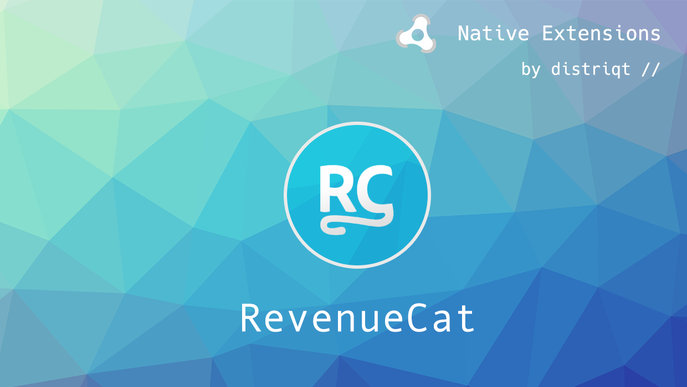

# RevenueCat

The [RevenueCat](https://airnativeextensions.com/extension/com.distriqt.RevenueCat) extension gives you access to ...

TODO


We provide complete guides to get you up and running with sharing quickly and easily.


### Features

- ...
- Single API interface - your code works across iOS and Android with no modifications
- Sample project code and ASDocs reference

As with all our extensions you get access to a year of support and updates as we are 
continually improving and updating the extensions for OS updates and feature requests.


## Documentation

The [documentation site](https://docs.airnativeextensions.com/docs/revenuecat) forms the best source of detailed documentation for the extension along with the [asdocs](https://docs.airnativeextensions.com/asdocs/revenuecat). 

Quick Example: 

```actionscript title="AIR"
```

More information here: 

[com.distriqt.RevenueCat](https://airnativeextensions.com/extension/com.distriqt.RevenueCat)


## License

You can purchase a license for using this extension:

- [airnativeextensions.com](https://airnativeextensions.com/)


distriqt retains all copyright.


