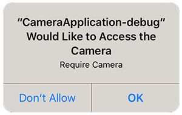

## Add the Extension

First step is always to add the extension to your development environment. 
To do this use the tutorial located [here](/docs/tutorials/getting-started).


## Dependencies

Many of our extensions use some common libraries, for example, the Android Support libraries.

We have to separate these libraries into separate extensions in order to avoid multiple versions of the libraries being included in your application and causing packaging conflicts. This means that you need to include some additional extensions in your application along with the main extension file.

You will add these extensions as you do with any other extension, and you need to ensure it is packaged with your application.


### Core 

The Core ANE is required by this ANE. You must include and package this extension in your application.

The Core ANE doesn't provide any functionality in itself but provides support libraries and frameworks used by our extensions.
It also includes some centralised code for some common actions that can cause issues if they are implemented in each individual extension.

You can access this extension here: [https://github.com/distriqt/ANE-Core](https://github.com/distriqt/ANE-Core).


### Android Support

The Android Support libraries encompass the Android Support, Android X and common Google libraries. 

These libraries are specific to Android. There are no issues including these on all platforms, they are just **required** for Android.

This extension requires the following extensions:

- [androidx.core.ane](https://github.com/distriqt/ANE-AndroidSupport/raw/master/lib/androidx.core.ane)

You can access these extensions here: [https://github.com/distriqt/ANE-AndroidSupport](https://github.com/distriqt/ANE-AndroidSupport).


>
> **Note**: if you have been using the older `com.distriqt.androidsupport.*` (Android Support) extensions you should remove these extensions and replace it with the `androidx` extensions listed above. This is the new version of the android support libraries and moving forward all our extensions will require AndroidX.
>


## Extension IDs

The following should be added to your `extensions` node in your application descriptor to identify all the required ANEs in your application:

```xml
<extensions>
    <extensionID>com.distriqt.Scanner</extensionID>
    <extensionID>com.distriqt.Core</extensionID>
    <extensionID>androidx.core</extensionID>
</extensions>
```


## Android 

### Manifest Additions

The Scanner ANE requires a few additions to the manifest to be able to get access 
to the device camera and to display the scanning activity. 

You should add the listing below to your manifest:

```xml
<manifest android:installLocation="auto">
	<uses-sdk android:minSdkVersion="14" android:targetSdkVersion="23"/>
	
	<uses-permission android:name="android.permission.INTERNET"/>
	<uses-permission android:name="android.permission.CAMERA"/>
	<uses-feature android:name="android.hardware.camera" />
	
	<application>
		<activity android:name="com.distriqt.extension.scanner.zbar.ZBarScannerActivity" />
		<activity android:name="com.distriqt.extension.scanner.permissions.AuthorisationActivity" android:theme="@android:style/Theme.Translucent.NoTitleBar" />
	</application>
	
</manifest>
```


## iOS 

### Info Additions

The following additions are for the `InfoAdditions` node of the iPhone section in your application descriptor:

```xml
<iPhone>
	<InfoAdditions><![CDATA[

		HERE

	]]></InfoAdditions>
</iPhone>
```


If you are using **iOS 10** you now need to add some strings to display messages to the user 
when certain permissions are requested. 

The most important string is the camera usage description which will get displayed during
the request authorisation process (later). 



The key that controls the text in this dialog is:

```xml
	<key>NSCameraUsageDescription</key>
	<string>Require camera usage description</string>
```


## Checking for Support

You can use the `isSupported` flag to determine if this extension is supported on the current platform and device.

This allows you to react to whether the functionality is available on the device and provide an alternative solution if not.


```actionscript
if (Scanner.isSupported)
{
	// Functionality here
}
```

