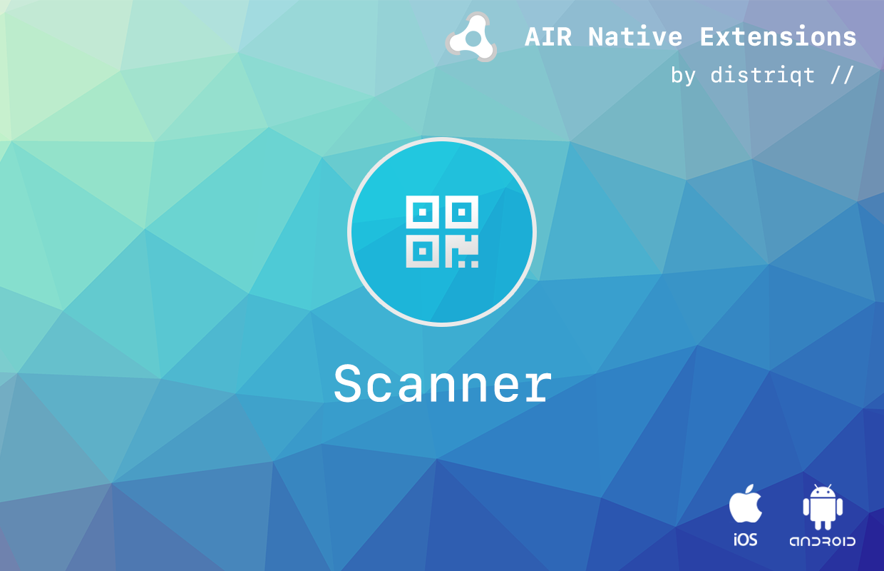

# Scanner

The [Scanner](https://airnativeextensions.com/extension/com.distriqt.Scanner) extension 
allows you to display an interface using the camera to scan for codes such as QR Codes, 
bar codes and other such encoded information. It supports many popular symbologies 
(types of bar codes) including EAN-13/UPC-A, UPC-E, EAN-8, Code 128, Code 39, 
Interleaved 2 of 5 and QR Code. 

However the particular support will be determined by the underlying algorithm in use.

The extension currently supports the following algorithms for code detection:

- ZBar: http://zbar.sourceforge.net/


### Features

- Provides the ability to create a bar code scanning interface
- Ability to set a custom target image
- Uses the built in default camera for scanning
- Works across iOS and Android with the same code
- Sample project code and ASDocs reference


The simple API allows you to quickly integrate scanning in your AIR application. 
Identical code base can be used across all platforms allowing you to concentrate on 
your application and not device specifics.

We provide complete guides to get you up and running with the extension quickly and easily.

As with all our extensions you get access to a year of support and updates as we are continually 
improving and updating the extensions for OS updates and feature requests.


## Documentation


The [wiki](https://github.com/distriqt/ANE-Scanner/wiki) forms the best source of detailed documentation for the extension along with the [asdocs](https://docs.airnativeextensions.com/asdocs/scanner). 


Quick Example:

```actionscript
```

More information here: 

[com.distriqt.Scanner](https://airnativeextensions.com/extension/com.distriqt.Scanner)


## License

You can purchase a license for using this extension:

[airnativeextensions.com](https://airnativeextensions.com/)

distriqt retains all copyright.


