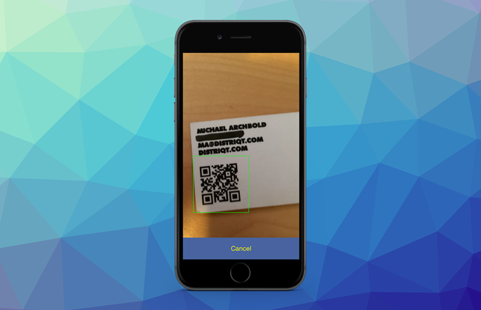
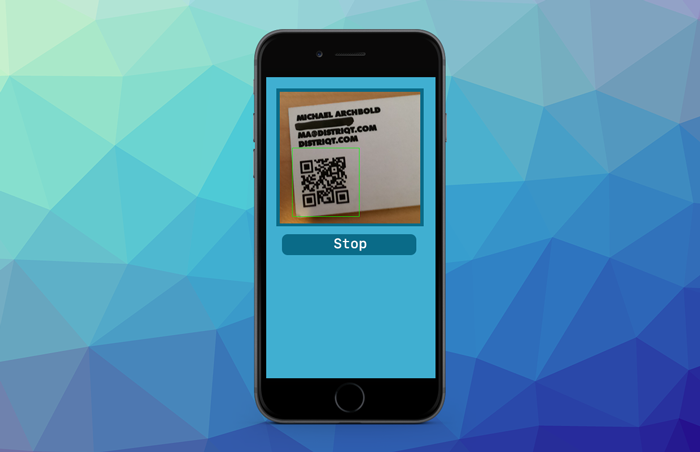

Once you have setup your application and gained permission to access the camera, then there are three approaches you can take to scan, 2 that utilise the camera directly and a third option to scan a provided image.


The first is using a fullscreen activity which will take over the fullscreen of your application, presenting a camera preview and some UI elements. 




The second is to show a preview contained within an area (viewport) of your application. This view will sit above any other elements however you can create a UI around the preview to control the scanner or present feedback to your user.




The third is to scan an image directly by passing bitmap data to the extension. 


Below we describe the methods using the camera. You can find information on bitmap data scanning [here](scanning-bitmap-data).

:::info Authorisation
Ensure you have [requested authorisaton](requesting-access) to use the camera before attempting to use these methods. 
:::


## Scan Activity


To start the fullscreen scan activity, call the `startScanActivity()` method passing in the required options. This method takes several parameters:

- [`ActivityOptions`](#activity-options): instance describing the appearance of the fullscreen UI elements;
- [`ScannerOptions`](#scanner-options): describing the options for the scanning algorithm (eg symbologies);
- [`CameraOptions`](#camera-options): options for configuring the camera such as whether to use the front or rear camera;

You can pass in `null` (the default) for all the options to simply use the defaults.


```actionscript
Scanner.service.startScanActivity();
```

This function will return a `Boolean` value indicating the success of the start request. If it returns `false` there may be another scan in progress or there was an error.


To specify options:

```actionscript
var scanOptions:ScannerOptions = new ScannerOptions();
scanOptions.symbologies = [];

var uiOptions:ActivityOptions = new ActivityOptions();
uiOptions.singleResult = false;
uiOptions.heading = "Scan a barcode";
uiOptions.cancelLabel = "FINISH";
uiOptions.colour = 0x4863A0;
uiOptions.textColour = 0xFFFFFF;

uiOptions.overlay = _overlay.bitmapData;
uiOptions.overlayAutoScale = true;

var cameraOptions:CameraOptions = new CameraOptions();
cameraOptions.refocusInterval = 0;
cameraOptions.camera    = CameraOptions.CAMERA_REAR;
cameraOptions.torchMode = CameraOptions.TORCH_AUTO;

var success:Boolean = Scanner.service.startScanActivity(
		scanOptions,
		uiOptions,
		cameraOptions
);
```


## Scan in Viewport

To start the scan in a viewport call the `startScanInViewport()` method passing in the required options. This method takes several parameters:

- [`ViewportOptions`](#viewport-options): instance describing the viewport for the camera preview;
- [`ScannerOptions`](#scanner-options): describing the options for the scanning algorithm (eg symbologies);
- [`CameraOptions`](#camera-options): options for configuring the camera such as whether to use the front or rear camera;

You can pass in `null` (the default) for all the options to simply use the defaults, however we suggest you at least pass a valid `ViewportOptions` instance to set the initial frame for the camera preview.


```actionscript
var frame:Rectangle = ...;

var viewportOptions:ViewportOptions = new ViewportOptions()
		.setFrame( frame );

Scanner.service.startScanInViewport( viewportOptions );
```

To specify all the options:


```actionscript 
var viewportOptions:ViewportOptions = new ViewportOptions()
		.setFrame( new Rectangle( 100, 100, 500, 300 ) );

var scanOptions:ScannerOptions = new ScannerOptions()
		.setSymbologies( [ Symbology.QRCODE ] );

var cameraOptions:CameraOptions = new CameraOptions()
		.setCamera( CameraOptions.CAMERA_REAR )
		.setTorchMode( CameraOptions.TORCH_AUTO );

var success:Boolean = Scanner.service.startScanInViewport(
		viewportOptions,
		scanOptions,
		cameraOptions
);
```


### Updating the Viewport

You can change the viewport frame for the camera preview while scanning is in progress.

To change the viewport frame call the `setScanViewport()` method passing the new frame:

```actionscript
Scanner.service.setScanViewport(
	new Rectangle( 50, 200, 600, 600 )
);
```


## Stop Scanning

To stop the scan process, call the `stopScan()` method. This will stop the active scan process independent of the method you are using to scan (i.e. activity or viewport).

```actionscript
Scanner.service.stopScan();
```

This will stop the scan process and release any camera resources. 


## Events

There are several events dispatched at various points of the scanning process, these are defined by the `ScannerEvent` and `ScannerErrorEvent` classes.

- `ScannerEvent.CODE_FOUND`: Dispatched when a code was detected;
- `ScannerEvent.SCAN_START`: Dispatched when a scanning process was started;
- `ScannerEvent.SCAN_STOPPED`: Dispatched when a scanning process was stopped / terminated;
- `ScannerEvent.CANCELLED`: Dispatched when the user cancels the scan activity;
- `ScannerErrorEvent.ERROR`: Dispatched when an error occurred in the scan process;


The most important is probably the `CODE_FOUND` event that is dispatched with the scan result. This event has a `result` property that contains information about the scan result as an instance of the `ScanResult` class.


```actionscript
Scanner.service.addEventListener( ScannerEvent.CODE_FOUND, codeFoundHandler );

function codeFoundHandler( event:ScannerEvent ):void
{
	var result:ScanResult = event.result;

	trace( "code found: " + result.data  );
}
```


## Options

When scanning there are some options that can be used. 


### Scanner Options

The `ScannerOptions` class represents any options relating to the scanning algorithm to use, such as the list of symbol types to enable. An instance of this can be passed to any of the scan methods.

To create a `ScannerOptions` you can use the properties on an instance of the class or use the builder methods.

```actionscript
var scanOptions:ScannerOptions = new ScannerOptions();
scanOptions.symbologies = [ Symbology.QRCODE ];
```

or 

```actionscript
var scanOptions:ScannerOptions = new ScannerOptions()
	.setSymbologies( [ Symbology.QRCODE ] );
```


### Camera Options

The `CameraOptions` class represents any configuration options around the camera functionality, such as device position.

To create a `CameraOptions` you can use the properties on an instance of the class or use the builder methods.


```actionscript
var cameraOptions:CameraOptions = new CameraOptions();
cameraOptions.camera    = CameraOptions.CAMERA_REAR;
cameraOptions.torchMode = CameraOptions.TORCH_AUTO;
```

or 

```actionscript
var cameraOptions:CameraOptions = new CameraOptions()
	.setCamera( CameraOptions.CAMERA_REAR )
	.setTorchMode( CameraOptions.TORCH_AUTO );
```


### Viewport Options

The `ViewportOptions` class represents the options to define the area of the screen to use as the viewport for the `startScanInViewport()` method.

The most important option here is the `frame` which defines the area of the screen to place the camera preview. It should be in native pixel coordinates.

```actionscript
var viewportOptions:ViewportOptions = new ViewportOptions()
		.setFrame( new Rectangle( 100, 100, 500, 300 ) );
```


### Activity Options

The `ActivityOptions` class describes the appearance of the fullscreen UI elements for the `startScanActivity()` method.

Options include:

- `cancelLabel`: The label to place on the cancel button;
- `singleResult`: If this option is true then the scanner will automatically stop and close the interface when a code is successfully scanned;
- `colour`: The colour for the background of the interface elements;
- `textColour`: The text colour for the text elements;

For more details see the asdocs reference for the [`ActivityOptions`](https://docs.airnativeextensions.com/asdocs/scanner/com/distriqt/extension/scanner/ActivityOptions.html) class.


