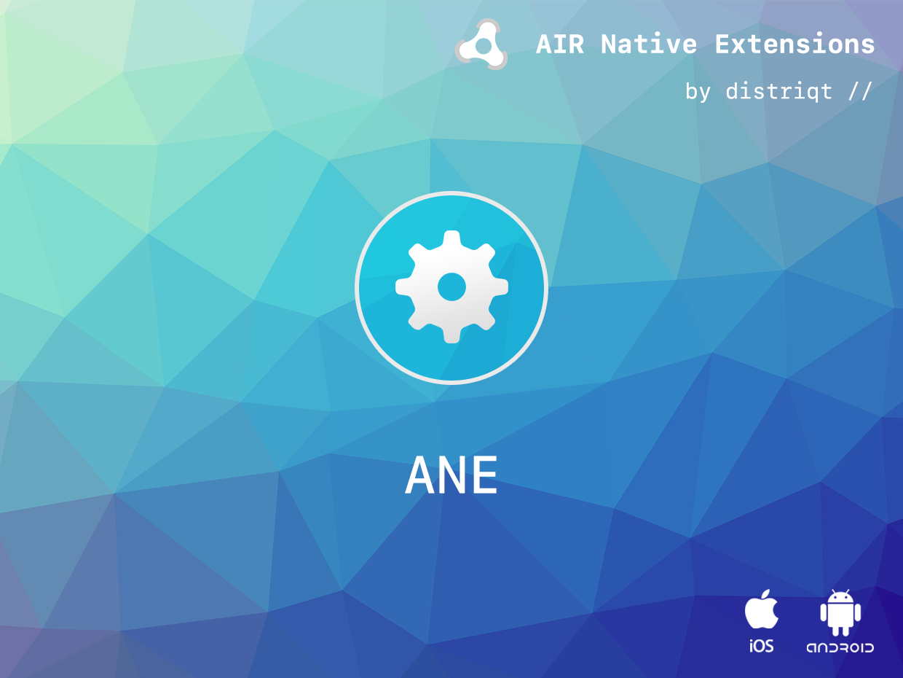

# SensorManager

The [SensorManager](https://airnativeextensions.com/extension/com.distriqt.SensorManager) extension gives you the ability to retrieve data from the device sensors.

The objective is to centralise some of the simpler sensors to provide a simple common interface for detecting sensor data and changes from the device hardware.


### Features:

- Proximity sensor
- Single API interface - your code works across supported platforms with no modifications
- Sample project code and ASDocs reference


## Documentation

The [documentation site](https://docs.airnativeextensions.com/docs/sensormanager) forms the best source of detailed documentation for the extension along with the [asdocs](https://docs.airnativeextensions.com/asdocs/sensormanager). 


Quick Example:

```actionscript
SensorManager.service.proximity.addEventListener( ProximityEvent.CHANGED, proximity_changedHandler );
SensorManager.service.proximity.startMonitoring();

function proximity_changedHandler( event:ProximityEvent ):void
{
    trace( "proximity changed: " + event.state );
}
```


