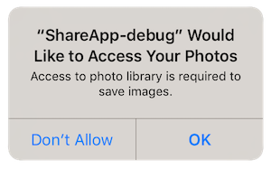

First step is always to add the extension to your development environment. 
To do this use the tutorial located [here](/docs/tutorials/getting-started).


## Dependencies

Many of our extensions use some common libraries, for example, the Android Support libraries.

We have to separate these libraries into separate extensions in order to avoid multiple versions of the libraries being included in your application and causing packaging conflicts. This means that you need to include some additional extensions in your application along with the main extension file.

You will add these extensions as you do with any other extension, and you need to ensure it is packaged with your application.


### Core ANE

The Core ANE is required by this ANE. You must include this extension in your application and call the initialisation function at some point, generally at the same time as the initialisation of this extension. If you are using other extensions that also require the Core ANE, you only need to initialise it once, generally before initialising the other extensions.

```actionscript
Core.init();
```

The Core ANE doesn't provide any functionality in itself but provides support libraries and frameworks used by our extensions.
It also includes some centralised code for some common actions that can cause issues if they are implemented in each individual extension.

You can access this extension here: [https://github.com/distriqt/ANE-Core](https://github.com/distriqt/ANE-Core).


### Android Support

The Android Support libraries encompass the Android Support, Android X and common Google libraries. 

These libraries are specific to Android. There are no issues including these on all platforms, they are just **required** for Android.

This extension requires the following extensions:

- [androidx.core.ane](https://github.com/distriqt/ANE-AndroidSupport/raw/master/lib/androidx.core.ane)

You can access these extensions here: [https://github.com/distriqt/ANE-AndroidSupport](https://github.com/distriqt/ANE-AndroidSupport).


>
> **Note**: if you have been using the older `com.distriqt.androidsupport.*` (Android Support) extensions you should remove these extensions and replace it with the `androidx` extensions listed above. This is the new version of the android support libraries and moving forward all our extensions will require AndroidX.
>


## Extension IDs

The following should be added to your `extensions` node in your application descriptor to identify all the required ANEs in your application:

```xml
<extensions>
    <extensionID>com.distriqt.Share</extensionID>
    <extensionID>com.distriqt.Core</extensionID>
    <extensionID>androidx.core</extensionID>
</extensions>
```


## Android

### Manifest Additions

The Share extension requires a few additions to the manifest to be able to start certain activities. 
You should add the `FileProvider` listing below. 
You will need to replace any occurances of `APPLICATION_PACKAGE` with your application package name 
(generally your application id prefixed by `air.`)

```xml
<manifest android:installLocation="auto">
	<uses-permission android:name="android.permission.INTERNET"/>
	
	<application android:hardwareAccelerated="true">
		
		<provider
			android:name="com.distriqt.extension.share.content.ShareFileProvider"
			android:authorities="APPLICATION_PACKAGE.sharefileprovider"
			android:grantUriPermissions="true"
			android:exported="false">
			<meta-data
				android:name="android.support.FILE_PROVIDER_PATHS"
				android:resource="@xml/distriqt_share_paths" />
		</provider>

		<!-- PERMISSIONS -->
		<activity android:name="com.distriqt.extension.share.permissions.AuthorisationActivity" android:theme="@android:style/Theme.Translucent.NoTitleBar" />
		
	</application>
</manifest>
```


## iOS 

### Info Additions

The following additions are for the `InfoAdditions` node of the iPhone section in your application descriptor:

```xml
<iPhone>
	<InfoAdditions><![CDATA[

		HERE

	]]></InfoAdditions>
</iPhone>
```


If you are using iOS 10 you now need to add some strings to display messages to the user 
when certain permissions are requested. If you are sharing images then there is a chance 
the user may select to save to their camera roll in which case the following is displayed 
the first time your user attempts to access the camera roll.



From iOS 10 you must add a string to your Info Addition to set the text in this dialog:

```xml
	<key>NSPhotoLibraryUsageDescription</key>
	<string>Access to photo library is required to save images.</string>
	<key>NSPhotoLibraryAddUsageDescription</key>
	<string>Access to photo library is required to save images.</string>
```

The second key was added in iOS 11.2. You should add both keys to your info additions.


If you are going to be launching or querying installed applications then you must define the schemes of these applications
in your additions. For example the following adds WhatsApp and Instagram:

```xml
	<key>LSApplicationQueriesSchemes</key>
	<array>
		<string>instagram</string>
		<string>whatsapp</string>
	</array>
```


## Checking for Support

You can use the `isSupported` flag to determine if this extension is supported on the current platform and device.

This allows you to react to whether the functionality is available on the device and provide an alternative solution if not.


```actionscript
Core.init();
if (Share.isSupported)
{
	// Functionality here
}
```

