## App Extension basics

In order to create an App Extension for your AIR application you are going to need:

- macOS (OSX)
- Xcode

In this document we will illustrate the creation of a Share App Extension, however 
the following process should apply to any App Extension. 


### AIR Application ID

Before starting to create an App Extension you must know what your application id in your publish App Store application will be.

For example we often use the following in our example applications: 

`com.distriqt.test`

This is crucial as we will setup a "dummy" Xcode project matching this id and create our App Extensions inside this 
Xcode project.


### Create an Xcode project

The first step is to create an Xcode project. Open up Xcode and create a new project, select a new 
"Single View Application" as in the below screenshot.

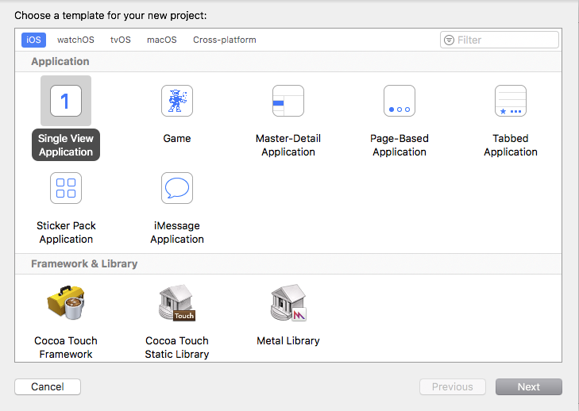

In the next step you need to be very careful to make sure the ID listed in the **Bundle Identifier** matches
your AIR application ID. We suggest using the last part of your application identifier as the **Product Name** 
and the rest as your **Organization Identifier**. In the following screenshot you can see our example 
for the `com.distriqt.test` application identifier: 

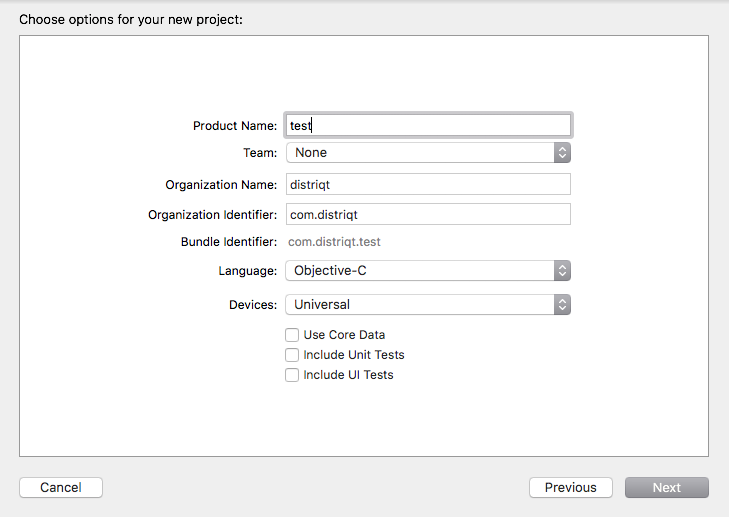


You will now have a basic Xcode project as a dummy for your AIR application.


### Add an App Extension

To add an App Extension you will need to add a new **Target** to your project.
Select `File / New / Target ...`

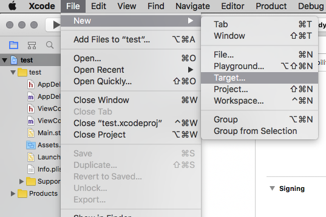

Find the group titled **Application Extension**, and for this example we are going to use the **Share Extension**.

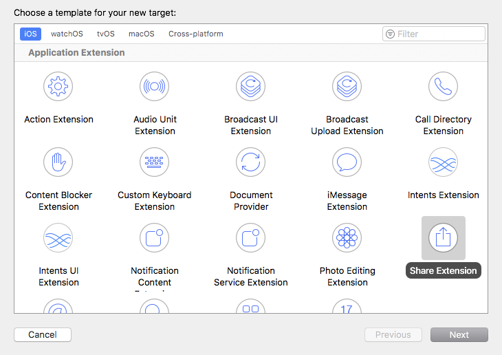

Enter a name for the extension and click finish

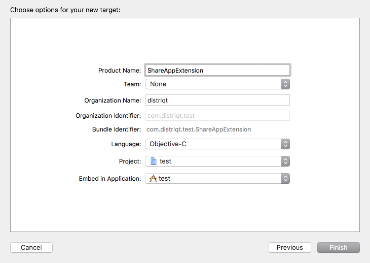

You now have an empty App Extension in your project. We are going to skip over 
adding functionality to the extension for the moment and focus on the details
of building and packaging the extension with your AIR application.

One last thing of importance here is setting the **Display Name**. This is the name that
will be shown to the user in the share menu so it is very important. You change this name
by selecting the main project and then the App Extension target as below: 

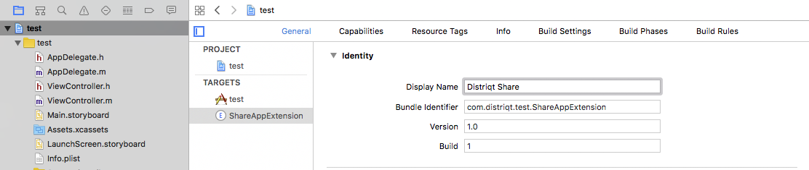

Here is an example of the change to "Distriqt Share"

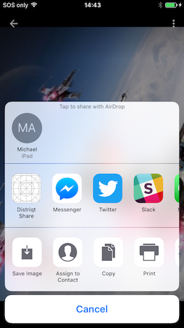


### Building the Extension

Firstly make sure we are building a Release build. You can package the Debug build with your
application however we suggest you always publish release code with final versions. You can
of course change this as you require.

Select the main application target and select **Edit Scheme...* as below:

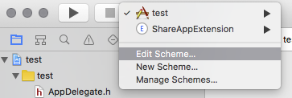

Change the Build Configuration to be **Release** as below:

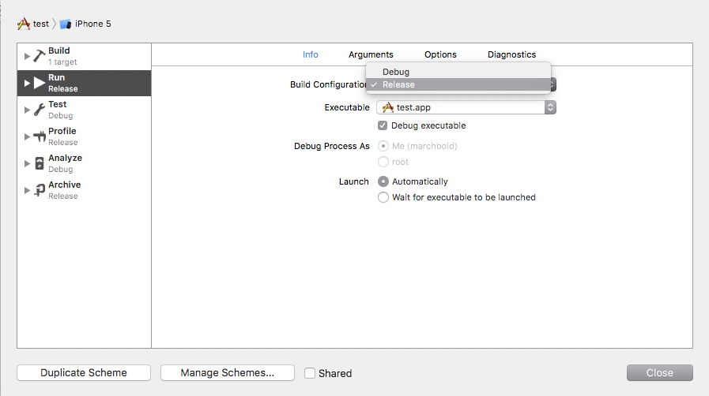

Then to actually build the targets select `Product / Build For / Running`

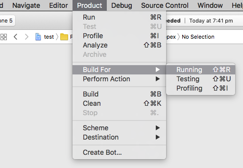

This will produce the compiled targets including the `appex` file representing your 
App Extension. To locate this file you can right click on the extension in the Products
listing and select **Show in Finder**. 

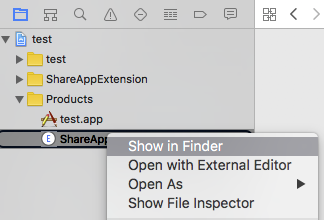

Your App Extension will be a `appex` file matching the name of your App Extension.

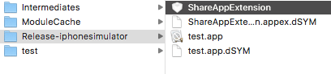


### Packaging with your AIR Application

Now that you have the `appex` file you need to include this file in a particular location
inside your application.

Create the following directory in your source, note the capitalisation (of the 'I'), 
you must match this exactly otherwise it won't appear.

```
src/PlugIns
```

and place the `appex` file inside this directory. This should be copied to your build 
and ensure it is included in your application package. You can confirm it's included
by unzipping your application's ipa and looking for the appex file in the folder:

```
unzip APPLICATION.ipa
```

Now if you install this application you should see your extension appear in the 
iOS share menu.


### Next steps

Right now the extension doesn't really do alot, just installs itself as a potential
avenue for share activities.

Next we need to add some code to the App Extension. 


