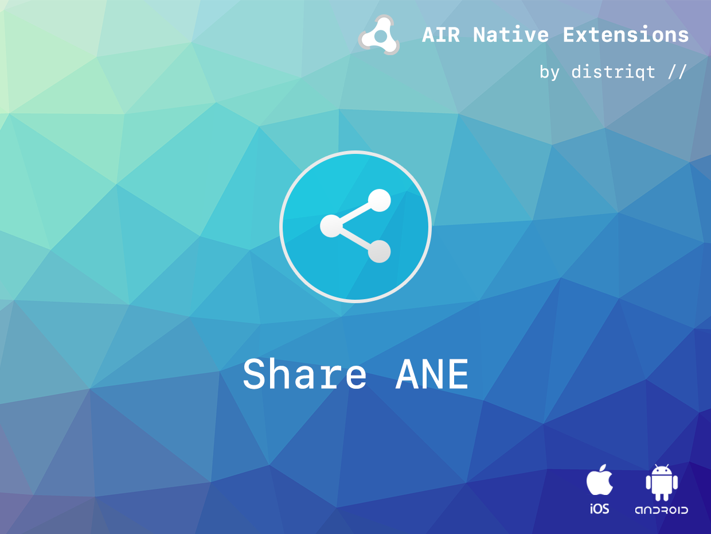

# Share

The [Share](https://airnativeextensions.com/extension/com.distriqt.Share) ANE gives
you access to the default share menu to send files and information to other applications. 
You can use one simple line of Actionscript to display the built-in native share dialogs 
allowing your user to share files and content with other applications.


For example, your user could use this to:

- save an image to the camera roll,
- send as an attachment on an email,
- save a pdf to Dropbox,
- plus much more.

Additionally this ANE now has the ability to launch other applications on the user's device allowing you to deeply integrate with other applications. 

You can pass detailed extras to an explicit Intent on Android allowing amazing integration with other applications, 
launching specific views in other applications or sending detailed information for another application to use within an activity.


The email and sms APIs allow you to quickly integrate sending emails and sms in your AIR application with just a few lines of code. Identical code base can be used across all supported platforms allowing you to concentrate on your application and not 
device specifics.

We provide complete guides to get you up and running with sharing quickly and easily.


### Features

- Share text/image/url/files with other applications
- Launch applications directly 
  - Pass parameters and data
- Email
  - Provides ability to compose an email using the native UI
  - Multiple To, CC and BCC Addresses
  - Multiple Attachments using a file path reference
  - Default implementation using a "mailto" link
  - Send preformatted HTML emails on iOS and Android;
- SMS
  - Create an SMS and send with the native UI
  - Send an SMS without UI on Android
- Single API interface - your code works across iOS and Android with no modifications
- Sample project code and ASDocs reference

As with all our extensions you get access to a year of support and updates as we are 
continually improving and updating the extensions for OS updates and feature requests.


## Documentation

Th [Wiki](https://github.com/distriqt/ANE-Share/wiki) forms the best source of detailed documentation for the extension along 
with the [asdocs](https://docs.airnativeextensions.com/asdocs/share). 

Quick Example: 

```actionscript
Share.service.share( "some text", null, "https://airnativeextensions.com" );
```

More information here: 

[com.distriqt.Share](https://airnativeextensions.com/extension/com.distriqt.Share)


## License

You can purchase a license for using this extension:

[airnativeextensions.com](https://airnativeextensions.com/)

distriqt retains all copyright.


