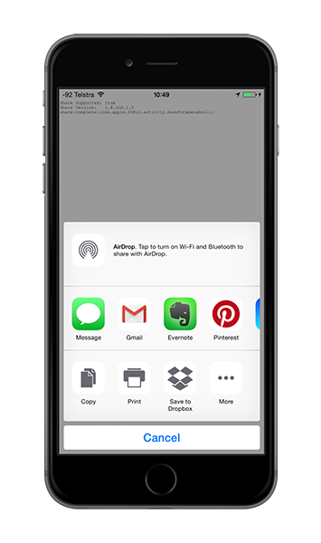
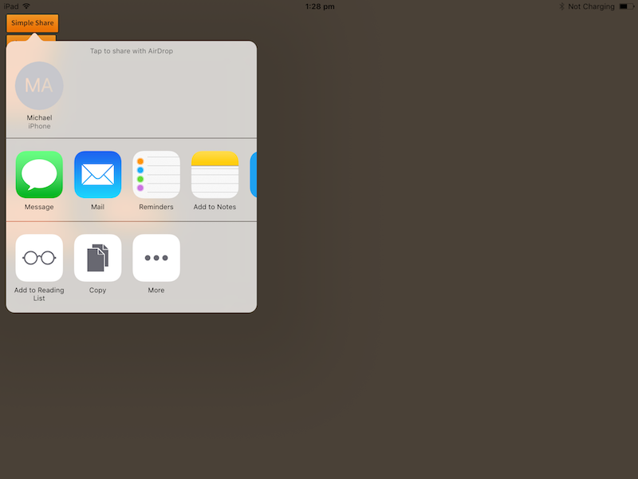
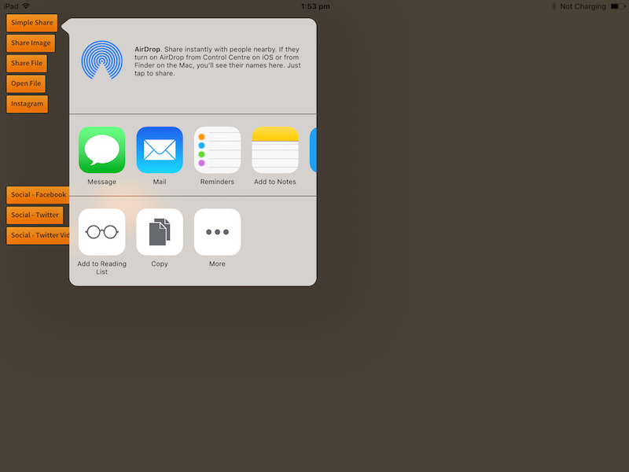

import Tabs from '@theme/Tabs'
import TabItem from '@theme/TabItem'

In general the share dialog is presented as a slide up dialog presenting the available sharing options.



However in some circumstances such as on an iPad, the dialog will appear as a popup dialog and you can 
guide where this dialog will appear using some of the parameters on the share options.

The options allow you to specify two things:

- `position`: The rectangle in view at which to anchor the popover window
- `arrowDirection`: the direction the popover is permitted to use


For example if we had a button located at x,y `100,100` of width `200` and height `50`, 
the following will use the best positioning for the dialog and display a small arrow pointing 
to the button:

<Tabs groupId="framework" defaultValue="air" values={[
    {label: 'AIR', value: 'air'},
    {label: 'Unity', value: 'unity'},
  ]}>
  <TabItem value="air" >

```actionscript  
var options:ShareOptions = new ShareOptions();
options.position = new Rectangle( 100, 100, 200, 50 );
options.arrowDirection = ShareOptions.ARROWDIRECTION_ANY;

Share.service.share( "Share text", null, "http://airnativeextensions.com", options );
```


  </TabItem>
  <TabItem value="unity" >

```csharp  
ShareOptions options = new ShareOptions();
options.position = new Rect(100, 100, 200, 50);
options.arrowDirection = ShareOptions.ARROWDIRECTION_ANY;

Share.Instance.share( "Share text", null, "http://airnativeextensions.com", options );
```

  </TabItem>
</Tabs>





Or we could limit the dialog to only appear to the left or right of the position by using 
bitwise-OR to combine the required directions:

<Tabs groupId="framework" defaultValue="air" values={[
    {label: 'AIR', value: 'air'},
    {label: 'Unity', value: 'unity'},
  ]}>
  <TabItem value="air" >

```actionscript 
var options:ShareOptions = new ShareOptions();
options.position = new Rectangle( 100, 100, 200, 50 );
options.arrowDirection = ShareOptions.ARROWDIRECTION_LEFT | ShareOptions.ARROWDIRECTION_RIGHT;

Share.service.share( "Share text", null, "http://airnativeextensions.com", options );
```

  </TabItem>
  <TabItem value="unity" >

```csharp  
ShareOptions options = new ShareOptions();
options.position = new Rect(100, 100, 200, 50);
options.arrowDirection = ShareOptions.ARROWDIRECTION_LEFT | ShareOptions.ARROWDIRECTION_RIGHT;

Share.Instance.share( "Share text", null, "http://airnativeextensions.com", options );
```

  </TabItem>
</Tabs>




### Centering

If you need to center the dialog you can simply use the center of the screen as the `position` and supply 
`ARROWDIRECTION_NONE` as the `arrowDirection`.

For example:

<Tabs groupId="framework" defaultValue="air" values={[
    {label: 'AIR', value: 'air'},
    {label: 'Unity', value: 'unity'},
  ]}>
  <TabItem value="air" >

```actionscript 
var options:ShareOptions = new ShareOptions();
options.position = new Rectangle( stage.stageWidth*0.5, stage.stageHeight * 0.5, 0, 0 );
options.arrowDirection = ShareOptions.ARROWDIRECTION_NONE;

Share.service.share( "Share text", null, "http://airnativeextensions.com", options );
```

  </TabItem>
  <TabItem value="unity" >

```csharp  
ShareOptions options = new ShareOptions();
options.position = new Rect(centerX, centerY, 0, 0);
options.arrowDirection = ShareOptions.ARROWDIRECTION_NONE;

Share.Instance.share( "Share text", null, "http://airnativeextensions.com", options );
```

  </TabItem>
</Tabs>


