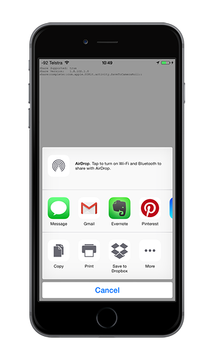
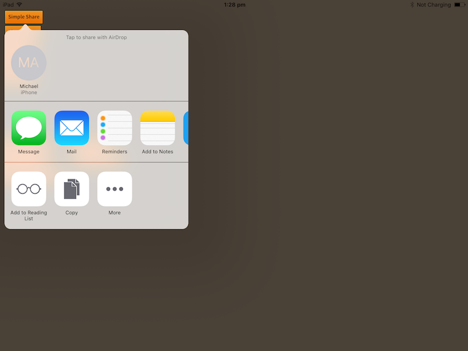
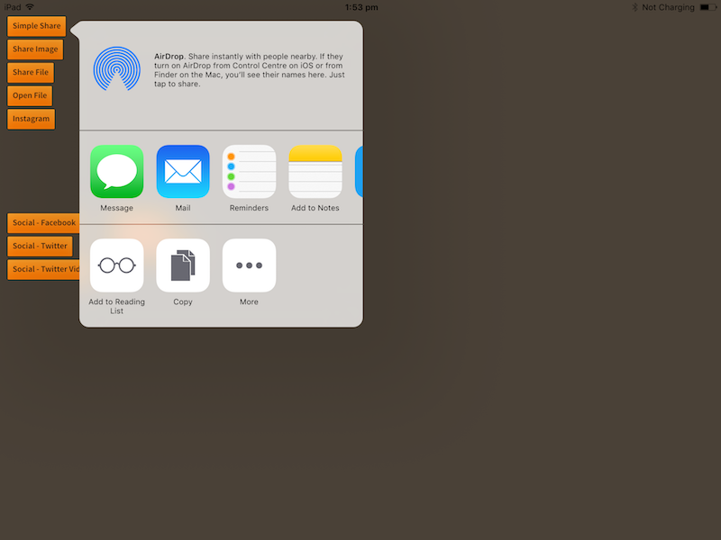
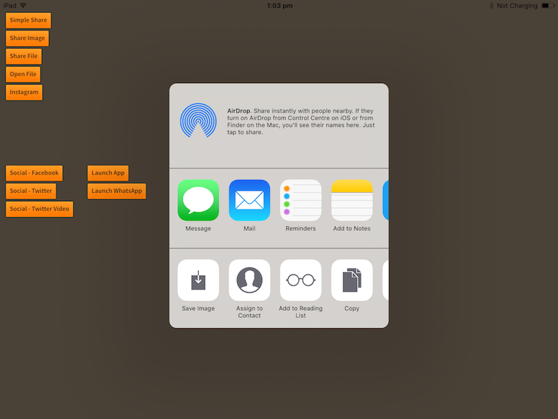

<!--newpage-->


## Contents

- [Overview](#overview)
- [Features](#features)
- [Add the Plugin](#add-the-plugin)
    - [Asset Store](#asset-store)
    - [Manual Installation](#manual-installation)
    - [Import the Plugin](#import-the-plugin)
	- [Resolve Android Dependencies](#resolve-android-dependencies)
- [Usage](#usage)
    - [Checking for Support](#checking-for-support)   
    - [Simple Share](#simple-share)
    - [Share Files](#share-files)
    - [Launch Applications](#launch-applications)
    - [Email](#email)
    - [SMS](#sms)
- [Support](#support)


<!--newpage-->


## Overview

The [Share](https://universalextensions.com/extension/com.distriqt.Share) plugin gives
you access to the default share menu to send files and information to other applications. 
You can use one simple line of Actionscript to display the built-in native share dialogs 
allowing your user to share files and content with other applications.


For example, your user could use this to:

- save an image to the camera roll,
- send as an attachment on an email,
- save a pdf to Dropbox,
- plus much more.

Additionally this ANE now has the ability to launch other applications on the user's device allowing you to deeply integrate with other applications. 

You can pass detailed extras to an explicit Intent on Android allowing amazing integration with other applications, 
launching specific views in other applications or sending detailed information for another application to use within an activity.


The email and sms APIs allow you to quickly integrate sending emails and sms in your AIR application with just a few lines of code. Identical code base can be used across all supported platforms allowing you to concentrate on your application and not 
device specifics.

We provide complete guides to get you up and running with sharing quickly and easily.


<!--newpage-->


## Features

- Share text/image/url/files with other applications
- Launch applications directly 
  - Pass parameters and data
- Email
  - Provides ability to compose an email using the native UI
  - Multiple To, CC and BCC Addresses
  - Multiple Attachments using a file path reference
  - Default implementation using a "mailto" link
  - Send preformatted HTML emails on iOS and Android;
- SMS
  - Create an SMS and send with the native UI
  - Send an SMS without UI on Android
- Single API interface - your code works across iOS and Android with no modifications
- Sample project code and ASDocs reference

As with all our extensions you get access to a year of support and updates as we are 
continually improving and updating the extensions for OS updates and feature requests.


## Add the Plugin

First step is always to add the plugin to your development environment. 


### Asset Store

Open the Asset Store in your browser and add the Share plugin to your assets.

Open the Package Manager (Window > Package Manager) in the Unity Editor and select the "My Assets" section. Select the Share plugin, and click Import in the bottom right.


### Manual Installation

In unity you import the package by selecting `Assets / Import Package / Custom Package ...` and then browsing to the unity plugin package file: `com.distriqt.Share.unitypackage`.


You can manually download the extension from our repository:

- https://github.com/distriqt/ANE-Share


### Import the Plugin


This will present the import dialog and display all the files for the plugin, make sure all the files are selected.

The plugin will be added to your project and you can now use the plugins functionality in your application.


### Resolve Android Dependencies

This plugin depends on some common Android libraries, particularly the AndroidX support libraries and the Google Play Services.

You can get these dependencies using one of the following methods.


#### External Dependency Manager

This is the suggested method.

Use the *External Dependency Manager* plugin to download and manage the Android dependencies. 


###### Importing

> If you already use the *External Dependency Manager* in your project you can skip this step.

- Download the latest version of the [*External Dependency Manager*](https://github.com/googlesamples/unity-jar-resolver/raw/master/external-dependency-manager-latest.unitypackage) from the [github repository](https://github.com/googlesamples/unity-jar-resolver)
- Import the plugin by selecting `Assets / Import Package / Custom Package ...` and locate the plugin you downloaded. The plugin will be in the zip named: `external-dependency-manager-latest.unitypackage` 
- In the *Import Unity Package* window, click Import


###### Resolving

By default, the resolver should run automatically and will add the dependencies required by this plugin. 

If you have need to resolve the dependencies manually then you will need to:

- Open the menu under: `Assets / External Dependency Manager / Android Resolver`
- Select `Resolve` or `Force Resolve`


More information on the *External Dependency Manager* can be found [here](https://github.com/googlesamples/unity-jar-resolver)


#### Custom Gradle Template

> Note: This applies only if you are using a custom gradle template. If you haven't enabled this then the dependency manager will automatically update this for you.

Unity's in-built gradle build support and exporting to android studio does not support per plugin gradle script. Therefore, this plugin cannot add the dependencies by itself.

The `mainTemplate.gradle` is generated when you enable the **Custom Gradle Template** property on the Player window.

The `build.gradle` exists in generated Gradle project when you enable the **Export Project** property on the Player window and Build the project.

Update the `dependencies` section in your `mainTemplate.gradle` or `build.gradle` as below:

```
dependencies {
    implementation fileTree(dir: 'libs', include: ['*.jar'])

	implementation 'androidx.annotation:annotation:1.2.0' 
    implementation 'androidx.core:core:1.9.1' 
    implementation 'androidx.legacy:legacy-support-v4:1.0.0'
}
```


### Proguard 

If you are using a custom proguard configuration you will need to add the following line to ensure the interface class for the plugin is accessible to unity at runtime.

```
-keep class com.distriqt.extension.share.ShareUnityPlugin {*;}
```


<!--newpage-->


## Usage


### Checking for Support

You can use the `isSupported` flag to determine if this extension is supported on the current platform and device.

This allows you to react to whether the functionality is available on the device and provide an alternative solution if not.


```csharp
if (Share.isSupported)
{
	// Functionality here
}
```


## Simple Share 

Displaying an action to share text, image data or/and URL is simply a process of calling `share()` with data you wish to share.
An action dialog will be displayed with a list of applications that will accept the content for sharing. 
This generally includes applications like: Messaging, Email, Twitter, Facebook.


To share a URL:

```csharp
if (Share.isSupported)
{
    Share.Instance.share("Check out this site", null, "https://distriqt.com");
}
```


To share an image (`Texture2D`):

```csharp
Texture2D image = ...; // Some image texture (eg ScreenCapture.CaptureScreenshotAsTexture())

Share.Instance.share(
    "Look at this screenshot",
    image
);
```


### Android Events 

A small note about events on Android. 

The result event may not always return success. The extension returns the event code returned from the application however as a lot of applications on Android don't necessarily respond with success or failure events you will most likely just get an `OnClosed` dispatched. 

So you should be prepared to treat a cancelled or closed event as a success.


<!--newpage-->
 

## Share Files


There are two operations regarding files exposed by this ANE, referred to as sharing a file (`shareFile`) and opening a file (`showOpenIn`).

Both of these will display a list of applications however they are subtly different.

The major difference here is that sharing just attaches the file to an activity whereas opening will actually pass the file data for opening. 
You will probably want to use the open method in most cases, however feel free to experiment with the different methods
to see which suits your requirements better.

To distinguish these methods you should consider `shareFile` to be used to send a file to someone, via mail, message etc 
whereas `showOpenIn` is used to open a file in an application, for playback, editing or even to post to social networks.


### Sharing a File

Displaying an action to share a file is simply a process of calling `shareFile` with the path of the file you wish to share. 
You control which applications are displayed in the share dialog by setting the `mimeType`. 
The system will then only display applications that can handle that type of file.

On iOS this uses the `UIActivityViewController` to display a list of services that support the supplied data.

```csharp
// Here we have an image file in the streaming assets (iOS only)
string filePath = Path.Combine(
    UnityEngine.Application.streamingAssetsPath, 
    "image.png"
);

Share.Instance.OnComplete += Share_OnComplete;

Share.Instance.shareFile( filePath, "image.png", "image/png" );
```


```csharp
private void Share_OnComplete(ShareEvent e)
{
    Debug.Log("Share_OnComplete");
}
```


### Opening a File

Similarly to "Sharing a File", opening a file can be used to pass a file to another application, for opening, editting or posting to a social network. The major difference here is that sharing just attaches the file to an activity whereas opening will actually pass the file data for opening. 

Generally this operation gives better functionality than the share file.

On iOS this uses the `UIDocumentInteractionController` to display a list of applications that can open the specified file.

```csharp
// Here we have an image file in the streaming assets (iOS only)
string filePath = Path.Combine(
    UnityEngine.Application.streamingAssetsPath, 
    "image.png"
);

Share.Instance.OnComplete += Share_OnComplete;

Share.Instance.showOpenIn( filePath, "image.png", "image/png" );
```


The below shows an example of opening an `igo` (instagram only file) and setting the packageName and UTI to limit the applications displayed to only be Instagram. We also use the `Applications.IsInstalled()` to check that Instagram is installed. More on this function in the [Launch Applications](#launch-applications) section.

```csharp
plugins.share.applications.Application app
        = new plugins.share.applications.Application(
            "com.instagram.android",
            "instagram://");

if (Share.Instance.Applications.IsInstalled(app))
{
	string filePath = Path.Combine(UnityEngine.Application.streamingAssetsPath, "instagram.igo");
	
	ShareOptions options = new ShareOptions();
	options.packageName = "com.instagram.android";
	options.UTI = "com.instagram.photo";
	
	Share.Instance.showOpenIn( filePath, "", "image/*", options );
}
```


<!--newpage-->
 

## Positioning 


In general the share dialog is presented as a slide up dialog presenting the available sharing options.



However in some circumstances such as on an iPad, the dialog will appear as a popup dialog and you can 
guide where this dialog will appear using some of the parameters on the share options.

The options allow you to specify two things:

- `position`: The rectangle in view at which to anchor the popover window
- `arrowDirection`: the direction the popover is permitted to use


For example if we had a button located at x,y `100,100` of width `200` and height `50`, 
the following will use the best positioning for the dialog and display a small arrow pointing 
to the button:

```csharp 
ShareOptions options = new ShareOptions();
options.position = new Rect(100, 100, 200, 50);
options.arrowDirection = ShareOptions.ARROWDIRECTION_ANY;

Share.Instance.share( "Share text", null, "http://airnativeextensions.com", options );
```




Or we could limit the dialog to only appear to the left or right of the position by using 
bitwise-OR to combine the required directions:


```csharp 
ShareOptions options = new ShareOptions();
options.position = new Rect(100, 100, 200, 50);
options.arrowDirection = ShareOptions.ARROWDIRECTION_LEFT | ShareOptions.ARROWDIRECTION_RIGHT;

Share.Instance.share( "Share text", null, "http://airnativeextensions.com", options );
```




#### Centering

If you need to center the dialog you can simply use the center of the screen as the `position` and supply `ARROWDIRECTION_NONE` as the `arrowDirection`.

For example:

```csharp 
ShareOptions options = new ShareOptions();
options.position = new Rect(centerX, centerY, 0, 0);
options.arrowDirection = ShareOptions.ARROWDIRECTION_NONE;

Share.Instance.share( "Share text", null, "http://airnativeextensions.com", options );
```




<!--newpage-->


## Launch Applications

This function allows your application to start another application on the device. 
It uses different methods on iOS and Android however both will allow you to specify start up parameters to an application:

- On Android it uses an explicit Intent with a package, type, action and extras;
- On iOS it uses a custom url scheme with query parameters;

The simplest example of launching another application if installed.

```csharp
plugins.share.applications.Application app
        = new plugins.share.applications.Application(
            "com.instagram.android",
            "instagram://");

if (Share.Instance.Applications.IsInstalled(app))
{
    Share.Instance.Applications.Launch(app);
}
```

An example of launching Instagram and opening a specific user profile

```csharp
plugins.share.applications.Application app
        = new plugins.share.applications.Application(
            "com.instagram.android",
            "instagram://");

ApplicationOptions options = new ApplicationOptions();
options.action = ApplicationOptions.ACTION_VIEW;
options.data = "http://instagram.com/_u/distriqt";
options.parameters = "user?username=distriqt";
 
if (Share.Instance.Applications.IsInstalled(app))
{
    Share.Instance.Applications.Launch(app, options);
}
```


### iOS 

On iOS you must add the application schemes you wish to query or launch to your info additions. 
If you don't perform these additions you will always receive `false` from the `isInstalled()` and the launch functions.

You should add the `LSApplicationQueriesSchemes` value to your `Info.plist`, and include the schemes for the applications you intend to query.

```xml
<key>LSApplicationQueriesSchemes</key>
<array>
    <string>instagram</string>
    <string>whatsapp</string>
</array>
```


### Start Actvity 

**Android only**

This functionality allows you to use the Android Intent system to launch an Intent directly.

This is sometimes required when you need particular control over how the data is passed to an Intent.


Use the `Intent` class to create an Intent and then pass it to the `StartActivity` function.

For example to launch a url in the Chrome application

```csharp
Intent intent = new Intent(Intent.ACTION_VIEW);
intent.packageName = "com.android.chrome";
intent.data = "https://distriqt.com";

Share.Instance.Applications.StartActivity(intent);
```

The return value of the `StartActivity` function will be `false` if no activity could be launched matching the `Intent` and will be `true` if an activity was started.


<!--newpage-->


## Email 


### Email Support

You can check whether the current user can send emails using the `isMailSupported` call.

This performs some basic checks as to whether the user can send an email.

```csharp
if (Share.Instance.Email.IsMailSupported)
{
	// You should be able to send an email
}
```


- On Apple devices this checks that the user has an email account setup in the settings.
- On Android devices this checks that there is an email client application installed.


### Simple Email

Sending an email is a simple task of calling the `SendMail()` function, specifying the subject, body and recipients.

```csharp
string subject = "Test email from unity";
string body = "Some awesome message I want to send";
string toRecipients = "unityplugins@distriqt.com";

Share.Instance.Email.OnCompose += Email_OnCompose;
Share.Instance.Email.OnAttachmentError += Email_OnAttachmentError;

bool success = Share.Instance.Email.SendMail(subject, body, toRecipients);
```

```csharp
private void Email_OnCompose(EmailEvent e)
{
    Debug.Log("Email_OnCompose: " + e.details);
}

private void Email_OnAttachmentError(EmailEvent e)
{
    Debug.Log("Email_OnAttachmentError: " + e.details);
}
```


### Send Email with Options

 You can use the `sendMailWithOptions()` function to send more complex data, including:

- CC and BCC recipients;
- file attachments; and
- HTML content;


If you wish to send html content you can set the `isHTML` flag in the `sendMailWithOptions()` function to true and the extension will attempt to use the body text as html.

The following example shows the supported HTML content:

```csharp
string subject = "Test email from unity";
string body = "Some awesome message I want to send";
string toRecipients = "unityplugins@distriqt.com";
string ccRecipients = "distriqt@distriqt.com";
string bccRecipients = "airnativeextensions@distriqt.com";

string body = 
		"<div>"+
		"<p>This HTML email was sent using the distriqt <b>Message ANE</b></p>"+
		"A link: <a href='http://airnativeextensions.com'>airnativeextensions.com</a>"+
		"<br/>" +
		"Block: <blockquote>Some quote</blockquote>"+
		"<br/>" +
		"Bold: <b>This text should be bold</b>"+
		"<br/>" +
		"Italic: <i>This text should be italic</i>"+
		"<br/>" +
		"Colour: <font color='#ff0000'>This text should be red</font>"+
		"<div/>" ;

Share.Instance.Email.SendMailWithOptions( 
		subject, 
		body, 
		toRecipients, 
		ccRecipients,
		bccRecipients,
		null,           // Attachments (see next section)
		true            // isHTML flag
	);
```

>
> HTML content can depend on the client the user has installed. As this can vary greatly (on Android in particular) the HTML content functionality can have unexpected results in clients that don't respect or accept html content.
>
> Our extension uses the underlying standard method to format and flag the content as html however there are still cases you may encounter issues. We highly recommend you throughly test this feature to make sure it suits your needs.
> 


#### Attachments

You can specify an `Array` of `Attachment` objects each representing a file to attach to the email.

You create an attachment using the constructor and passing the native path to the file and we suggest passing a mime type.

```csharp
Attachment attachment = new Attachment();
attachment.nativePath = imageFile; // Absolute native path to file 
```

Then you pass your attachments to the send mail function in an `Attachment[]` array:

```csharp
Attachment[] attachments = new Attachment[1];
attachments[0] = attachment;

Share.Instance.Email.SendMailWithOptions( 
		subject, 
		body, 
		toRecipients, 
		"",
		"",
		attachments
	);
```


<!--newpage-->
 

## SMS


### SMS Supported


You can check whether the current user can send sms using the `IsSMSSupported` call.

```csharp
if (Share.Instance.SMS.IsSMSSupported)
{
	// You should be able to send an sms
}
```


### Sending an SMS with UI

The example below shows how to send an SMS using the native UI:

```csharp
if (Share.Instance.SMS.IsSMSSupported)
{
    Share.Instance.SMS.OnSMSSent += SMS_OnSMSSent;
    Share.Instance.SMS.OnSMSSentError += SMS_OnSMSSentError;
    Share.Instance.SMS.OnSMSCancelled += SMS_OnSMSCancelled;

	SMS sms = new SMS();
	sms.address = "0444444444";
	sms.message = "Sending an SMS with the distriqt plugin";
	
	Share.Instance.SMS.SendSMSWithUI( sms );
}

private function smsEventHandler( event:SMSEvent ):void
{
	trace( event.type +"::"+ event.details + "::"+event.sms.toString() );
}
```

```csharp
private void SMS_OnSMSCancelled(SMSEvent e)
{
    Debug.Log("SMS_OnSMSCancelled");
}

private void SMS_OnSMSSentError(SMSEvent e)
{
    Debug.Log("SMS_OnSMSSentError");
}

private void SMS_OnSMSSent(SMSEvent e)
{
    Debug.Log("SMS_OnSMSSent");
}
```


### Android Advanced SMS operations

On Android you can request permission to directly send and receive SMS messages without 
user interaction. 


#### Manifest Additions

The plugin requires a few additions to the manifest to be able to start certain activities and to get permission to send and receive SMS. 

These are optional and so should be added manually currently. 

```xml
<uses-permission android:name="android.permission.SEND_SMS" /> 
<uses-permission android:name="android.permission.READ_SMS" /> 
<uses-permission android:name="android.permission.RECEIVE_SMS" />

<!-- To access SIM subscriptions -->
<uses-permission android:name="android.permission.READ_PHONE_STATE" />


<application>

    <!-- TO RECEIVE SMS -->
    <receiver android:name="com.distriqt.extension.share.receivers.SMSReceiver" android:exported="true" > 
        <intent-filter android:priority="1000"> 
            <action android:name="android.provider.Telephony.SMS_RECEIVED" />
        </intent-filter> 
    </receiver>

</application>
```
	


#### Requesting Authorisation

Firstly you must request authorisation to send and receive messages. 

You can do this using the normal `Permission` process through Unity, eg to check whether you have permission to send sms directly:

```csharp
if (Permission.HasUserAuthorizedPermission("android.permission.SEND_SMS"))
{
    //
}
```

More information here: [https://docs.unity3d.com/Manual/android-RequestingPermissions.html](https://docs.unity3d.com/Manual/android-RequestingPermissions.html)


#### Sending an SMS

Once you have authorisation, sending an SMS is a simple matter of calling `sendSMS`:


```csharp
if (Share.service.sms.isSMSSupported)
{
	SMS sms = new SMS();
	sms.address = "0444444444";
	sms.message = "Sending an SMS with the distriqt plugin";
	
	Share.Instance.SMS.SendSMS( sms );
}
```


#### Subscription Info

In some devices there are multiple SIM cards and you may wish to specify the subscription to use to send the SMS.

Firstly you must add the additional permission to `READ_PHONE_STATE` to be able to access the subscription information.


Then call `GetSubscriptions()` to retrieve an array of `SubscriptionInfo` objects representing the different sims.

```csharp
SubscriptionInfo[] subs = Share.Instance.SMS.GetSubscriptions();
foreach (SubscriptionInfo sub in subs)
{
	Debug.Loh( "SIM: ["+sub.id+"] " + sub.displayName + "/"+sub.carrierName);
}
```

When sending an SMS you can specify the subscription id to use to send the SMS:

```csharp
Share.Instance.SMS.SendSMS( sms, sub.id );
```

>
> Note: This is only supported on Android API v22+. If it is not supported (or if you haven't requested the additional permission) `GetSubscriptions()` will return an empty array and the default sim will be used to send messages.
>


#### Events

You can listen for several events, as defined in the `SMSManager` class, see the documentation
in that class for more information on the events.

```actionscript
Share.Instance.SMS.OnSMSSent += SMS_OnSMSSent;
Share.Instance.SMS.OnSMSSentError += SMS_OnSMSSentError;
Share.Instance.SMS.OnSMSCancelled += SMS_OnSMSCancelled;
Share.Instance.SMS.OnSMSDelivered += SMS_OnSMSDelivered;
Share.Instance.SMS.OnSMSNotDelivered += SMS_OnSMSNotDelivered;
Share.Instance.SMS.OnSMSReceived += SMS_OnSMSReceived;


private void SMS_OnSMSCancelled(SMSEvent e)
{
    Debug.Log("SMS_OnSMSCancelled");
}

private void SMS_OnSMSSentError(SMSEvent e)
{
    Debug.Log("SMS_OnSMSSentError");
}

private void SMS_OnSMSSent(SMSEvent e)
{
    Debug.Log("SMS_OnSMSSent");
}

private void SMS_OnSMSReceived(SMSEvent e)
{
    Debug.Log("SMS_OnSMSReceived");
}

private void SMS_OnSMSNotDelivered(SMSEvent e)
{
    Debug.Log("SMS_OnSMSNotDelivered");
}

private void SMS_OnSMSDelivered(SMSEvent e)
{
    Debug.Log("SMS_OnSMSDelivered");
}
```


<!--newpage-->


## Support

If you need further support integrating or using this extension please feel free to contact us.

- Email: unityplugins@distriqt.com

We have been supporting developers for over 10 years and always happy to help.


<br/>
<br/>
<br/>
<br/>


- [https://distriqt.com](https://distriqt.com)
- [more native extensions](http://universalextensions.com)
