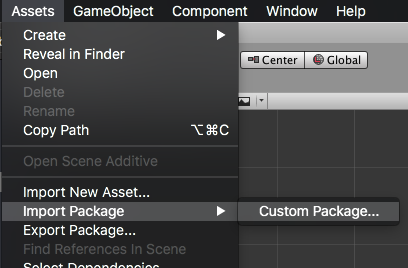

<!--newpage-->


## Contents

- [Overview](#overview)
- [Features](#features)
- [Add the Plugin](#add-the-plugin)
    - [Asset Store](#asset-store)
    - [Manual Installation](#manual-installation)
    - [Import the Plugin](#import-the-plugin)
	- [Resolve Android Dependencies](#resolve-android-dependencies)
- [Usage](#usage)
- [Support](#support)


<!--newpage-->


## Overview

The [StatusBar](https://universalextensions.com/extension/com.distriqt.StatusBar) plugin gives
you access 


TODO


<!--newpage-->


## Features

TODO

As with all our extensions you get access to a year of support and updates as we are 
continually improving and updating the extensions for OS updates and feature requests.


## Add the Plugin

First step is always to add the plugin to your development environment. 


### Asset Store

Open the Asset Store in your browser and add the StatusBar plugin to your assets.

Open the Package Manager (Window > Package Manager) in the Unity Editor and select the "My Assets" section. Select the StatusBar plugin, and click Import in the bottom right.


### Manual Installation

In unity you import the package by selecting `Assets / Import Package / Custom Package ...` and then browsing to the unity plugin package file: `com.distriqt.StatusBar.unitypackage`.



You can manually download the extension from our repository:

- https://github.com/distriqt/ANE-StatusBar


### Import the Plugin


This will present the import dialog and display all the files for the plugin, make sure all the files are selected.

The plugin will be added to your project and you can now use the plugins functionality in your application.


### Resolve Android Dependencies

This plugin depends on some common Android libraries, particularly the AndroidX support library.

You can get these dependencies using one of the following methods.


#### Unity Jar Resolver

This is the suggested method.

Use the *Unity Jar Resolver* plugin to download and manage the Android dependencies. 


###### Importing

> If you already use the *Unity Jar Resolver* in your project you can skip this step.

- Download the latest version of the [*Unity Jar Resolver*](https://github.com/googlesamples/unity-jar-resolver/releases)
- Import the plugin by selecting `Assets / Import Package / Custom Package ...` and locate the plugin you downloaded. The plugin will be in the zip named: `external-dependency-manager-latest.unitypackage` 
- In the *Import Unity Package* window, click Import


###### Resolving

By default, the resolver should run automatically and will add the dependencies required by this plugin. 

If you have need to resolve the dependencies manually then you will need to:

- Open the menu under: `Assets / External Dependency Manager / Android Resolver`
- Select `Resolve` or `Force Resolve`


More information on the *Unity Jar Resolver* can be found [here](https://github.com/googlesamples/unity-jar-resolver)


#### Custom Gradle StatusBar

Unity's in-built gradle build support and exporting to android studio does not support per plugin gradle script. Therefore, this plugin cannot add the dependencies by itself.

The `mainStatusBar.gradle` is generated when you enable the **Custom Gradle StatusBar** property on the Player window.

The `build.gradle` exists in generated Gradle project when you enable the **Export Project** property on the Player window and Build the project.

Update the `dependencies` section in your `mainStatusBar.gradle` or `build.gradle` as below:

```
dependencies {
    compile fileTree(dir: 'libs', include: ['*.jar'])

    implementation 'androidx.legacy:legacy-support-v4:1.0.0'
}
```


<!--newpage-->


## Usage


### Checking for Support

You can use the `isSupported` flag to determine if this extension is supported on the current platform and device.

This allows you to react to whether the functionality is available on the device and provide an alternative solution if not.


```csharp
if (StatusBar.isSupported)
{
	// Functionality here
}
```


<!--newpage-->


## Support

If you need further support integrating or using this extension please feel free to contact us.

- Email: unityplugins@distriqt.com

We have been supporting developers for over 10 years and always happy to help.


<br/>
<br/>
<br/>
<br/>


- [https://distriqt.com](https://distriqt.com)
- [Asset Store](https://assetstore.unity.com/publishers/46451)
- [more native extensions](http://universalextensions.com)
