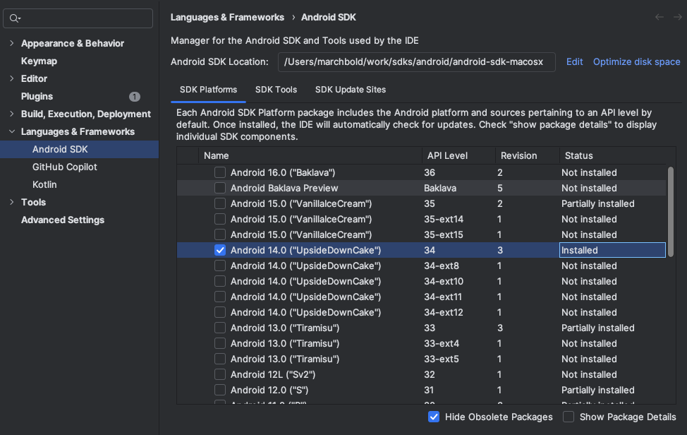
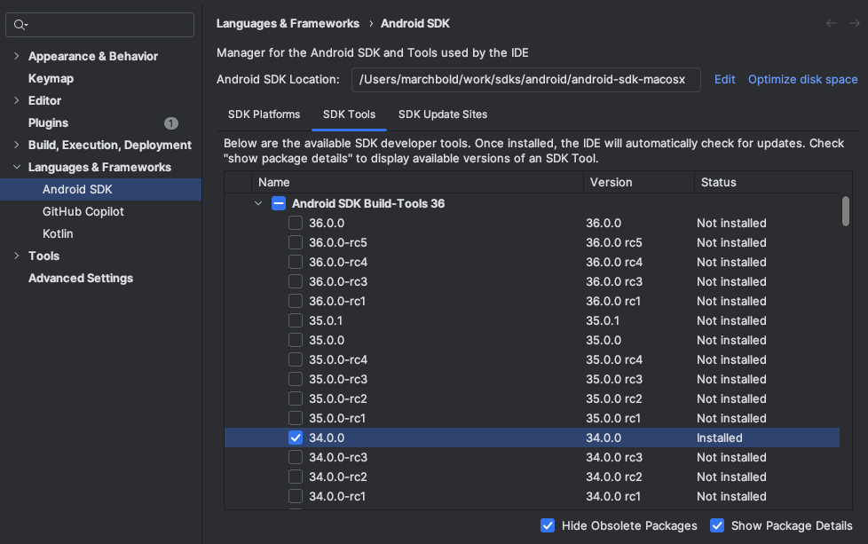
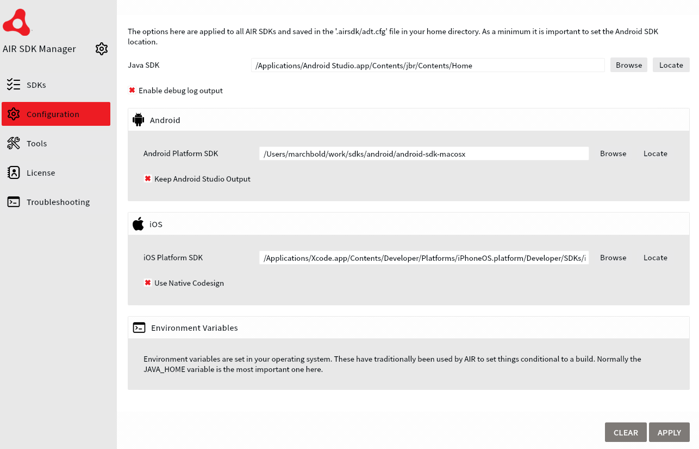

This is the suggested build environment for the current version of the AIR SDK and the extensions.

## Java 

Currently we recommend using Java 21 for building AIR applications.

## Android 

You will need to install the Android SDK and ensure you inform the AIR SDK where it is located.

- The Android SDK can be installed using the [Android Studio](https://developer.android.com/studio) IDE.
    - Use the Android Studio SDK Manager to install the latest version of the Android SDK.
    - Ensure you install the Android SDK Platform Tools and the Android SDK Build Tools.
    - Version 34 (Android 14) of the Android SDK is recommended.
    - Version 34.0.0 of the Android Build Tools is recommended.

- Set the path to the Android SDK in the AIR SDK Manager:
  - Open the AIR SDK Manager
  - Click on the "Configuration" tab
  - Set the path to your Android SDK installation directory

## iOS 

We suggest you install the latest version of Xcode for building iOS applications and ensure you have the latest version of the iOS SDK installed.

- Version 18.4+ of iOS SDK is recommended.

- Ensure you set the path to the iOS SDK in the AIR SDK Manager:
  - Open the AIR SDK Manager
  - Click on the "Configuration" tab
  - Set the path to your iOS SDK installation directory

