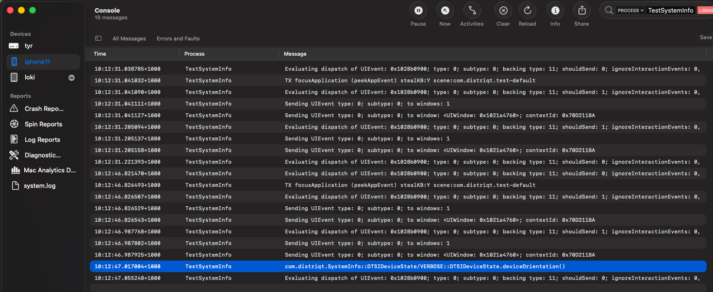
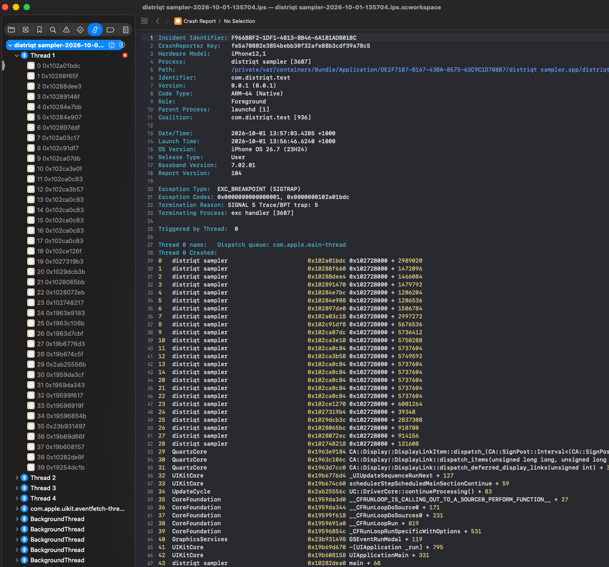
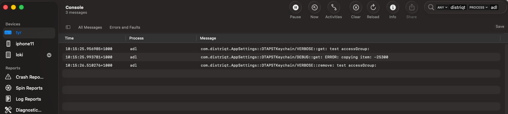
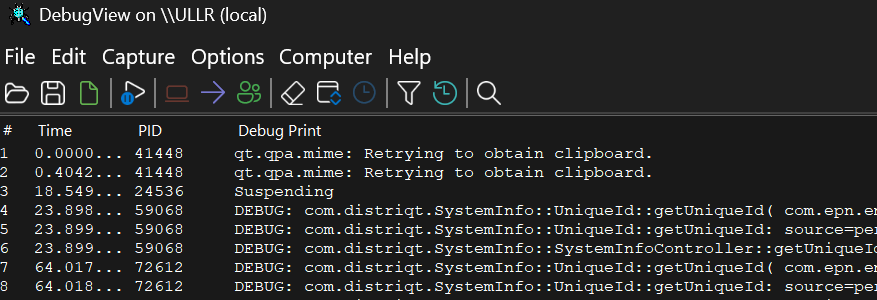
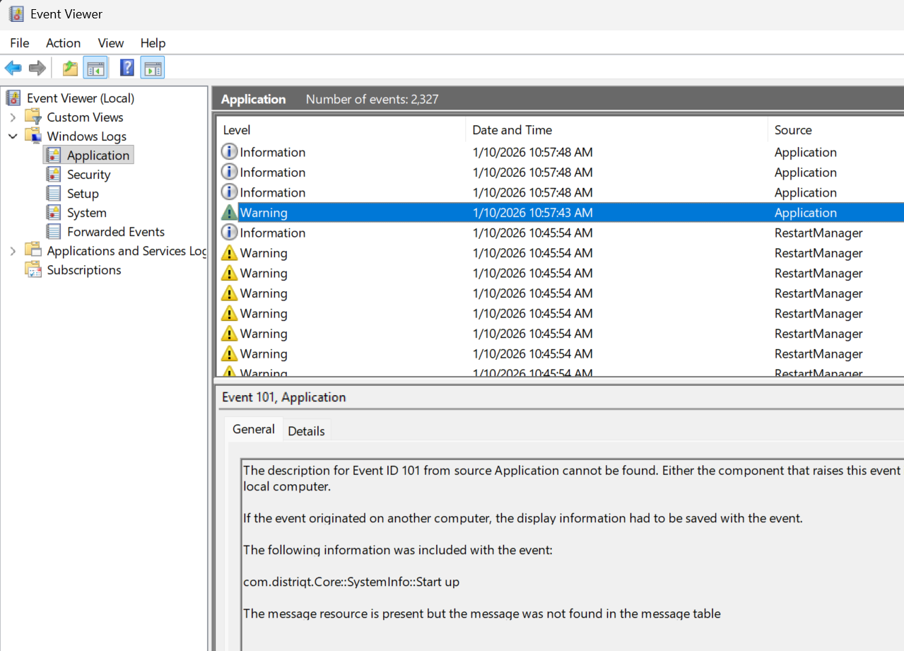

# Access the Device Logs


## Actionscript

From version 7.8 of the Core extension we have made it possible to access the logs from our extensions from actionscript. This won't include logs from the services and SDK's that our extensions implement but may be useful for debugging certain aspects of your implementation.

### Log Level

You can control the level of output from our extensions by setting the logging level:

```actionscript
Core.service.logger.setLogLevel( LogLevel.DEBUG );
```

We suggest that you set the logging level for your application even if you won't necessarily need it initially. Setting the logging level can help when debugging user issues. 


### Tracing Extension Logs

You can listen for the `LogEvent` which will be dispatched when any applicable logs are recorded by the extensions. 

```actionscript
Core.service.logger.addEventListener( 
    LogEvent.LOG, 
    function( event:LogEvent ):void
    {
        trace( event.message, event.id );
    }
);
```

The event contains the `id` of the extension (the same identifier that you add to your extensions list), the log `message` and a `tag` that categorises the log based on a class name or area of the extension. Using this event you can handle the logs as you require, recording them to a file or sending them to your analytics. 


## Native Logs


Getting access to the native device logs often yields additional information when attempting to isolate an issue with an extension. We may sometimes ask for you to provide these logs in order for us to debug an issue or isolate a problem. These provide additional information over the actionscript logs as they contain outputs from SDKs that we package into our extensions and native logs from the operating system itself.


---

### Android

On Android it is relatively simple to get the device logs. The debugger command line utility (`adb`/`adb.exe`) can be used to output the logs along with installing your application and is packaged as part of AIR at `AIRSDK/lib/android/bin`. If you have installed the Android SDK you can also use the version from there.

:::caution
It is important you have set your device into debug mode. See [Android Device Debugging](android-device-debugging.md).
:::


:::info 
If we ask you to supply logs for debugging please provide an unfiltered log. Filtering can accidentally remove entries of interest.
:::

#### Android from macOS

To access the logs:

- open a Terminal
- run `adb logcat`


##### Filtering

You can control the output by using `grep` to filter the logs. For example, we often use the following:

```
adb logcat | grep -E --color=always 'distriqt|AndroidRuntime|System.err'
```


#### Android from Windows

To access the logs:

- open a Command Prompt window
- run `AIRSDK\lib\android\bin\adb.exe logcat`


---

### iOS

On iOS, there are 2 types of logs, "Device Logs" and the "Console". The device logs are crash reports and can be useful when isolating the cause of a crash. However the console is quite helpful and contains debugging information output from the ANE's and can help isolate functionality issues. Supplying both generally yields the best results.


#### iOS from macOS 

##### Console application

To access the console open the **Console** application and select the device in the left hand panel. Press **Start** to start the logging.

You can use the filter to search the logs for any relevant information. 




##### libimobiledevice

Using these tools you can do a range of iOS device related tasks, such as installing an application and accessing the console logs.

Firstly install the tools using homebrew:

```
brew install usbmuxd
brew install libimobiledevice  
brew install ideviceinstaller  
```

Then in a terminal type:

```
idevicesyslog
```

You can filter this output by using grep, eg: 

```
idevicesyslog | grep 'distriqt'
```

[Reference](http://www.libimobiledevice.org/)


##### Xcode Device Logs

To access the crash logs the easiest way is through Xcode

- Open Xcode
- Open "Window / Devices and Simulators" 
- Select your connected device in the left hand pane
- Click "Open Recent Logs"
- Find the crash log applicable for your application and crash time and click "Open"
- It will display the application crash information including cause and thread states



#### iOS from Windows

It is possible to get the logs on a Windows machine. There are several methods that we have found to be reliable in the past, using iTunes and the other using a program called iTools.


:::note
While this is possible we highly recommend using macOS for debugging iOS applications. The additional tools and ease of configuration makes the environment much easier to work with.
:::

If you know of a consistent way to get the console logs on windows please let us know and we will add it to this answer.


##### libimobiledevice

Currently the best option seems to be the libimobiledevice cross platform library:

[Reference](http://www.libimobiledevice.org/)

Follow the directions on the site to install and use these tools.


---

### macOS

With macOS applications you will use the similar processes as for iOS and the same principals of device crash logs and console logs apply. However you will use the Console application for both. 


##### Console Logs

To access the console logs open the **Console** application and select the device in the left hand panel.

You can use the filter to search the logs for any relevant information. 




##### Device Logs

To access the crash logs open the **Console** application and select the **Crash Reports** under the Reports section in the left hand panel.

This will display the list of recent crashes and click on the one relevant to your application.


---

### Windows


#### DbgViewer

To install Microsoft Sysinternals DebugView (DbgViewer), you do not actually need to run a traditional installer wizard. It is a portable, standalone application.


##### Option 1: Quick Manual Download

1. Download: Grab the official ZIP archive directly from the Microsoft Sysinternals Live Download Link. 
    - [Website](https://learn.microsoft.com/en-us/sysinternals/downloads/debugview)
    - [Download](https://download.sysinternals.com/files/DebugView.zip)
2. Extract: Extract the contents of the `DebugView.zip` folder into a directory of your choice (e.g., `C:\Program Files\DebugView` or your Desktop).
3. Run: Double-click `Dbgview.exe` to open it immediately.


##### Option 2: Install via Command Line

If you prefer Using Windows Package Manager, open PowerShell or Command Prompt and run the following command to download and set it up automatically:
bash

```
winget install -e --id Microsoft.Sysinternals.DebugView
```

> Note: If you plan to capture global Win32 logs or kernel-mode output, right-click Dbgview.exe and select Run as Administrator.

Once installed all of our extensions using our updated centralised logging system (from October 2026) will appear in this console.




#### Event Viewer

To open Windows Event Viewer, press the Windows Key + R, type `eventvwr.msc` (or `eventvwr`), and press Enter. Alternatively, type Event Viewer into the Windows search bar and select the desktop app.

Under Windows Logs in the left sidebar, you will find five primary categories. You will find any information logged from our extensions or issues with your application in the **Application** category.




## Disclaimer

Any links to third-party software available on this website are provided “as is” without warranty of any kind, either expressed or implied and such software is to be used at your own risk.

